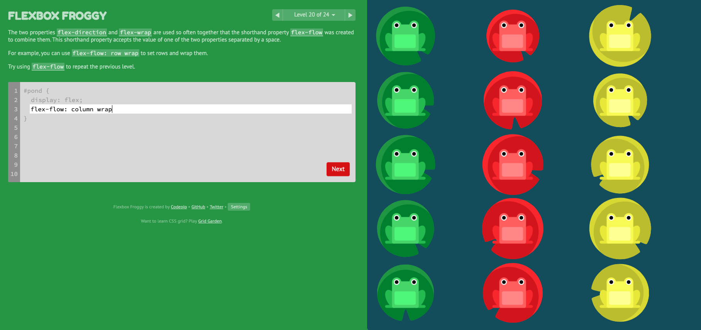

## Flexbox Froggy Game 으로 공부하는 flexbox

그냥 멋모르고 쓰던 flex 를 실제로 앱 layout에 적용하기 위해서 공부하게 되었다. 선임이 추천한 게임 방식의 튜토리얼 사이트를 통해서 연습해보았다. 

결론부터 말하면, 매우 재미있고 알찬 연습 도구이다. 시각적으로 뚜렷하게 보여주니 기억하기도 좋다. 초반에는 '너무 쉽네?' 하다가도 뒤에 가면 금방 까먹고 헤매기도 해서 나중에 복습할 수 있는 짧은 정리 글을 써본다. 프로퍼티 별로 assign할 수 있는 값들, 중간 중간 헷갈리는 부분, 내 스스로 기억하기 좋은 방법/팁을 정리했다.

#### 개구리로 연습하는 flexbox: [flexbox froggy game](http://flexboxfroggy.com/)


레벨은 1부터 24까지 나눠져 있고, 개구리를 계속 움직이면서 연습하는 툴이다. 

## Level 1 ~ 4: justify-content
justify-content 프로퍼티를 사용해서 아이템을 horizontally align 한다. 

**assignable values**
- flex-start (left align)
- flex-end(right align)
- center
- space-between (equal spacing between items): 아이템 사이의 간격만 고려
- space-around(equal spacing around items): 양 끝 여백도 고려한 간격 gap
```css
#pond {
  display: flex;
  justify-content: flex-end;
}
```

## Level 5 : align-items
**align-items** 프로퍼티를 사용해서 vertically align  한다.

**assignable values**
- flex-start: top of container
- flex-end: bottom of container
- center: vertical center of container
- baseline: == flex-start
- stretch: == flex-start
```css
#pond {
  display: flex;
  align-items: flex-end;
}
```
 
## Level 6 ~ 7: justify-content & align-items

```css
#pond {
  display: flex;
  justify-content: center;
  align-items: center;
}
```

## Level 8 ~ 13 : flex-direction & (justify-content & align-items)
**flex-direction**이란 프로퍼티를 사용해서 아이템이 컨테이너 안에서 정렬되는 방향을 정의한다.

**assignable-items**
- row: text 방향과 일치
- row-reverse, 180도 뒤집기
- column: top to bottom, 시계방향으로 90도 회전
- column-reverse, 반시계방향으로 90도 회전

```css
#pond {
  display: flex;
  flex-direction: row-reverse;
  justify-content: flex-end;
}
```

**Confusing Part** 

- Notice that when you set the direction to a reversed row or column, start and end are also reversed.
    - row-reverse를 한 후, 왼쪽 정렬을 하고 싶으면, flex-start가 아닌 flex-end를 해야 한다.

- Notice that when the flex direction is a column, justify-content changes to the vertical and align-items to the horizontal.
    - flex-direction을 column으로 한 후에는, justify-content는 vertical 정렬을 다루게 된다.



## Level 14 ~ 15: order

row-reverse, column-reverse 로 부족할 때 **order** 프로퍼티를 고련한다.

default value는 0. 음수나 양수(-2, -1, 0, 1, 2 ..) 를 부여할 수 있다.

음수가 왼쪽, 양수가 오른쪽.

```css
#pond {
  display: flex;
}

.red {
    order: -1
}
```

## Level 16 ~ 17 : align-self
**align-self** 프로퍼티는 **align-items** 의 기능을 아이템 개별적으로 적용할 수 있다. 같은 values 들을 인자로 가진다. 

```css
#pond {
  display: flex;
  align-items: flex-start;
}

.yellow {
  align-self: flex-end;
  order: 1
}
```
- **순서 중요!**
    - 위 코드의 경우, order:1 을 먼저 쓰게 되면 적용이 다르게 된다.
    - align-self로 먼저 아이템을 vertically align (container 바닥으로 보내고), order: 1로 yellow 아이템을 오른쪽으로 붙인다.

## Level 18 ~ 19: flex-wrap

아이템을 한 줄에 몰아붙일지, 여러 줄로 spread out 할지.
**assignable values**
- nowrap: 한 줄에 다 fit
- wrap: 필요한 만큼 additional lines 생성 (액셀에서 칸이 길어지는 것과 같은 효과)
- wrap-reverse: wrap 하는 데 reverse 순서로. 

## Level 20: flex-flow

**flex-wrap**, **flex-direction** 을 합친 프로퍼티이다. 

**how to assign values**
- flex-flow: FLEX_D_VALUE FLEX_W_VALUE

```css
#pond {
  display: flex;
  flex-flow: column wrap
}
```

## Level 21 ~ 23: align-content

여러 줄을 어떻게 배치할지 정하는 프로퍼티.

- align-content determines the spacing between lines, while align-items determines how the items as a whole are aligned within the container. When there is only one line, align-content has no effect.
    - align-items는 컨테이너 안에서 전체 아이템들의 배열을 다루고, align-content 는 라인 별로 배치한다. 한 줄만 있는 경우, align-content는 의미가 없다. 
- assign하는 values는 align-items와 동일하다.

```css
#pond {
  display: flex;
  flex-wrap: wrap;
  align-content: flex-end;
}
```