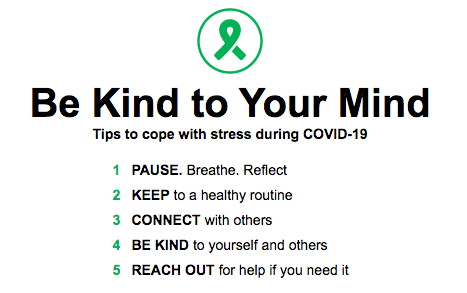

I don't remember when exactly, but it was probably after listening to Ariana Grande, Billie Eilish, and Maggie Rogers.

In high school, I was very unaware of my stress. I thought the responsibilities and pressures of working hard and studying hard were something that I couldn't complain about. It was just a necessary part of life. I should be sad if I didn't achieve my goal, not because of the fact that I should study hard. After an important exam, I had a bad stomache because of stress. That was the first time I realized I am a person who gets stressed out. 

But even after then, I thought I was mentally unbreakable. I thought 'breaking down' would only collapse you and you should avoid feeling down. I didn't even like sad R&B songs because i was afraid of getting sad and melancholy. 

I used Spotify when I was in NYC, and soon after Spotify showed a feature of [Genius](https://genius.com/) which shows lyrics, hidden meanings, or related interviews of the musicians. I listened to the songs of Ariana Grande overcoming the trauma, Billie Eilish expressing her depression, and Maggie Rogers talking about her growth. And reading the stories and intentions of the musicians were powerful to me. Them expressing their feelings without hiding back was even more impressive. I think that was when I started to think 'it is okay to feel sad or low, you can still admit it and move on'. 

After I came back to Korea, I started reading pyschologists' books and having more conversation about it. Then maybe I thought too much about my past. It was good to find the causes of my certain characteristics. Yet, at some point, I was just giving myself excuses, focusing on those situations, instead of moving on.

Retrospecting and identifying those moments help you clarify your sadness/worries because now you know why you talk like this or behave like this or feel like this. Today, I watched the series of youtube videos about mental health, and realized I missed important parts of self-retrospection. 

- [부모에게 받은 상처를 극복하고 싶은 당신이 들어야할 대답](https://www.youtube.com/watch?v=PPJoM9N1Eno)
- [말 그릇을 키우는 방법](https://www.youtube.com/watch?v=IQJzVFUbGU4)
- [스트레스 받지 않는 방법: 담백해지는 법](https://www.youtube.com/watch?v=AU8pmjKIlUQ&t=508s)

- separating yourself from the person who made you feel like that - either family or friend
- hurtful moments happened but it is just a small part. do not identify yourself as your mistakes
- you're different from the past because you acknowledged the causes and you are trying to improve and hoping for better future, which is very constructive
- think optimistically: because you experienced certain issues, you now better understand other people and good at coping with their weakness
- it takes time to overcome mental stress unlike physical scars. don't hurry. pat your shoulders because you're continuously trying and getting better than before
- when your words or other people's words are hurtful, focus on the intention and the heart. 

But at the same time, I don't think its healthy to just ignore your stress. Sometimes, Korean culture forces you to be stronger and thicker. It treats like you're whining or too sensitive if you feel low or depressed. It labels you as a weak person. (In fact, all humans are weak. Just say it.) In contrast, I think you have to be much stronger to admit your negative feelings. Yes, you shouldn't let the negativity absorb you, but there's nothing wrong with feeling and expressing it. Pretending like you're okay and fine? I honestly think that is more pretentious and frustrating to watch.

I believe we all need to balance between identifying the stress/emotion and preventing it to become a huge bubble in our heads. Maybe I will just stop thinking too much lol.