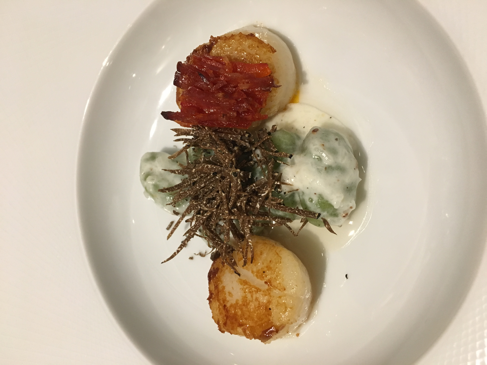
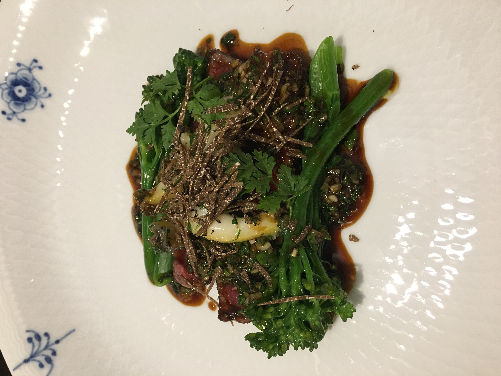
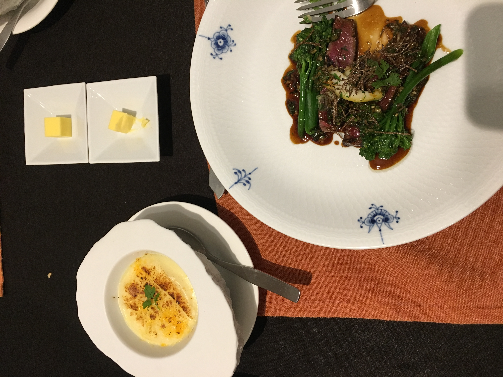
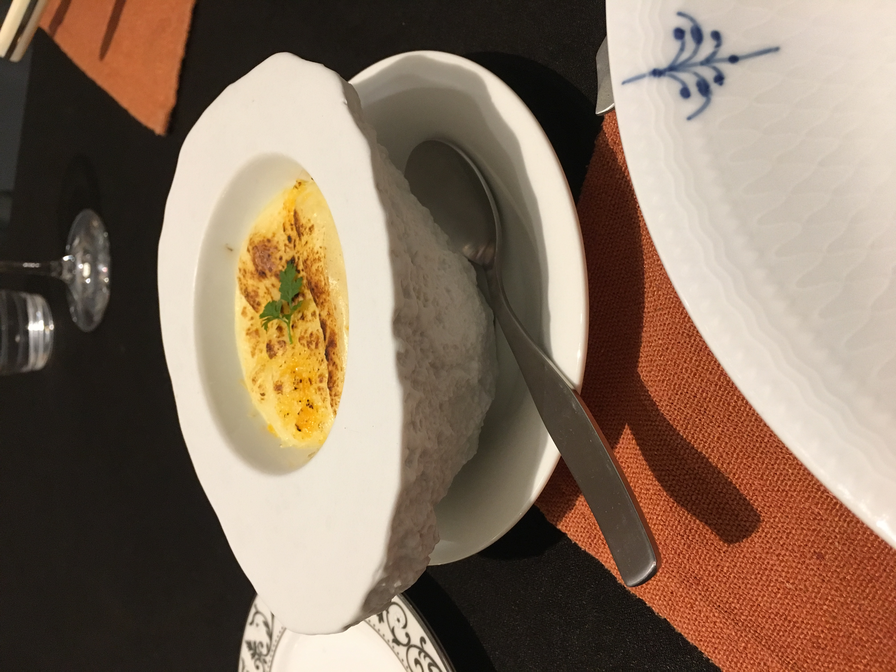
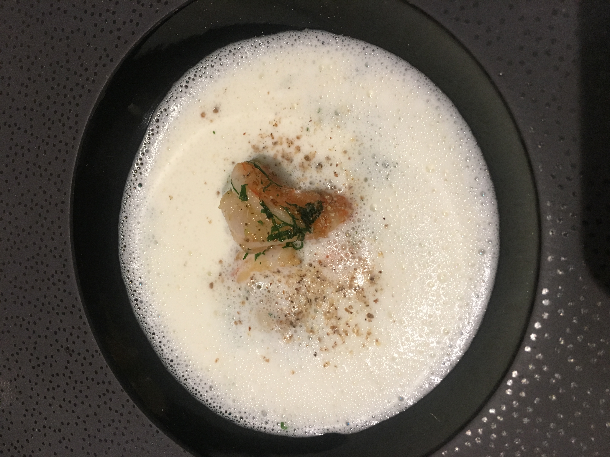
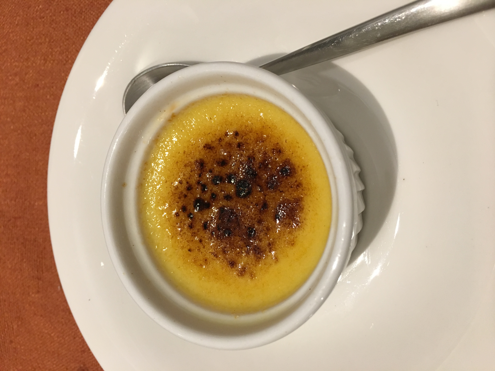
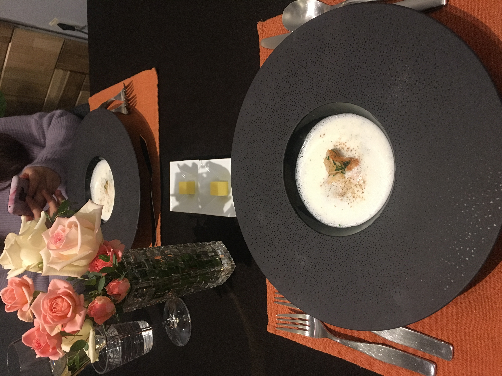
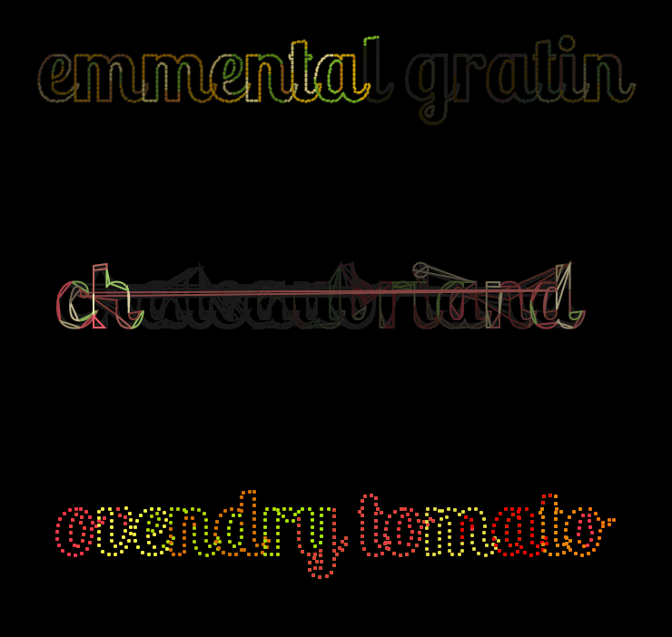

#### 레스토랑 리뷰 

청담동 골목길에 조용히 위치한 레스토랑 온을 찾아갔다. 
초등학교 시절 친구의 연말 생일을 뒤늦게 기념하기 위해 특별히 원테이블 파인다이닝 식당을 예약했다. 

2020년에도 당당하게 미슐랭 가이드에 선정된 레스토랑 온은 '따뜻할 温' 처럼 따뜻하고 편안한 음식을 대접하려는 셰프의 작은 공간이다.

> The name may have changed from the previous Siot to the current On, but the food at this refined French restaurant retains its integrity. - Michelin Guide Review

사실 뉴욕 유학 시절, 바로 옆동네였던 요리 학교를 다니던 친구가 하는 식당이다. 
친구가 하는 식당이니까 가야지 하면서도, 나조차 미루고 미루다 친구의 생일을 기념하여 예약했다.



파인 다이닝을 안 다녀본 사람이라면, 어느 파인 다이닝 식당을 가도 가격에 놀랄 것이다. 
보편적이고 누구나 먹을 수 있는 음식의 평등함도 정말 중요하지만, 파인 다이닝은 맛을 넘어서 경험을 선사한다는 시선으로 바라봐야 한다.
(파인 다이닝 자체가 생소하고 궁금한 사람들에게는 넷플릭스의 Chef's Table, 셰프의 테이블 다큐 시리즈를 강력 추천하고 싶다.)
종종 티비나 영화의 비싼 레스토랑 장면에서 웨이터들이 주변에 항시 대기하고, 가끔은 요리사나 지배인이 손님에게 꼼꼼히 물어보는 장면들이 보인다.
파인 다이닝은 맛과 개성과 창의력은 기본이고, 손님들이 요리사의 작품을 음미하고 이해하게끔 공간과 분위기를 최대한 배려하는 게 중요하기 때문에 그렇다. 



그리고 그러다보니 그에 맞는 비용이 측정된다. 나도 개인적으로 돈을 아끼는 사람인지라 처음에는 파인 다이닝이 부담스러웠었다. 하지만 요리사 친구들과 자주 이야기하고, 넷플릭스의 파인 다이닝 다큐들을 보다보니 (물론 연출을 기가 막히게 해서 그런 것도 있겠지만), 그 비싼 값을 지불하고 갈만한 곳들도 있구나 싶었다.





청담동 레스토랑 온은 셰프의 정성이 담긴 요리뿐만 아니라, 프라이빗한 공간에서 오붓한 시간을 만끽할 수 있으니, 종합적으로 보았을 때 결코 비싼 비용이 아니라는 생각도 들었다.
(여기는 친구라고 해서 디스카운트는 없는 정직한 식당이다ㅜㅜ)





1월 초에 식당을 갔었는데, 추운 겨울날을 포근하게 만들어 준 메뉴 구성이었다.

1. 에멘탈 감자 그라탕 emmental cheese potato gratin
2. 샤토브리앙 브로콜리니 전복 블랙트러플 Chateaubriand broccolini abalone black truffle 
    -  샤토브리앙이란 쇠고기의 안심살을 구워내어 만든 프랑스식 비프 스테이크
3. 크렘블레 피낭시에 creme brulee financier
4. 가리비 시금치 뇨끼, 블랙트러플, 파프리카
5. 오븐드라이 토마토 자몽
6. 컬리플라워 새우



크리에이티브 코딩 작업을 하는 만큼, 이 음식과 경험을 나만의 방법으로 표현하고 싶었다. 그리고 좋은 서비스를 제공해준 친구 셰프에게도 고마운 마음으로 독특한 만들어보고 싶어서 구상을 했다. 

# 개발 및 구상 과정

## 1. 우선 각 요리에서 색감을 뽑아내보면서 그 중에서 표현하고 싶은 음식 메뉴들을 골라보았다.

1. 에멘탈 감자 그라탕 emmental cheese potato gratin: 
-  `#DEAD0B`
-  `#DD9C04`
-  `#F3E093`
-  `#425516`
-  `#BA7A20`
- 삶은 달걀을 반으로 자른 듯한, 이쁘고 독특한 그릇에 담겨져 나왔어서 인상 깊었다.
- 겨울날, 몸을 데워주는 푸근한 느낌의 그라탕이었다.
- 색조합과 폰트 패쓰 결과물을 구성해보니, 푸근한 할머니가 해준 감자 그라탕 무드가 느껴진다.

2. 샤토브리앙 브로콜리니 전복 블랙트러플 Chateaubriand broccolini abalone black truffle 
-  `#904c43` 
-  `#cfc192` 
-  `#869c51` 
-  `#523c24` 
- 메인 고기 디쉬인만큼 진한 식감에 소스가 강렬했다.
- 고기하면 butchers 생각이 나서, 모션과 디자인도 heavy한 느낌으로 다가갔다.

3. 오븐드라이 토마토 자몽
-  `#e23d21` 
-  `#cc563c` 
-  `#e7642c` 
-  `#f28435` 
-  `#d3b33c` 
-  `#dac670` 
-  `#c0970b` 
-  `#a5b062` 
-  `#bfd36c` 
-  `#ddf280` 
-  `#7e8b46` 
- 색도 맛도 상큼하고 통통 튄다.
- 오븐드라이로 이런 맛이 난다니 신기했다.
- 그래서 디자인도 반짝거리는 네온 사인 분위기가 나도록 작업했다.


## 2. 필요한 변수들과 textPath 함수를 불러온다.

- 각 메뉴별로 색깔 데이터를 지정하고, 사용할 폰트를 preload한다.

```js
let ovendryColors = [ '#ff6b52', '#ee8d2c', '#f25b5b', '#f1f25a', '#d0ff00', '#ee2c2c'] ; 
//'#cc563c', '#f28435', '#dac670','#e7642c', '#ee2300', '#ff8f43',
let emmentalColors = ['#DEAD0B', '#DD9C04', '#F3E093', '#85ab2c', '#BA7A20'];
let chateauColors = ['#904c43', '#cfc192','#f6e7b9', '#b87167', '#857665', '#e16d6d', '#b5d270'];
// '#f5f2e9','#f2e7c6', 
let font;
function preload() {
  font = loadFont("LobsterTwo-Bold.otf");
}
```
- 메뉴 글씨와 textPath 를 저장할 변수들을 생성한다.

```js
let ovendry = "ovendry tomato";
let emmental = "emmental gratin";
let chateau = "chateaubriand";
let ovendryP, emmentalP, chateauP;

function setup() {
    createCanvas(800, 800);
    noFill();
    strokeWeight(1);
    ovendryP = createPoints(ovendry);
    chateauP = createPoints(chateau);
    emmentalP = createPoints(emmental);
}

function createPoints(txt){
    points = font.textToPoints(txt, 0, 0, 100, {
      sampleFactor: 2,
      simplifyThreshold: 0
    });
    return points;
  }
```

## 3. draw 함수에서 반복적으로 text를 그린다

- p5의 random() 안에 배열을 넣으면, 따로 인덱스를 주지 않아도, 색깔 배열 중 원소 하나를 랜덤으로 골라서 리턴한다.
- point(p.x, p.y) 의 경우 beginShape(), endShape() 이 필요없지만, vertex 를 쓰게 되면 반드시 필요하다.
- for loop 의 i 값이 클수록 텍스트를 반복적으로 그리는 속도가 빨라진다.
- 1st line 에서 이미 translate을 하고, pop()을 안했으니, 2nd line 에서는 이전의 translate 한 좌표가 (0,0) 기준이 되어서 작동한다.
- 서로 다른 텍스트를 여러개 그리고 싶다면, for loop 안의 count 변수들을 다 다른 이름으로 다 지정해줘야 한다. count 변수들이 여기서는 모두 global 전역 변수들이다.

```js
let count1 = 0, count2 = 0, count3 = 0;

function draw(){
  background(0, 5);
  // 1st line
  beginShape();
  translate(70, 150);
  stroke(random(emmentalColors));
  strokeWeight(3);
  for (let i = 0; i < 15; i++) {
    let p = emmentalP[count1];
    point(p.x, p.y);
    count1 += 5;
    if (count1 > emmentalP.length-1) {
      count1 = 0;
    }
  }
  endShape(CLOSE);

  // 2nd line
  beginShape();
  translate(20, 250);
  stroke(random(chateauColors));
  strokeWeight(2);
  for (let i = 0; i < 50; i++) {
    let p = chateauP[count2];
    vertex(p.x, p.y);
    count2 ++;
    if (count2 > chateauP.length-1) {
      count2 = 0;
    }
  }
  endShape(CLOSE);
```

## 4. 결과물



