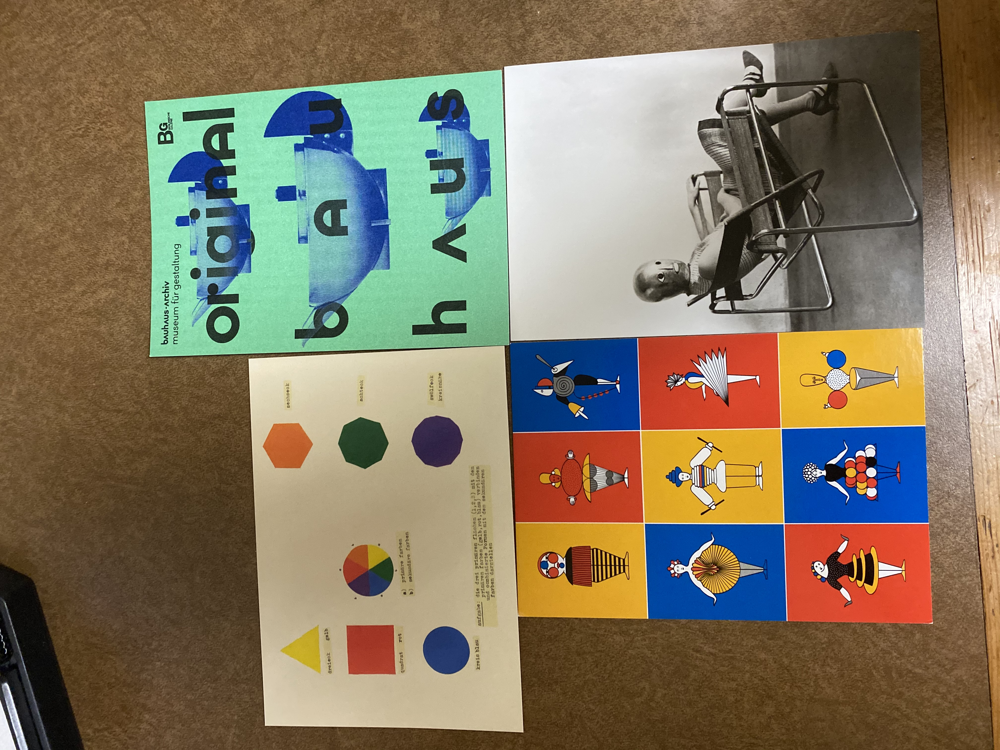
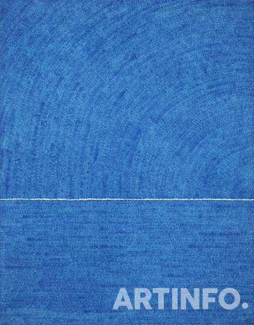
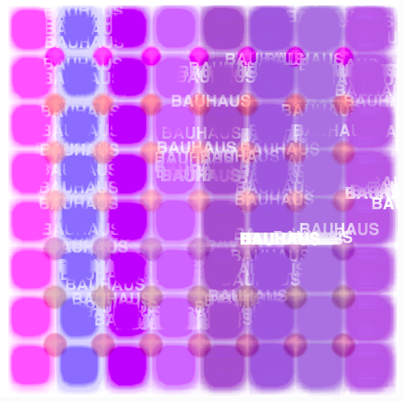
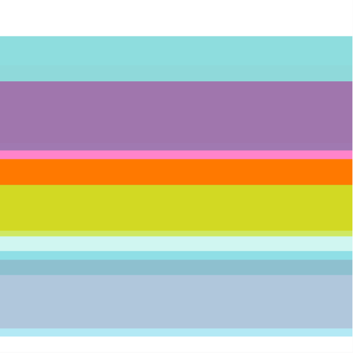

작년이 바우하우스 100주년이었다. 마침 독일 여행을 갔어서 바우하우스 기념 전시들을 너무 재미있게 봤다.  
(독일에서 우연히 마주치기도 했던) 인스타 친구인 작가님이 바우하우스 관련 포스팅을 하셨길래 갑자기 생각나서 크리에이티브 코딩 작업을 해보았다. 
 
처음에는 [p5 riso 리소 프린팅 코드](https://antiboredom.github.io/p5.riso/)를 이래저래 해보다가, 어떤 테마로 작업할까 고민했다.
[이 예시](https://editor.p5js.org/brain/sketches/i1gDFtMAI)를 보면서 응용하다보니, 작업물이 점점 김환기 작가의 작품들 분위기도 나고, 바우하우스의 기본 원형 컨셉과도 비슷해졌다.

[부암동 김환기 미술관](http://www.whankimuseum.org/new_html/main.php)

### version 1: bauhaus

### version 2: whanki kim: Universe
;

> special addition: Agnes Martin

구겐하임 뉴욕 미술관에서 아그네스 마틴 작품을 보며 힐링했던 순간이 기억났다. 
평화롭고 고요한 그녀의 작품들은 바라보는 것만으로도 마음이 차분해졌다.

[Agnes Martin works](https://www.google.com/search?q=agnes+martin&sxsrf=ALeKk03SAsZkWfeM1MlMRjYvXp4-qtVgIw:1587303622489&source=lnms&tbm=isch&sa=X&ved=2ahUKEwj-s8bkzvToAhWHHqYKHegkAxgQ_AUoAXoECBwQAw&biw=1352&bih=774)

