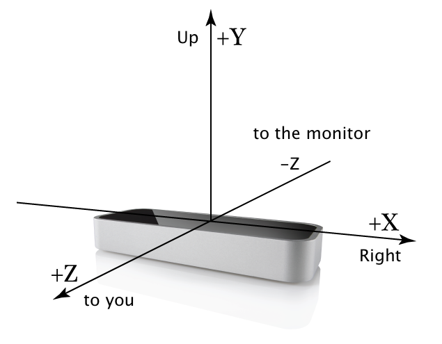
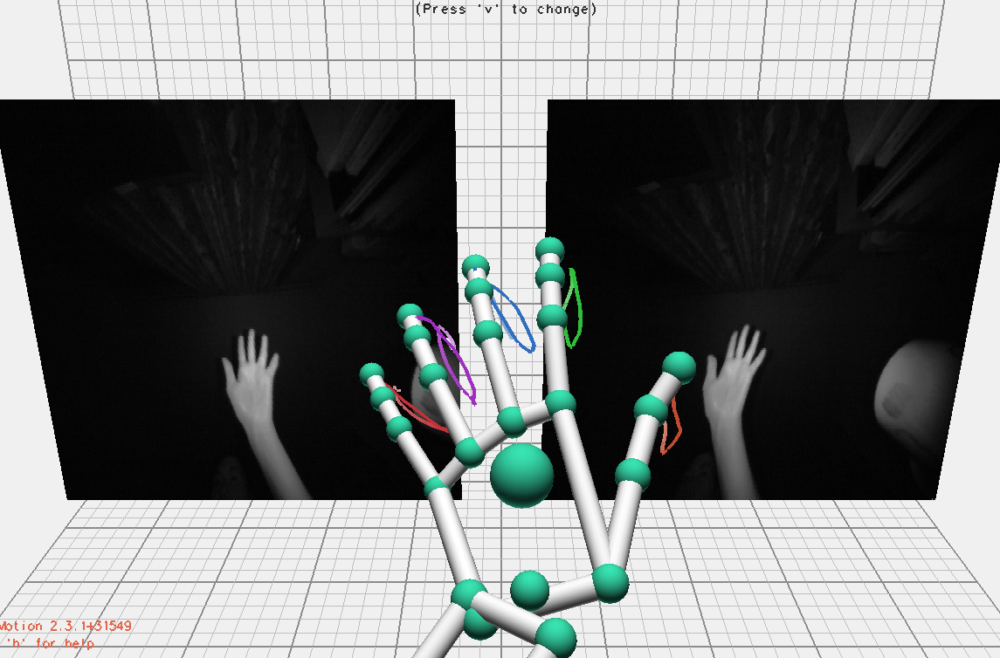
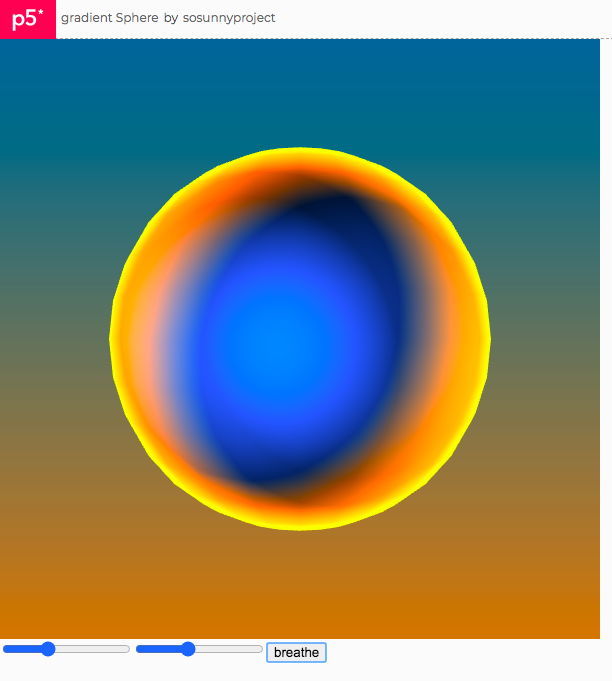
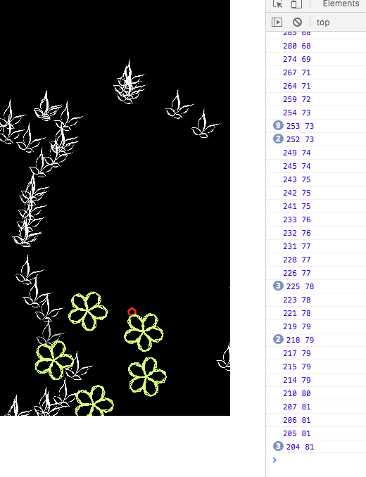

# Leap Motion x P5.JS API 파헤치기

전시에서 아두이노로 인터렉션을 구현하려다가 언택트 흐름에 맞게 립모션으로 대체하려고 라이브러리 API 를 테스팅하고 있다. 

# Leap Motion 이란?

Leap Motion은 손바닥만한 카메라 센서 기기이다. 키넥트처럼 인식 범위가 넓지는 않고 보통 손 2개 정도를 커버할 수 있다고 보면 된다. 

손목부터 손가락 마디마디, 손가락 끝부분까지 생각보다 굉장히 많은 손 관절들의 좌표를 캐치한다. 

<figure style="display: block; margin: 0 auto; text-align: center">

<figcaption>Leap Motion 기기 모형</figcaption>
</figure>

<br />

<figure style="display: block; margin: 0 auto; text-align: center">

<figcaption>실제 Leap Motion 소프트웨어 캡쳐</figcaption>
</figure>


내가 처음 사용해본 계기는 VR 이었던 걸로 기억한다. VR 헤드셋 앞쪽에 Leap Motion을 달고 그걸로 움직이는 내 손의 좌표 정보를 앱에 전달해서 게임같은 인터렉션을 할 수 있게 만드는 데모들이 꽤 많았다. 그걸 체험해보고 나서, 대학교 4학년 졸업작품으로 Unity와 Leap Motion을 연동해서 간단한 음악 게임 인터렉션을 구현했었다. 

# Leap Motion을 선택한 이유
작년에 독일 베를린의 Futurium (tech + art) 박물관을 갔을 때도 전시물 중 하나가 Leap Motion을 사용한 걸 보고, 아직도 꽤 쓰이는 구나 싶었다. 사실 키넥트만큼 파워풀하지는 않아서 잊고 있었는데, 요즘은 전시나 작품을 구상할 때, LESS IS MORE 를 모토로 삼고 있기 때문에 키넥트나 웹캠 대신 Leap Motion을 선택했다. 너무 복잡하게 만들어서 관객이나 사용자에게 '이거는 ~~이렇게 저렇게~~ 해야 한다'라고 설명해줘야 하는 것 자체가 어떻게 보면 경험에 방해가 될 수도 있고, 다양한 리액션이나 happy surprise 를 억제할 수도 있겠다는 생각이 들었다.

# 작업 구상



[버튼 인터렉션 코드](https://editor.p5js.org/sosunnyproject/full/yAFyidcnQ) 에서 breathe 버튼을 클릭하면 뒤의 배경색에 변화가 생긴다. 
원래 계획은 이 버튼 대신에 아두이노 인터렉션으로 시그널을 주고 싶었다. 실제로 아두이노 온습도 센서를 사서 시그널 테스팅까지 해보았다.
센서에 날숨을 불어서 습도 (온도는 변화가 크게 안 생김) 의 변화 데이터를 스케치로 넘겨서 파란색 배경을 주황색으로 서서히 바꾸는 기획이었다.
하지만 이 시국에 호흡기 관련 인터렉션을 쓴다고 하면 꺼림칙하게 느낄 관객들도 많을 것 같아서 최대한 언택트 인터렉션 도구를 고민했다.
저번에 잠깐 사용했던 leap motion 을 다시 한 번 제대로 API 를 뒤져보면서 하고 싶다는 생각 + 키넥트를 사용한 거대한 인터렉션 보다는, 
간결 명료한 인터렉션 비쥬얼을 구현하고 싶다는 생각이 들었다.

- [깃험 공식 leap motion js 리포](https://github.com/leapmotion/leapjs)
- [깃헙 예제 링크 examples](https://github.com/leapmotion/leapjs/tree/master/examples)

leap motion javascript 스크립트가 두 가지 버젼이 있는데, 둘 다 무리없이 작동하는 것 같다. 


# 버젼 1 : leap motion 기본 라이브러리

- 현재 P5에서 작동하는 스크립트 
- [Leap Motion Test 실행 코드 예제](https://editor.p5js.org/sosunnyproject/sketches/ThUMPizF4)
- [Leap Motion JS API](https://developer-archive.leapmotion.com/documentation/v2/javascript/index.html)

```html
<!DOCTYPE html>
<html>
  <head>
      <!-- p5 js -->
    <script src="https://cdnjs.cloudflare.com/ajax/libs/p5.js/0.7.2/p5.min.js"></script>
    <script src="https://cdnjs.cloudflare.com/ajax/libs/p5.js/0.7.2/addons/p5.dom.min.js"></script>
    <script src="https://cdnjs.cloudflare.com/ajax/libs/p5.js/0.7.2/addons/p5.sound.min.js"></script>
    <!-- leap motion -->
    <script src="//js.leapmotion.com/leap-0.6.3.js"></script>

    <link rel="stylesheet" type="text/css" href="style.css">
    <meta charset="utf-8" />
  </head>
  <body>
    <script src="sketch.js"></script>
  </body>
</html>
```

# 버젼 2 : leap motion plugin 라이브러리

- [LeapJS Plugins](http://leapmotion.github.io/leapjs-plugins/docs/#screen-position)
- 지난 데모 전시에 썼던 p5js 에서의 leap motion 플러그인 API 사용 코드



**빨간 점이 손의 위치를 가리킨다. colorful한 원들은 손을 따라가고, 나비들은 손을 피해가는 인터렉션.**

```js
let hand = p5.Vector();  // 손의 현재 위치 벡터값
let phand = p5.Vector(); // 손의 이전 위치 벡터값
//Leap Motion
Leap.loop(function(frame) {
  phand = hand.copy();
  frame.hands.forEach(function(handData, index) {
    let x = map(handData.screenPosition()[0], 0, 500, -width/2,width/2);
    let y = map(handData.screenPosition()[1], -400, 400, -height/2 ,height/2);  
    // WEBGL 세팅의 경우 가운데 좌표가 0,0 이어서 양 끝 좌표값은 -height ~ +height 같은 방식이다.

    hand.set(x,y);
  });

  }).use('screenPosition', {scale: 1});
```


# Hand Position

디테일한 손가락보다는 손의 높낮이 정도만 찾으면 된다.

- `frame.hands.forEach` => 왼손, 오른손
- x 좌표: `handData.screenPosition()[0]`
- y 좌표: `handData.screenPosition()[1]`
- LeapJS Plugins 에서는 screenPosition, LeapJS 에서는 palmPosition 을 사용해보았다.

- ScreenPosition 은 스케치의 좌표 기준에서 hand 가 어디있는지에 맞춰진 데이타가 반환된다.
```
Adds the “screenPosition” method by default to hands and pointables. 
This returns a vec3 (an array of length 3) with [x,y,z] screen coordinates 
indicating where the hand is. This method can accept an optional vec3, 
allowing it to convert any arbitrary vec3 of coordinates.
```

- 반면, palmPosition은 Leap origin (leap motion 기기) 로부터 손바닥이 얼마나 떨어져있는지에 대한 raw data를 반환하는 것 같다.

```
Hand.palmPosition
Type:	number[] – a 3-element array representing a unit direction vector.
The center position of the palm in millimeters from the Leap origin.
var position = hand.palmPosition;
```


**console.log 에 찍힌 첫번째 값은 screenPosition, 두번째 값은 palmPosition이다**

- 결론: screenPosition API 가 주는 데이터가 일단은 더 간편해보이는데 plugin API 라서 얼만큼 활용도가 가능한지 더 사용해볼 예정이다.
