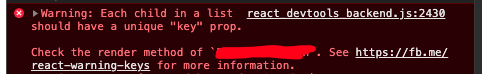

## Problem

When your last-child, first-child css condition doesn't work, we need to check html tags inside React code!

For example, my original code (like below) was causing such problem.

특정 컴포넌트 리스트의 first-child, last-child 특정 css 조건이 먹히지 않는다면, 리액트 코드의 html tag 들을 검토해보는 게 좋다. 아래는 예시코드이다.

### Code Example 

```js
import styled from 'styled-components'
import React from 'react'

const Name = styled.div`
  margin-bottom: 10px;

  &: last-child {
    margin-bottom: 0;
  }
`

<ExampleTable>
  <>
  {/* item: { data: ['annie', 'bianca', 'cecilia'] }   */}
    {item.data.length && item.data.map((value, index) => {
      return (
        <>
          <Name>
            {value}
          </Name>
        </>
      )
    })}
  </>
</ExampleTable>
```

### Analysis

- I wanted all `<Name>` components to have `bottom margin 10px`, but wanted to give `0 bottom margin` to `<Name>` tag's last-child.
- But my current code (above) does not have wrapper tag for several `<Name>` components. Fyi, `<> </>` doesn't really do anything.
- This means your html and css cannot recognize which one is the first-child or last-child of `<Name>` component list. 

[번역]
- `<Name>` 컴포넌트 리스트의 마지막 컴포넌트에만 마진을 다르게 주고 싶었으나, 위의 코드를 보면 해당 컴포넌트들을 하나로 묶어주는 html tag 가 없다. `<> </>` 이렇게 빈 태그는 wrapper 역할을 해주지 못한다.
- 이런 상황이면 해당 컴포넌트 리스트가 단독적으로 구별되지 않아서, 어떤 것이 첫번째이고 마지막인지 html css가 알지 못한다.

## Solution 1: make last-child, first-child css conditions work | css 조건 살리기

```js
<ExampleTable>
  <div> {/* change this!! */}
    {item.data.length && item.data.map((value, index) => {
      return (
        <> {/* do not make this as a div */}
          <Name>
            {value}
          </Name>
        </>
      )
    })}
  </div>
</ExampleTable>
```

- Make a wrapper div for list of `<Name>` components.
- Do not make `<> </>` as a `div` tag inside `return`. This will make html like this.

```js

<div><Name /></div>
<div><Name /></div>

```

- This causes problem because each `<Name>` component becomes **both first-child & last-child** inside the `div`. This is not what you want.
- 만약 `return` 안의 빈 태그를 `div`로 바꿔버리면, 위의 예시처럼 각 `<Name>` 컴포넌트가 하나의 리스트 안에 있지 않게 된다. 그러면 first-child, last-child 구분을 할 수가 없다. 모든 아이들이 first 이자 last 가 되는 것이다. 

## Solution 2: add key index | 컴포넌트에 키 값, 인덱스 값 추가하기

On top of solution 1, you can add one more thing.

In the example code, it creates the list of components because we are using array of data. To make your code clean, you might want to create `key` or `index` for iterating items inside `return` code. 

Because you will see annoying warnings like this in a console.



But you don't want to make outer tag of `<Name>` component as `div` tag. We already talked above that it will mess up your css. 

As alternatives, we have two possible solutions.

1. We can just delete empty tag `<> </>`. 

Just delete empty tag, and give `key` to `<Name>` component.

```js
// ...
  return (
    <Name key={index}>
      {value}
    </Name>
  )
// ...

```

2. For some reason, if you need to keep it, we can use **React.Fragment**.  

```
A common pattern in React is for a component to return multiple elements. 
Fragments let you group a list of children without adding extra nodes to the DOM.

- quote from official REACT Docs.
```

Here is example code of React.Fragment.

```js
// ...
  return (
    <React.Fragment key={index}> {/* change this!! */}
      <Name>
        {value}
      </Name>
    </React.Fragment>
  )
// ...

``` 

This way, you wouldn't mess up first-child or last-child css conditions AND have a key for each child component.

리스트 데이터이기에 어레이를 돌게 되면 각 내부 컴포넌트에 key, index 값을 주라는 콘솔 워닝이 뜰 것이다. 이 워닝을 없애려면 1번처럼 빈 태그 `<></>`를 아예 삭제하고 `<Name>` 컴포넌트에 키 값을 줄 수 있다. 

혹시 어떤 다른 조건때문에 `<Name>`을 감싸는 태그가 필요하다면, 2번처럼 React.Fragment 로 만들면 된다. 위에서 설명했듯이, 여기에 `div` 태그를 써서 추가적인 노드를 생성하는 방법은 피해야 한다.

## Conclusion

Let's not forget to wrap same components inside a single `div` tag to distinguish first-child and last-child of css. Hope this helped you solve a problem.

같은 컴포넌트 애들끼리 한 div 안에 잘 묶여있는지 확인하는 것 잊지 않기!



### Reference
- https://developer.mozilla.org/ko/docs/Web/CSS/Descendant_combinator
- https://www.geeksforgeeks.org/css-child-vs-descendant-selectors/
- https://reactjs.org/docs/fragments.html
- https://www.scaler.com/topics/css-nth-child/
