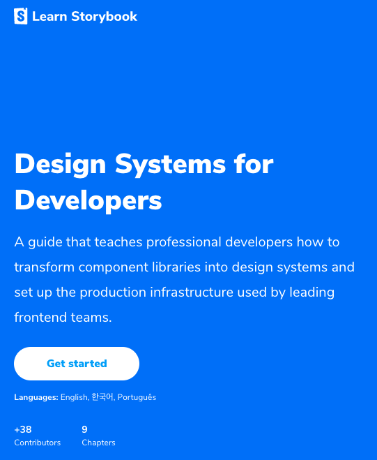
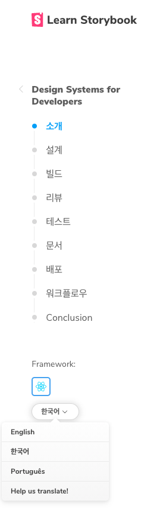
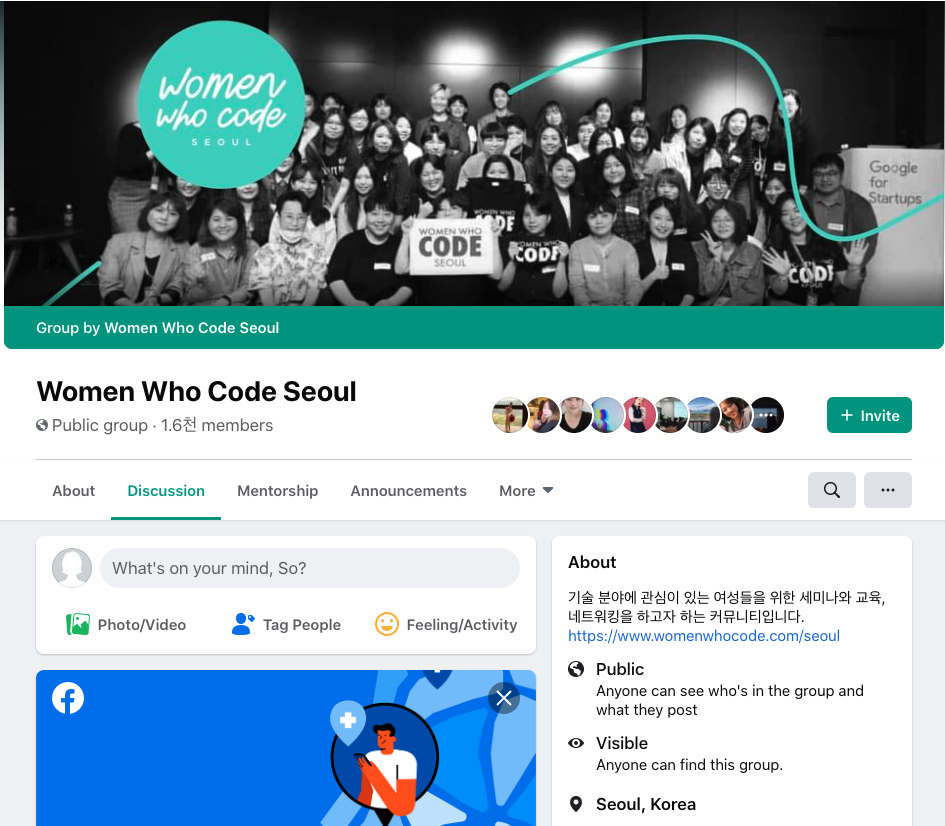
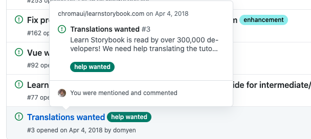
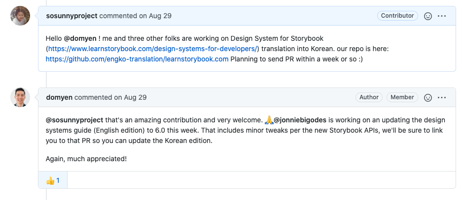
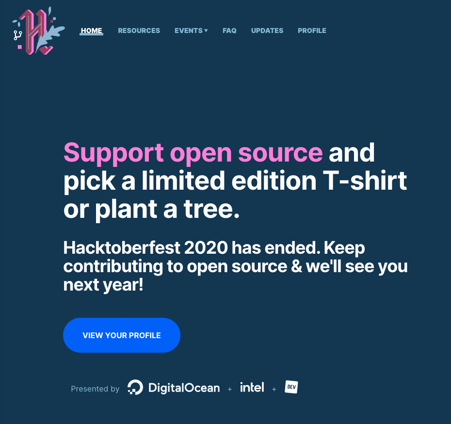

Few weeks ago, I finally finished my first-ever translation contribution on Storybook community (which is run by chromatic). From August 2020, I started this side-project with 3 other female developers I met online. 

> **Storybook 디자인 시스템 3개월간의 번역 + 온라인 협업 후기.**

> **본 블로그를 한글로 읽고 싶다면, <a href="https://papago.naver.com/" target="_blank">파파고 번역을 추천드려요!</a>**

And now - November 2020 - it is officially live 🎉 on [Storybook website](https://www.learnstorybook.com/design-systems-for-developers/react/kr/introduction/) and I'm so proud of me and my team!!

Throughout this process of contribution and leading the online group, I learned so much - what to be aware of, how to schedule with the team, what part of the process could be improved and etc. 

So I am writing this post to share what I learned through this journey.

### How I Decided to Start Translating Contribution

In fact, I never planned to translate the entire website. I was just looking for a side-project because my boss at work has been emphasizing **'Find your core skills to differentiate yourself from others'.**

My frontend engineering team recently talked about adapting 'Storybook' product. According to its official website, 
> Storybook is an open source tool for developing UI components in isolation for React, Vue, Angular, and more. It makes building stunning UIs organized and efficient.

It's been 9 months as a frontend web developer. Different from previous workplaces, I am working very (VERY) closely with designers - asking nitty gritty details about pixels, padding, margin, size, colors, and obviously any question about design. **Realizing how important the communication between Design and Dev team** (as well as Product team) is, I found Storybook to be very interesting and innovative.

I wanted to get to know more about Storybook and how it boosts the teamwork of designers and developers. Also, I was excited to learn about **Design System** as a frontend dev. While I saw more and more korean tech blogs talking about Storybook, there was no Korean version on its official website yet. So I decided to translate English into Korean. 

### How I Found Peers to Work Together Online

Very simple. 

It was **[Women Who Code Seoul Facebook Group](https://www.facebook.com/wwcodeseoul/).**

At the end of 2019 (wish we can go back, right?), I found out there was a branch of Women Who Code in Seoul and was so excited about this. I immediately joined its facebook group and participated as a speaker at its year-end party. Since then, I've been getting lots of useful information from the community. 

In Women Who Code group, I often saw korean developers working abroad. So I posted on the facebook group and it only took a week for three people to join me!

FYI, Facebook Messenger was a (surprisingly) fairly convenient platform for 4 of us to keep in contact and share the updates during 3 months. I didn't create Slack or Email thread at all. 

### Useful Things for Translation Newbies

- ISO abbreviation for languages: http://www.mathguide.de/info/tools/languagecode.html
- Search **translation style guide** in your native languages

#### Things You Must Discuss with Your Translation Peers
- Decide how strict you want to be in regards of GRAMMAR
  - what template / guideline are you following?
  - how about making your own peer review system?

- Write tech terms in your native language? English? or mixed?
  - find a good translation reference in other tech-related documents

- Unify how you're translating terms 
  - it's easy for one word to be translated in multiple ways

#### And My Team Decided ...
- **to have at least 1 peer review for each translation**
- **to follow well-known Translation Style Guide** (English to Korean)
  - [ko.javascript.info](https://github.com/javascript-tutorial/ko.javascript.info/wiki/%EB%B2%88%EC%97%AD-%EB%AA%A8%EB%B2%94-%EC%82%AC%EB%A1%80?fbclid=IwAR0vh8ofHL30gqJh5oExKOkiCbHfwpUUShj-NJLxkAsMcTcbsuh-SZyHaY8)
- **to use tech terms similar to official React** KOREAN translation version
  - Storybook documents mention many component names that are similar to React components

<figure style="display: block; margin: 0 auto; text-align: center">

<figcaption>Photo by <a href="https://unsplash.com/@marvelous?utm_source=unsplash&amp;utm_medium=referral&amp;utm_content=creditCopyText">Marvin Meyer</a> on <a href="https://unsplash.com/s/photos/team?utm_source=unsplash&amp;utm_medium=referral&amp;utm_content=creditCopyText">Unsplash</a></figcaption>
</figure>

### How to Lead an Online Team 
*of people you NEVER MET in person.*

Have you ever done that? 

Not me. It was my first time.(!!!) 

#### Here are few things I learned & I would recommend to future me.
- if possible, Find regular time/day to be online and chat more responsively
- Discuss temporary, reasonable deadline altogether
- Send a weekly/bi-weekly reminder about the progress
- Share your own work (even though you didn't do much), ask for any feedback, and then ask for peers progress
- Remember that this is a side-project or weekend-project. Everyone (including me) has other priorities
- Give less pressure, more (gentle) reminders
- Video Chat is not so necessary. No need to personally get to know each other, if someone feels uncomfortable or you all are busy to coordinate.

In the beginning, I did not set up any rules. **To be honest, I did not expect this project to go on for 3 (freaking!) months.** There were 4 people and 9 chapters, so I thought this would be easily done within a month. Thus, I didn't think much about leading the entire progress.

Yet, after few weeks, I realized we mostly worked on translation over the weekends. And it took much longer than I thought.

The important thing was **regularly keeping in touch**. I buzzed the group chat a lot in the beginning. Yet I tended to forget the chat when I didn't do much work, and thus there was nothing new to share. 

As a leader, no matter how much progress there is, it is good to ping the peers and ask for any updates. **Not to give pressure or blame them/yourself, but to not slip away from this project forever.**

#### Great Things About My Peers
- no one pushed or blamed each other
- we gave detailed feedback on each other's work
- everyone was very patient and understanding of each other's work speed
- we were respectful when writing comments, questions, or feedbacks
- when someone felt intimidated about language proficiency, we asked for no perfection. translating is not an easy task, and feels super awkward for anyone!

Out of many, these were few things that I truly appreciated to my peers, and what I learned through the project.

### What Are You Still Worried About?

After a month, I had a huge urge to rush our schedule because I did not want other people to suddnely submit the entire Korean translation when me and my team were halfway there. *(come on, you know what i mean...)*

It was probably because I already missed the original repo (intro to storybook - react tutorials) we wanted to translate in the first place. And I did not want months of our work to be scrapped all so easily without any heads up. 

Thankfully, when I openly talked about this, my peers suggested that we leave a note in the official github repo to let people know we were working on this. 

Great Communication Kudos to Chromatic team! They already had an open issue and a long long thread about translation contribution. I checked that no one mentioned Design System Korean Translation yet (phew!). So I left a note with our github organization link, making it clear that we are working on this. Chromatic team was very responsive and appreciative. 

There were other korean developers who wanted to participate the translation. Unfortunately, I wasn't paying much attention to github notifications, so didn't see their messages until later... oops :'(

*By the way, If you are ever in a similar situation - feeling too late to join, translation can always be improved. If the project really interests you, don't simply give up. Follow up with latest updates and send PR with better edits :)*

### Proficient in more than 1 language? Go for it!

It was my first translation, first online-only team project. 
Time to time, I lost my interest in translating. I admit it. For me, translation is not the most exciting work. So pick a project that is interesting enough to give you bounce back and persistence to finish it.

Furthermore, if you're just starting a journey of open source contribution or hacktoberfest, I would recommend it!

