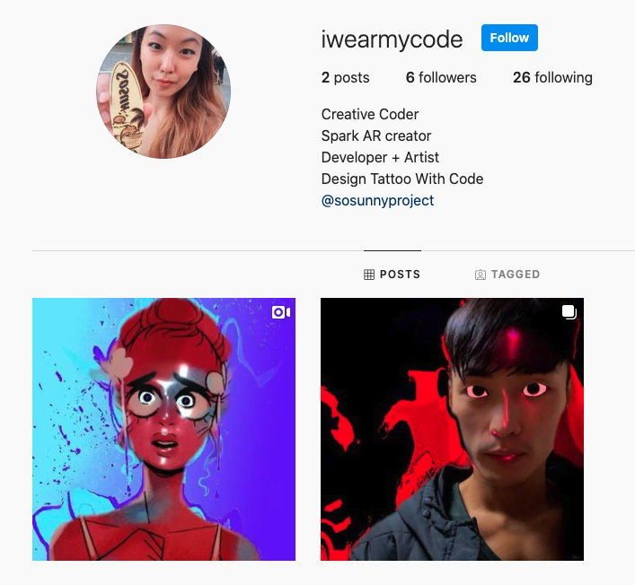

draft

category: 'blog'
title: "SPARK AR: How to do both face deformation & eye (iris) tracking"
date: '2020-11-29'

Before I share the entire tutorial on how I made my first filter, I would like to share the tips and references that helped me solving few problems during the making process.

*If you're interested in the looks of my filter, this is the [instagram link](https://www.instagram.com/ar/881956469216985/) (please open it on your mobile). I added the screenshots at the bottom of this page.*

# How to change eye size, make bigger eyes, face deformation?

Download face deformation pack here
- https://sparkar.facebook.com/ar-studio/learn/articles/people-tracking/face-mesh#applying-a-material-to-the-face-mesh

Follow this flow - distortion and retouching
- https://sparkar.facebook.com/ar-studio/learn/tutorials/face-distortion-retouching#applying-the-blend-shapes

Understand Eyeball layer and Occluder layer
- [What is Occluder?](https://sparkar.facebook.com/ar-studio/learn/articles/3D/occluders#example)
- [Solve Layer Problem](https://www.youtube.com/watch?v=BqGo2PvspqE)

More about layers
- Similar to Adobe photoshop and illustrator programs, **the upper layers in the Scene Panel get priority**
- Create different layers to handle deformation pack, eyes, retouching skin separately
- **Eyeball layer should be below face deformation layer** to avoid eye-popping situation

