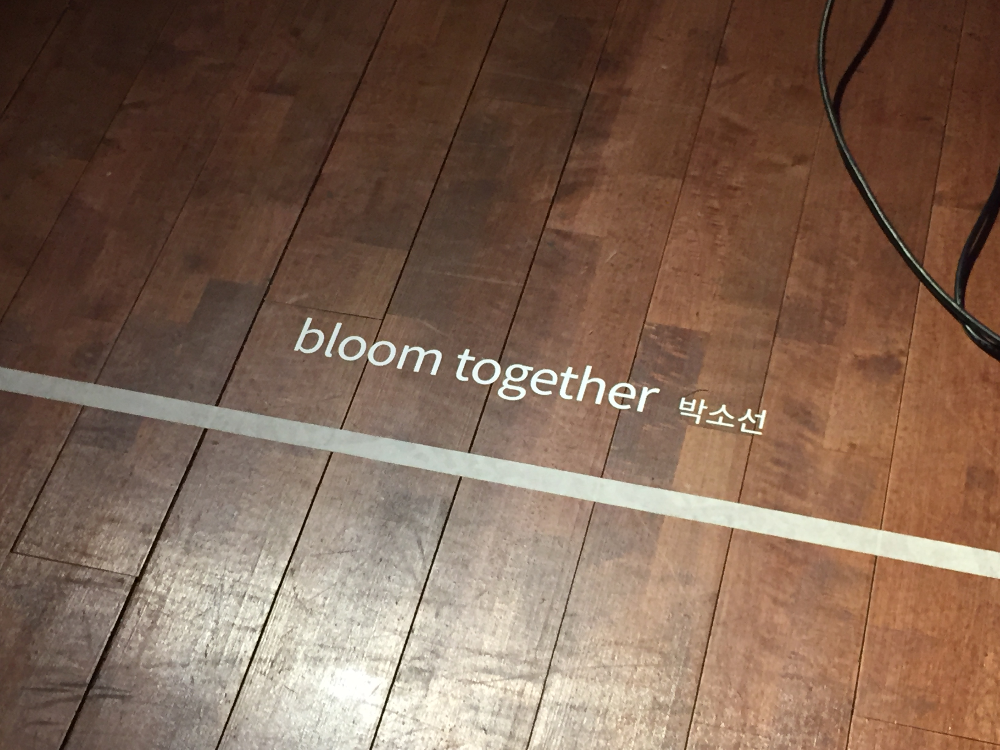
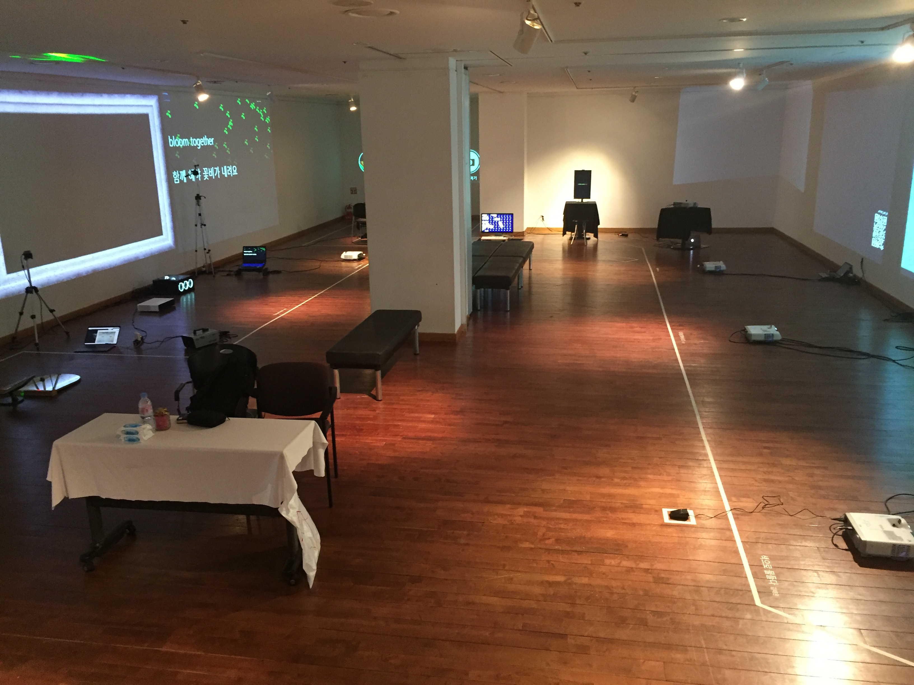
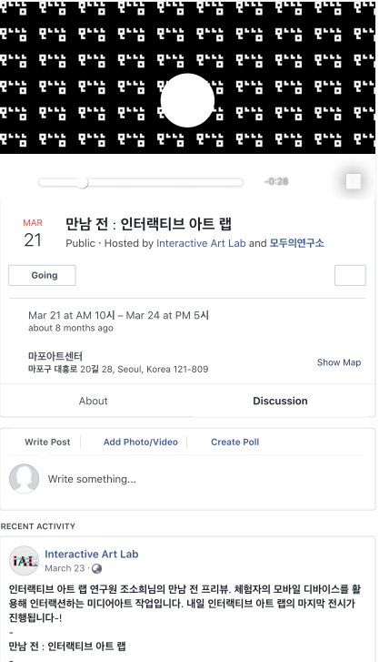

Artist: 박소선  
Venue: 마포아트센터  
Type: <a target="_blank" rel="noreferrer" href="https://www.instagram.com/interactive_art_lab/">인터렉티브 아트 랩</a> 그룹 전시 쇼케이스   ㄴ
Tools: p5js, ml5js, posenet tensorflow js (텐서플로우), 머신러닝, (일반) 웹 카메라
Date: 2019.03.21 ~ 2019.03.24

<iframe width="100%" height="400" src="https://www.youtube.com/embed/T4g00dbcMO0" frameborder="0" allow="accelerometer; autoplay; clipboard-write; encrypted-media; gyroscope; picture-in-picture" allowfullscreen></iframe>
<figure style="display: block; margin: 0 auto; text-align: center">

<figcaption></figcaption>
</figure>

<figure style="display: block; margin: 0 auto; text-align: center">

<figcaption></figcaption>
</figure>

<figure style="display: block; margin: 0 auto; text-align: center">

<figcaption></figcaption>
</figure>

<figure style="display: block; margin: 0 auto; text-align: center">

<figcaption></figcaption>
</figure>

<figure style="display: block; margin: 0 auto; text-align: center">

<figcaption></figcaption>
</figure>

<figure style="display: block; margin: 0 auto; text-align: center">

<figcaption></figcaption>
</figure>

<figure style="display: block; margin: 0 auto; text-align: center">

<figcaption>현장 QR 코드를 통해 볼 수 있는 작품 설명 웹페이지</figcaption>
</figure>

<figure style="display: block; margin: 0 auto; text-align: center">

<figcaption>현장 QR 코드를 통해 볼 수 있는 작품 설명 웹페이지</figcaption>
</figure>

<figure style="display: block; margin: 0 auto; text-align: center">

<figcaption>페이스북 이벤트 홍보 페이지</figcaption>
</figure>

본 작업의 프로토타입 버전은 현대 Zer01ne 제로원 데이 (2018), 모두콘 MODUCON (2018) 에서 발표된 바 있습니다. 관련 자료들도 포트폴리오 목록에 업데이트될 예정입니다.