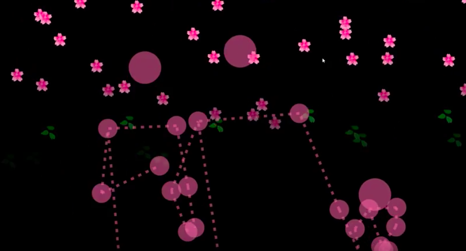

Position: [Director] Artist, Developer  
Topic: Interactive Installation, Social power dynamic, Playful technology  
Venue: Mapo Art Center 마포아트센터  
Type: <a target="_blank" rel="noreferrer" href="https://www.instagram.com/interactive_art_lab/">인터렉티브 아트 랩</a> 그룹 전시 쇼케이스   
Tools: p5js, ml5js, posenet tensorflow js, web camera, 텐서플로우 자바스크립트, 머신러닝, (일반) 웹 카메라 
Date: 2019.03.21 ~ 2019.03.24

<h3>An interactive media installation about encouraging two different people to come close and bloom the flowers together.</h3>
 

<iframe width="100%" height="400" src="https://www.youtube.com/embed/T4g00dbcMO0" frameborder="0" allow="accelerometer; autoplay; clipboard-write; encrypted-media; gyroscope; picture-in-picture" allowfullscreen></iframe>
<figure style="display: block; margin: 0 auto; text-align: center">

<figcaption>March 2019, Bloom Together, Interactive Art Lab group exhibition <Encounter>, Mapo Art Center, Seoul</figcaption>
</figure>

<figure style="display: block; margin: 0 auto; text-align: center">

<figcaption></figcaption>
</figure>

<figure style="display: block; margin: 0 auto; text-align: center">

<figcaption></figcaption>
</figure>

<figure style="display: block; margin: 0 auto; text-align: center">

<figcaption></figcaption>
</figure>

<figure style="display: block; margin: 0 auto; text-align: center">

<figcaption></figcaption>
</figure>

<figure style="display: block; margin: 0 auto; text-align: center">

<figcaption></figcaption>
</figure>

<figure style="display: block; margin: 0 auto; text-align: center">

<figcaption>현장 QR 코드를 통해 볼 수 있는 작품 설명 웹페이지</figcaption>
</figure>

<figure style="display: block; margin: 0 auto; text-align: center">

<figcaption>현장 QR 코드를 통해 볼 수 있는 작품 설명 웹페이지</figcaption>
</figure>

본 작업의 프로토타입 버전은 현대 Zer01ne 제로원 데이 (2018), 모두콘 MODUCON (모두의 연구소, 2018) 에서 발표된 바 있습니다. 관련 자료들도 포트폴리오 목록에 업데이트될 예정입니다.