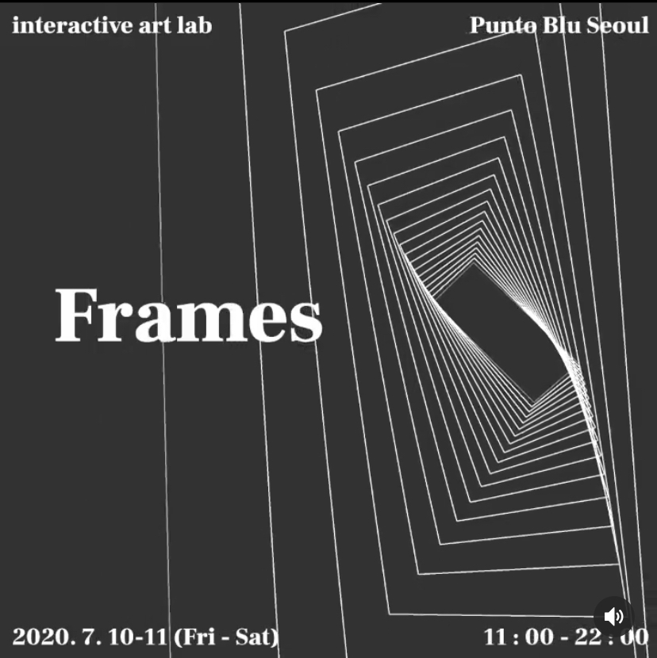
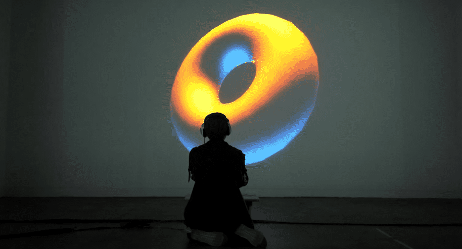
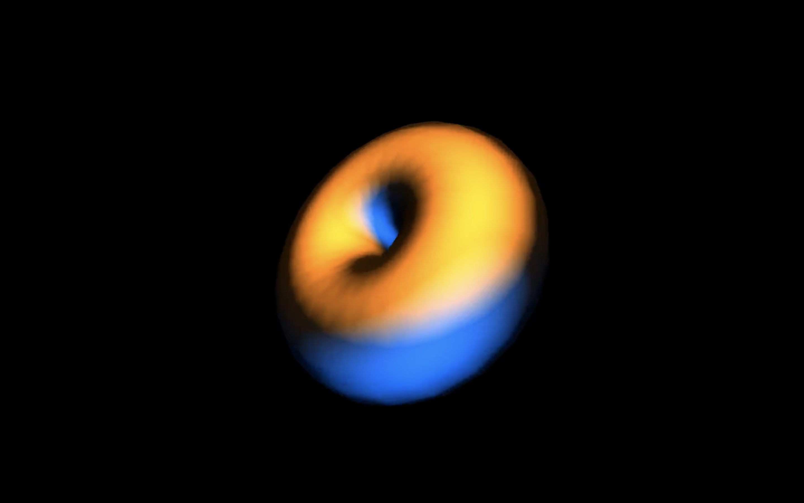
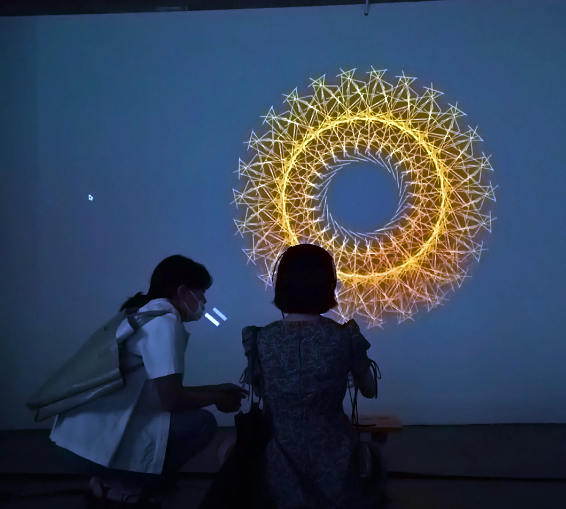
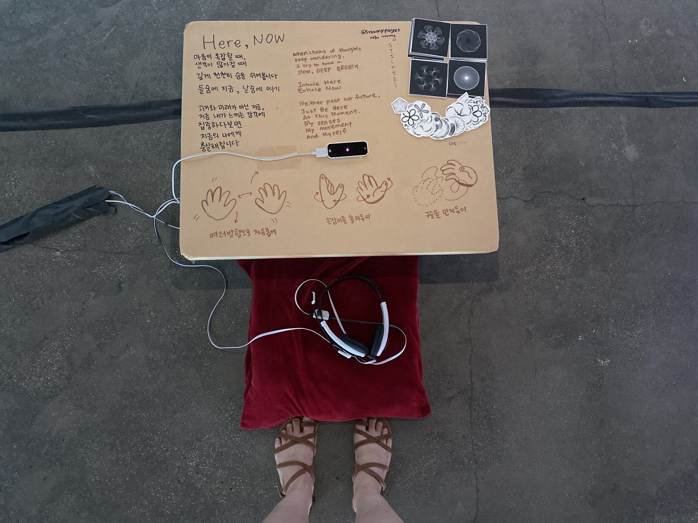
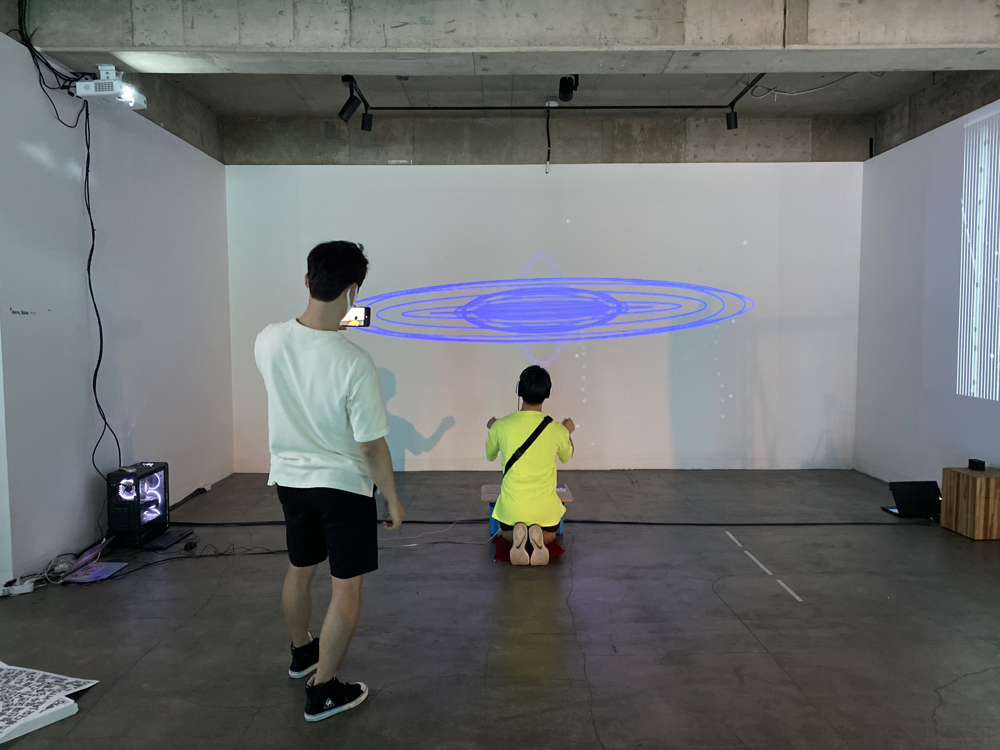

Position: Artist, Developer  
Venue: <a target="_blank" rel="noreferrer" href="https://www.instagram.com/puntobluseoul/">Punto Blu 뿐또블루 성수</a>  
Type: <a target="_blank" rel="noreferrer" href="https://www.instagram.com/interactive_art_lab/">인터렉티브 아트 랩</a> 그룹 전시 쇼케이스  
Tools: 립모션 leap motion, p5js 자바스크립트 라이브러리  
Date: 2020.07.10 ~ 2020.07.11

<iframe width="100%" height="400" src="https://www.youtube.com/embed/hv5kOB_E5DU" frameborder="0" allow="accelerometer; autoplay; clipboard-write; encrypted-media; gyroscope; picture-in-picture" allowfullscreen></iframe>

<h3><a target="_blank" rel="noreferrer" href="https://www.instagram.com/tv/CDJJrC-jmJ7/?utm_source=ig_embed&utm_campaign=loading">인스타 IGTV 감상하러 가기</a></h3>

*과거와 미래가 아닌 지금, 내가 느끼는 감각에 집중하면, 지금의 나에게 충실해집니다.*

태어나서 처음 모바일 앱으로 명상을 배우다가 바디스캐닝의 효과에 영감을 받아 만든 작품이다.
단순한 도형이지만 손 감지 센서의 데이터를 이용해서 모양을 바꿀 수 있다. 
손의 움직임과 감각에 집중시켜서 지금 이 순간에만 오롯이 집중하도록 설계했다.

In 2020, I learned meditation/mindfulness for the first time in my life via mobile app.
Out of many practices, my favorite was body scanning. I wanted to recreate such experience with creative coding.
The audience can change simple shapes on the screen with her hand movement. It allows her to focus on the moment and sensory.

사용 기술: P5 JS, Leap Motion 립모션

<figure style="display: block; margin: 0 auto; text-align: center">

<figcaption></figcaption>
</figure>

<figure style="display: block; margin: 0 auto; text-align: center">

<figcaption></figcaption>
</figure>

<figure style="display: block; margin: 0 auto; text-align: center">

<figcaption></figcaption>
</figure>

<figure style="display: block; margin: 0 auto; text-align: center">

<figcaption></figcaption>
</figure>

<figure style="display: block; margin: 0 auto; text-align: center">

<figcaption></figcaption>
</figure>

<figure style="display: block; margin: 0 auto; text-align: center">

<figcaption></figcaption>
</figure>

<figure style="display: block; margin: 0 auto; text-align: center">

<figcaption></figcaption>
</figure>

<figure style="display: block; margin: 0 auto; text-align: center">

<figcaption></figcaption>
</figure>

<figure style="display: block; margin: 0 auto; text-align: center">

<figcaption></figcaption>
</figure>

