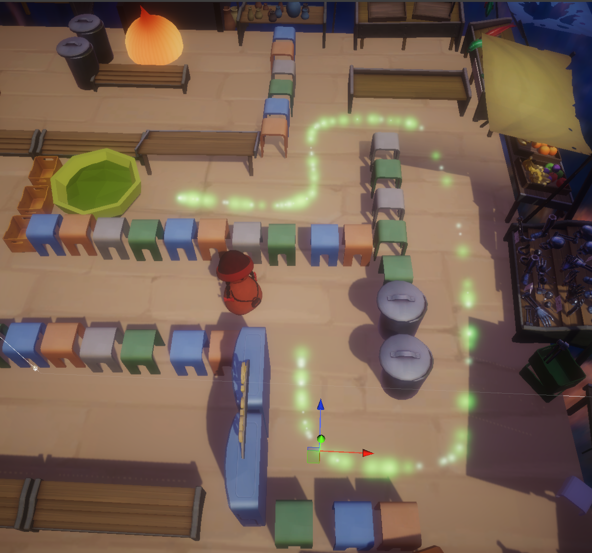

## 2. Trail Effect

### First method: Using same VFX Particle + Bezier Points

<figure style="display: block; width: 70%; margin: 0 auto; text-align: center">

<figcaption> </figcaption>
</figure>

### Initially random positions => Changed to progressive order to move along the path

<figure style="display: block; width: 70%; margin: 0 auto; text-align: center">

<figcaption> </figcaption>
</figure>

## Second method: Path Creator Asset (green line) + Shader Graph for trail visual & Trail Renderer 

<figure style="display: block; width: 70%; margin: 0 auto; text-align: center">

<figcaption> </figcaption>
</figure>

## 2-1. Shader graph for Trail Visual

<figure style="display: block; width: 70%; margin: 0 auto; text-align: center">

<figcaption> </figcaption>
</figure>
