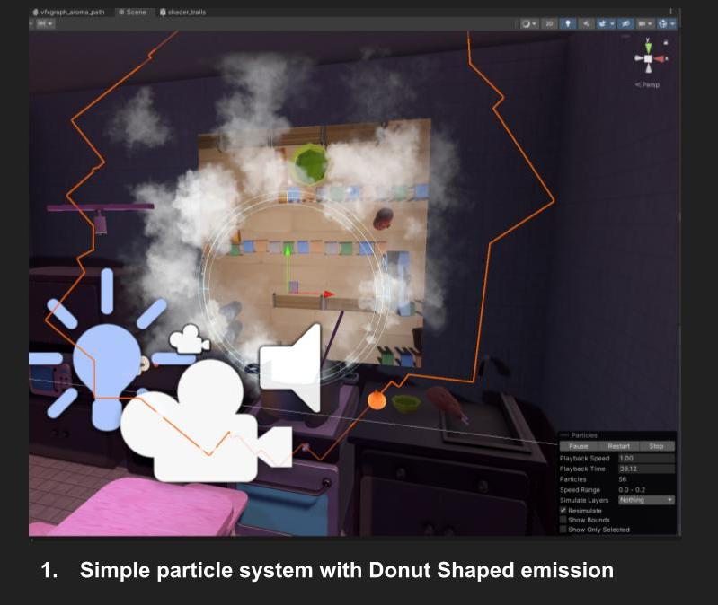
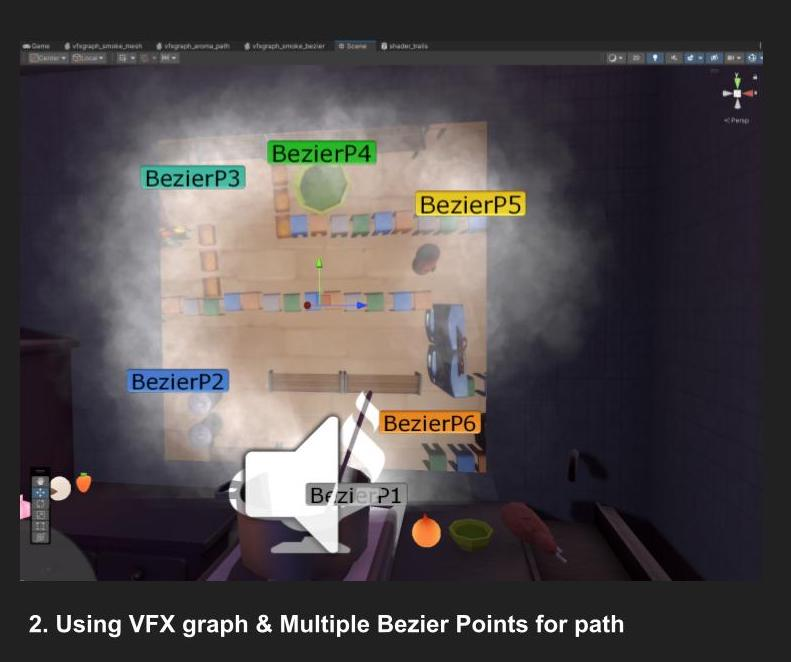
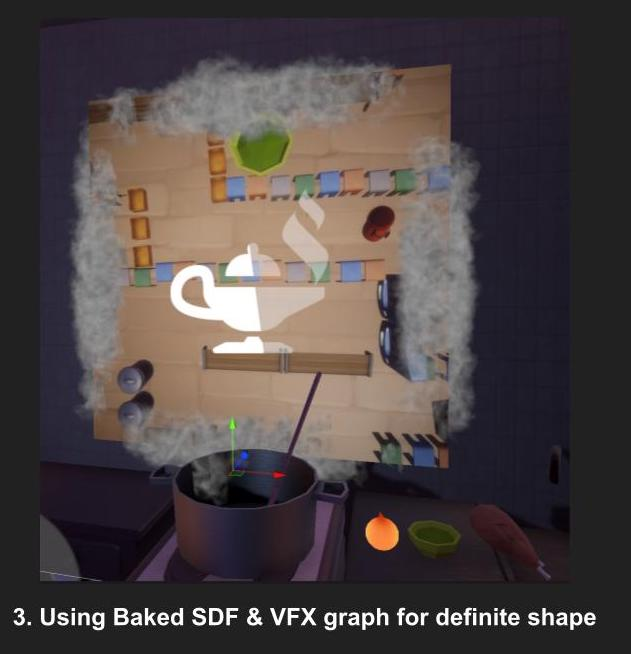
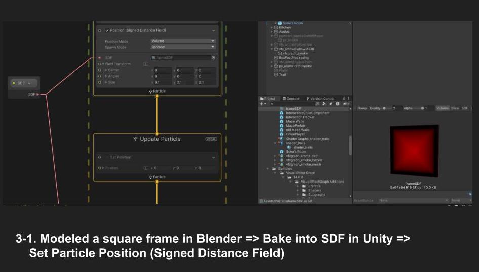
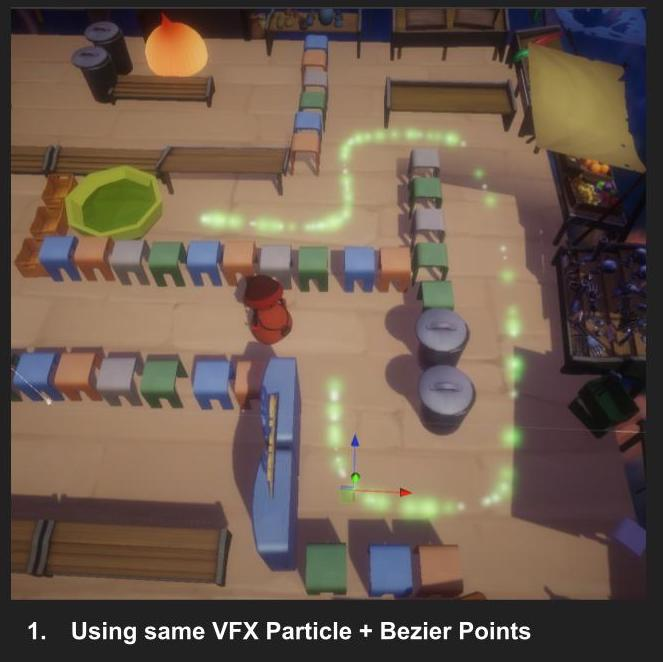
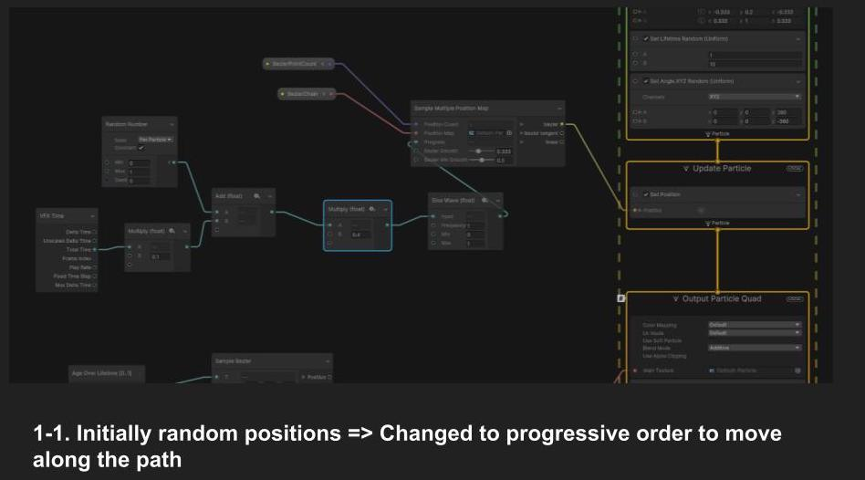
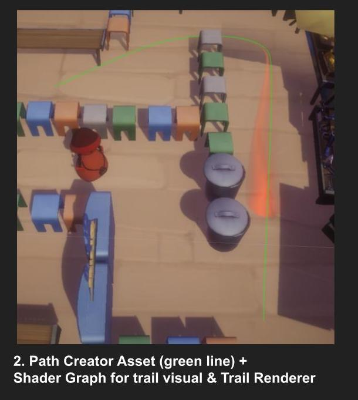
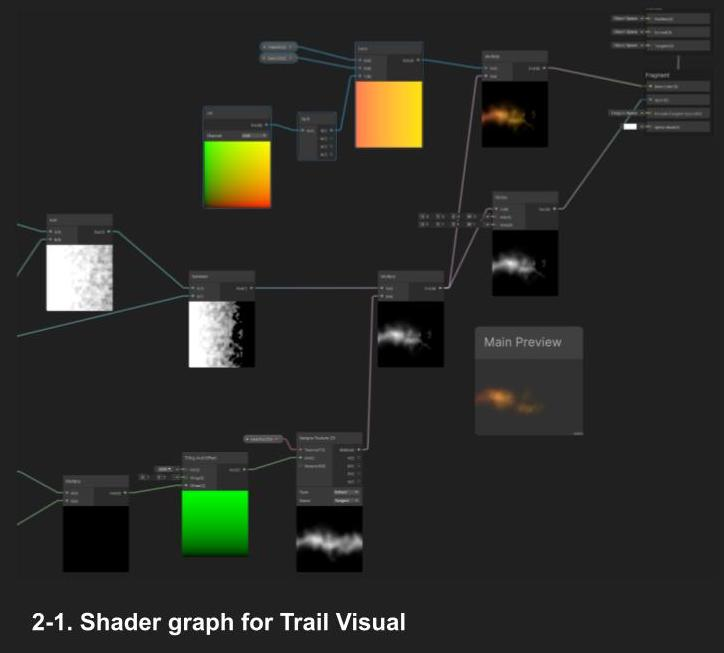

## Technical Artist

### Procedural Avatar System for USC Games MFA Thesis [Eight Moon To The Eternity](https://www.youtube.com/watch?v=-4KR8BfA4rk)

1. Focus on data-driven programming
- Scriptable Objects

2. Modularize the classes and functions

3. Save & Load the Runtime Generated Avatar Portrait Data

### Visual Effects & Shader Graphs for Fall 2023 final game project (USC coursework)

#### Smoke / Steam Effect

<figure style="display: block; width: 70%; margin: 0 auto; text-align: center">

<figcaption> </figcaption>
</figure>

<figure style="display: block; width: 70%; margin: 0 auto; text-align: center">

<figcaption> </figcaption>
</figure>

<figure style="display: block; width: 70%; margin: 0 auto; text-align: center">

<figcaption> </figcaption>
</figure>

<figure style="display: block; width: 70%; margin: 0 auto; text-align: center">

<figcaption> </figcaption>
</figure>

#### Trail Effect
<figure style="display: block; width: 70%; margin: 0 auto; text-align: center">

<figcaption> </figcaption>
</figure>

<figure style="display: block; width: 70%; margin: 0 auto; text-align: center">

<figcaption> </figcaption>
</figure>

<figure style="display: block; width: 70%; margin: 0 auto; text-align: center">

<figcaption> </figcaption>
</figure>

<figure style="display: block; width: 70%; margin: 0 auto; text-align: center">

<figcaption> </figcaption>
</figure>

### References, Assets
- https://rhorseman92.artstation.com/blog/LOmV/trails-and-ribbon-emitters-in-niagara
- https://github.com/SebLague/Path-Creator 
- https://docs.unity3d.com/Packages/com.unity.visualeffectgraph@10.2/manual/Operator-SampleBezier.html
- https://docs.unity3d.com/Manual/PartSysTrailsModule.html 
- https://forum.unity.com/threads/sample-bezier-operator-improvements.833035/
- https://www.youtube.com/watch?v=wvK6MNlmCCE 
