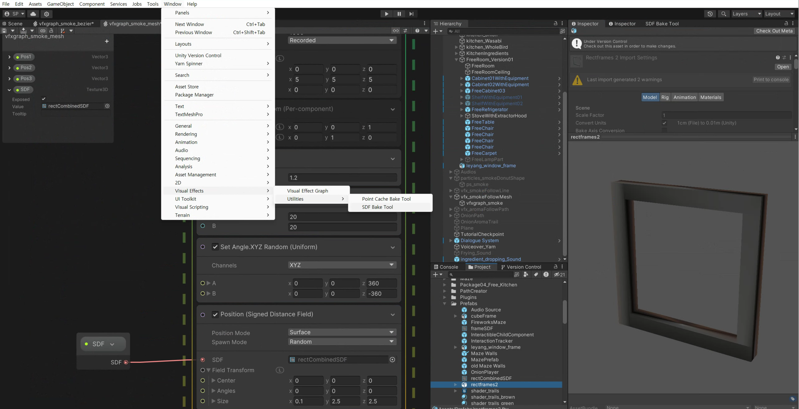

#### As these game productions are still WORK IN PROGRESS, I'm presenting the parts I heavily focused on & something related to Technical Arts, Tools programming. 

<hr >

# Technical Artist & Tools programmer for USC Games MFA Thesis Eight Moon To The Eternity

<iframe width="100%" height="640" src="https://www.youtube.com/embed/wX5Ow5Brzuk?si=EwYW-O98QIk0cisE" title="YouTube video player" frameborder="0" allow="accelerometer; autoplay; clipboard-write; encrypted-media; gyroscope; picture-in-picture; web-share" allowfullscreen></iframe>


### 1. Procedural Avatar Portrait System 
#### Goal
- Build a procedural system to manage all avatar portrait assets
- Generate a semi-controlled / semi-random avatar portrait combinations of helmet / visor / armor / etc
- Generate at each runtime but save and load the same portrait combination data during that runtime
- When the player comes back to the same planet, they should see a same avatar portrait. 

<figure style="display: block; width: 70%; margin: 0 auto; text-align: center">

<figcaption>Game - Cockpit view with runtime generated avatar character </figcaption>
</figure>


<figure style="display: block; width: 70%; margin: 0 auto; text-align: center">

<figcaption> Variations made with the latest avatar portrait system </figcaption>
</figure>


**1. Focus on data-driven programming**
- Define the asset components with Scriptable Objects
  - Even if the filenames change, it will not interfere or cause an error.
  - Easy to manage and scale

**2. Modularize the classes and functions**
- Portrait Element: Each component can be created as a Scriptable Object, containing all the images of this category
  - For example, all ARMOR sprites are contained in Portrait Element 'ARMOR'
- Portrait Library: Contains all the Portait Elements
- Portrait Display: Connect the portrait assets into the runtime prefab in the Scene

**3. Save & Load the Runtime Generated Avatar Portrait Data**
- Since the string filenames can be long and heavy to keep get/set, I encode the string into byte[] to save the data. 
- When it needs to load/get the data, it would internally decode the byte[] and return the string of filenames.

<figure style="display: block; width: 70%; margin: 0 auto; text-align: center">

<figcaption> Technical Design Diagram </figcaption>
</figure>


<hr >

# Tech Artist, Game developer for Design for Interactive Media final project (USC coursework)

### 1.Smoke / Steam Effect
#### Goal
- Convey the mysterious/dreamy effect for the Dream Scene (Render Texture) view appearing in front of the kitchen
- Connect it with the cooking experience. 

## First method: Default Particle system with Donut Shaped emission
- You can choose the shape of particle system emitter as Donut.
- **Problem**: Too sporadic. I want it to be more condensed around the frame area.

<figure style="display: block; width: 70%; margin: 0 auto; text-align: center">

<figcaption> Smoke Effect </figcaption>
</figure>

<figure style="display: block; width: 70%; margin: 0 auto; text-align: center">

<figcaption> Particle System: Shape property - Donut </figcaption>
</figure>

## Second method: Using VFX graph & Multiple Bezier Points for path
- **Resolved**: Keeping particles remain better in designated area
- It was nice to see the smoke particles following the path.
- **Troubleshooting in the process**
  - Default shader graph only has 'Sample Bezier' node, which only allows 3 positions.
  - Resolved: I downloaded more samples from Unity VFX Graph packages, and utilized **Sample Multiple Position Map**

<figure style="display: block; width: 70%; margin: 0 auto; text-align: center">

<figcaption> Smoke particles following bezier points </figcaption>
</figure>

<figure style="display: block; width: 70%; margin: 0 auto; text-align: center">

<figcaption>Inside the VFX graph, you can choose either Sample Bezier node or Sample Multiple Position Map node. Connect it with 'Set Position' node of particles </figcaption>
</figure>

<figure style="display: block; width: 70%; margin: 0 auto; text-align: center">

<figcaption> Make sure that you have al the properties connected from your Scene & Hierarchy properties </figcaption>
</figure>

- I later utilized the 'Sample Bezier' node because in this case, 3 points are enough to set the path. 
  - It was a negative feedback system to ensure the user keep stirring the spoon in the spot, as cooking motion and multi-tasking was the important part of our game. 

<figure style="display: block; width: 70%; margin: 0 auto; text-align: center">

<figcaption> Black smoke when you stop stirring the pot! </figcaption>
</figure>

<figure style="display: block; width: 70%; margin: 0 auto; text-align: center">

<figcaption> You can adjust the POS objects in the scene </figcaption>
</figure>


<figure style="display: block; width: 70%; margin: 0 auto; text-align: center">

<figcaption> Sample Multiple Position Map VFX Graph </figcaption>
</figure>

## Third method: Using Baked SDF & VFX graph for definite shape

- Position (SDF) node allows us to position the particles constrained to SDF area.
- I modeled a simple 3D square frame in Blender and baked SDF inside Unity.
- I knew about SDF through shadertoy and Inigo Quilez, but did not know Unity VFX graph had such features. So I gave it a try and it worked like a charm!

<figure style="display: block; width: 70%; margin: 0 auto; text-align: center">

<figcaption>Kitchen with nightsky window view</figcaption>
</figure>

<figure style="display: block; width: 70%; margin: 0 auto; text-align: center">

<figcaption>Transition to Dream Scene</figcaption>
</figure>


<figure style="display: block; width: 70%; margin: 0 auto; text-align: center">

<figcaption>Import FBX model and use SDF Bake Tool </figcaption>
</figure>

<figure style="display: block; width: 70%; margin: 0 auto; text-align: center">

<figcaption>After you bake FBX into SDF inside Unity</figcaption>
</figure>

<figure style="display: block; width: 70%; margin: 0 auto; text-align: center">

<figcaption>SDF, Position nodes inside VFX Graph</figcaption>
</figure>

#### Signed Distance Field 

- [Inigo Quilez](https://iquilezles.org/articles/distfunctions/)
<figure style="display: block; width: 70%; margin: 0 auto; text-align: center">

<figcaption></figcaption>
</figure>

- [Nvidia Article](https://developer.nvidia.com/gpugems/gpugems3/part-v-physics-simulation/chapter-34-signed-distance-fields-using-single-pass-gpu#:~:text=A%20signed%20distance%20field%20is,outside%20the%20object%20is%20applied.)
```
A signed distance field is represented as a grid sampling of the closest distance to the surface of an object represented as a polygonal model. Usually the convention of using negative values inside the object and positive values outside the object is applied. Signed distance fields are very attractive in computer graphics and related fields. Often they are used for collision detection in cloth animation (Bridson et al. 2003), multi-body dynamics (Guendelman et al. 2003), deformable objects (Fisher and Lin 2001), mesh generation (Molino et al. 2003), motion planning (Hoff et al. 1999), and sculpting (Bærentzen 2001).

However, fast and robust signed distance field computation is often either a performance bottleneck, because of high-resolution fields, or a nearly impossible task because of degeneracies in input meshes. Thus, computation can be tedious and time-consuming. For example, a naive implementation on a CPU can take hours, even days, to complete for high-resolution grids (2563 resolution or greater).

Methods for computing distance fields on graphics hardware fall into two different approaches: distance meshing or scan conversion of bounded volumes. Section 34.7 gives a short survey of these and other approaches.
```


#### References, Assets
- https://rhorseman92.artstation.com/blog/LOmV/trails-and-ribbon-emitters-in-niagara
- https://github.com/SebLague/Path-Creator 
- https://docs.unity3d.com/Packages/com.unity.visualeffectgraph@10.2/manual/Operator-SampleBezier.html
- https://docs.unity3d.com/Manual/PartSysTrailsModule.html 
- https://forum.unity.com/threads/sample-bezier-operator-improvements.833035/
- https://www.youtube.com/watch?v=wvK6MNlmCCE 
