## Build recordings
<iframe width="560" height="315" src="https://www.youtube.com/embed/wbmUbkq4enc?si=1ZJIUhVAieRveS4W" title="YouTube video player" frameborder="0" allow="accelerometer; autoplay; clipboard-write; encrypted-media; gyroscope; picture-in-picture; web-share" allowfullscreen></iframe>

<figure style="display: block; margin: 0 auto; text-align: center">
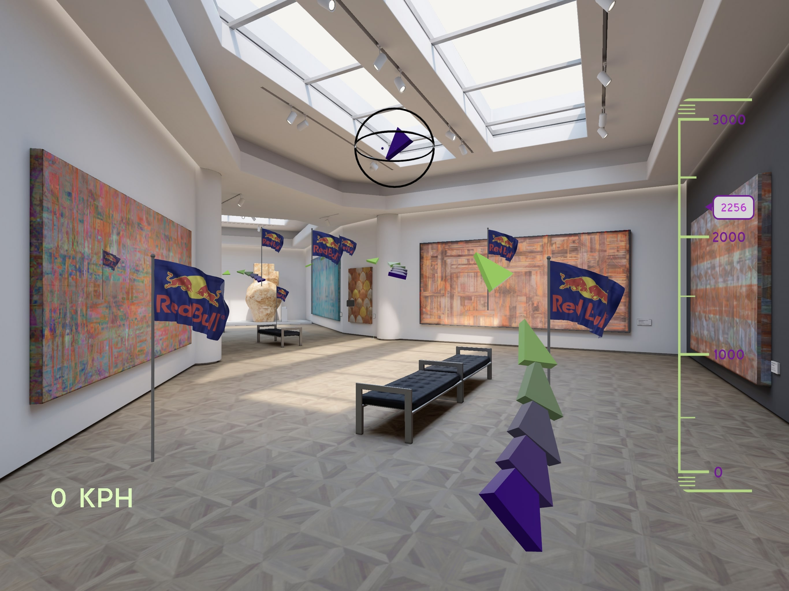
<figcaption>Final rendering in first-person view</figcaption>
</figure>

<figure style="display: block; margin: 0 auto; text-align: center">
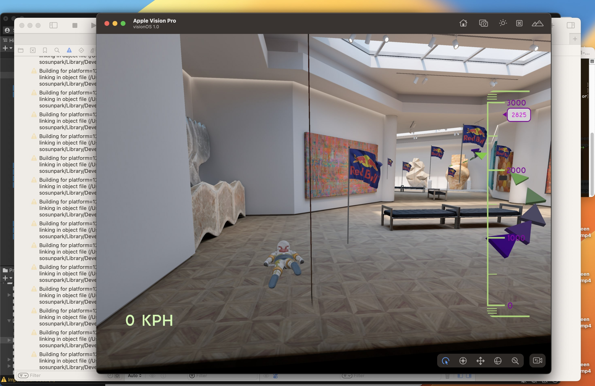
<figcaption>Build rendering in third-person view</figcaption>
</figure>

## Building a Apple Vision Pro Simulator Scene in Unity

<figure style="display: block; margin: 0 auto; text-align: center">
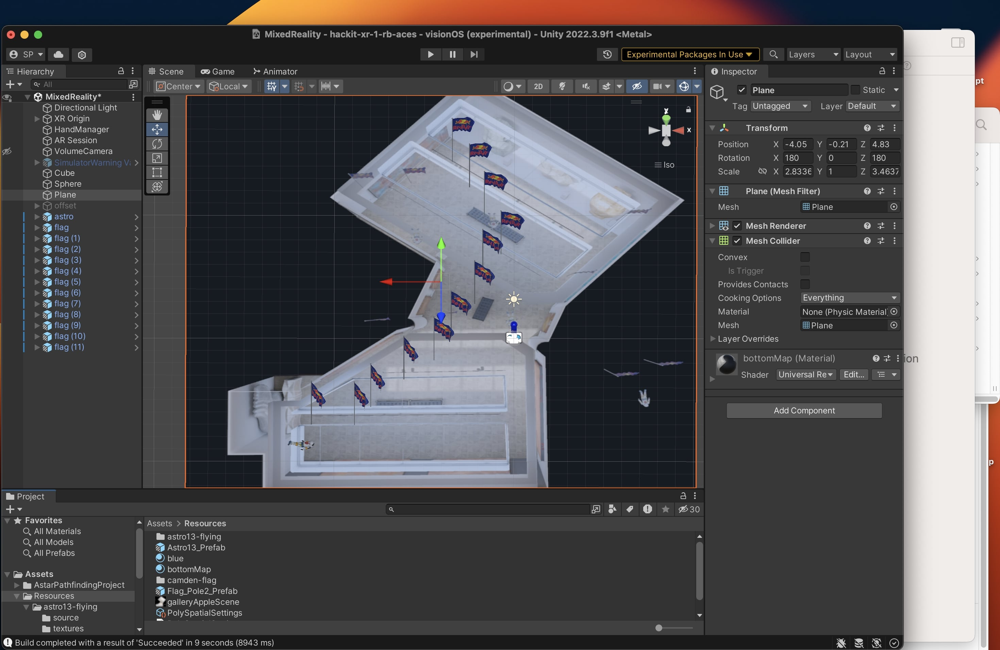
<figcaption>Replicating one of the Apple Vision Pro sample scene: Gallery</figcaption>
</figure>

<figure style="display: block; margin: 0 auto; text-align: center">
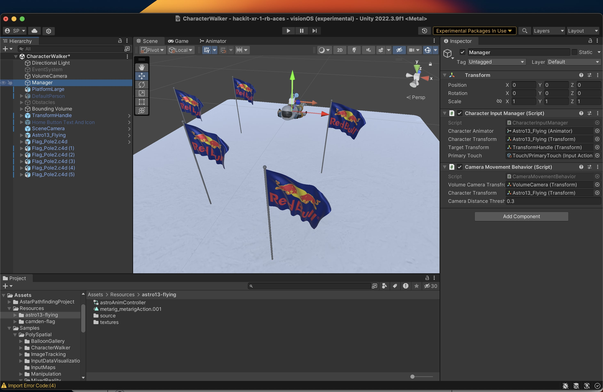
<figcaption>Customizing Character Walker scene for VisionOS</figcaption>
</figure>

<figure style="display: block; margin: 0 auto; text-align: center">
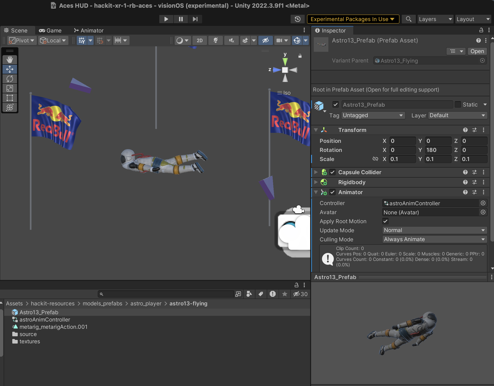
<figcaption>Customizing Character Walker scene for VisionOS</figcaption>
</figure>

<figure style="display: block; margin: 0 auto; text-align: center">
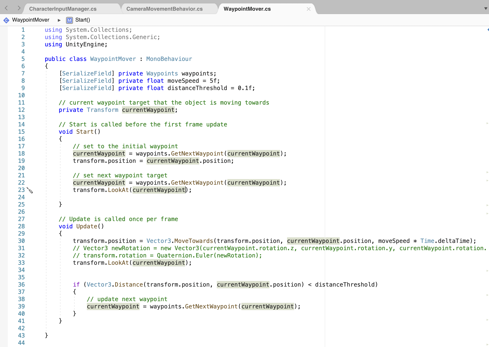
<figcaption>Waypoint algorithm for charact walking</figcaption>
</figure>

<figure style="display: block; margin: 0 auto; text-align: center">

<figcaption>Customizing Character Walker scene for VisionOS</figcaption>
</figure>

<figure style="display: block; margin: 0 auto; text-align: center">
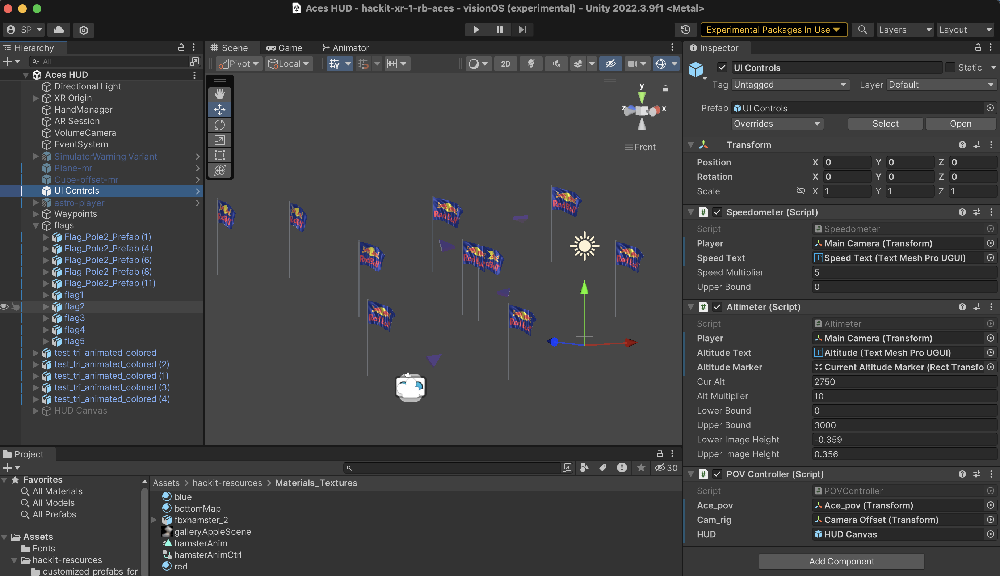
<figcaption>Adding UI components in Unity for VisionOS</figcaption>
</figure>

## Unity Polyspatial Build Setup & Troubleshooting

<figure style="display: block; margin: 0 auto; text-align: center">
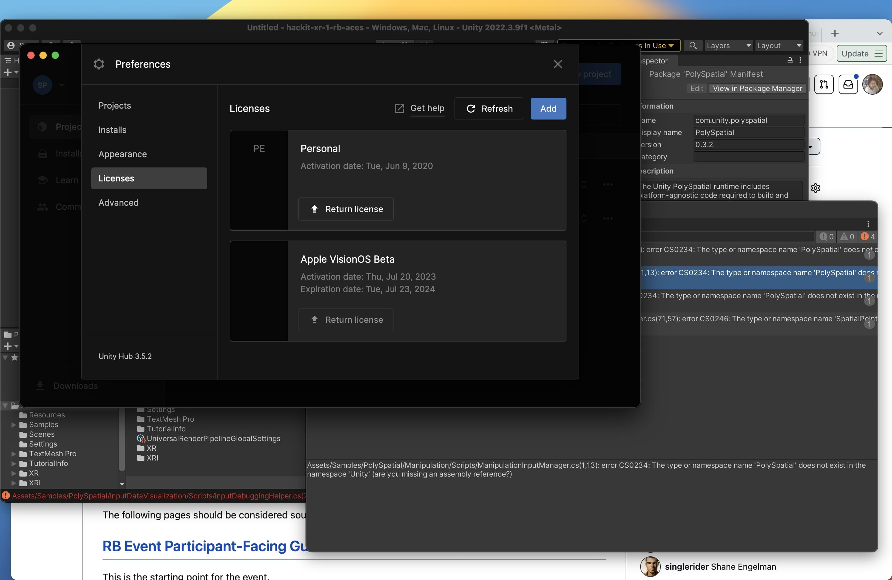
<figcaption>Apply Vision Pro and Unity Polyspatial SDK licenses</figcaption>
</figure>

<figure style="display: block; margin: 0 auto; text-align: center">
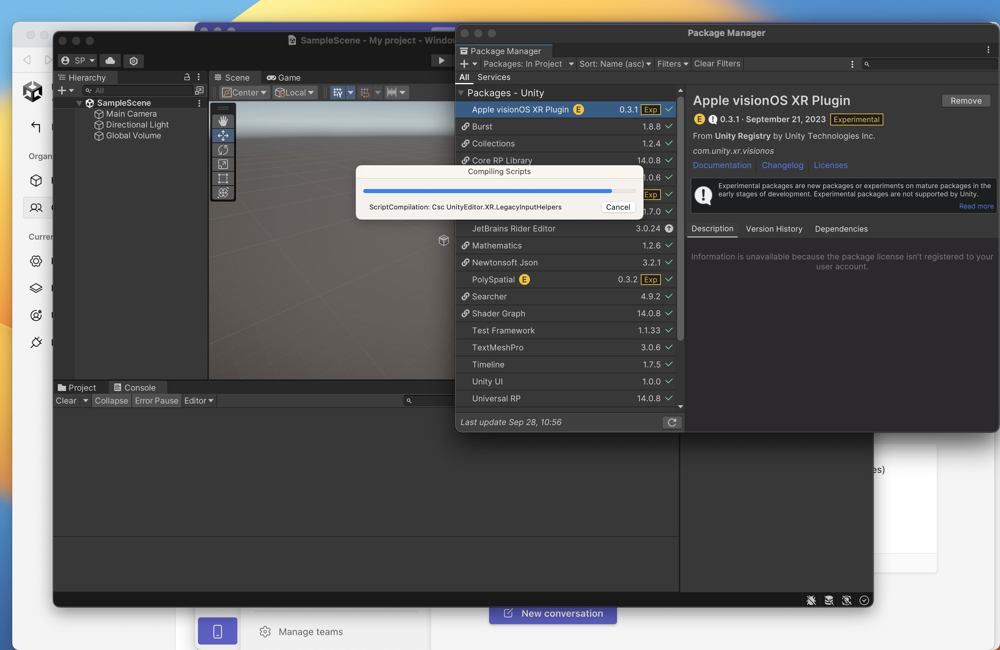
<figcaption>After you have Unity Polyspatial license, you can import plugins</figcaption>
</figure>

<figure style="display: block; margin: 0 auto; text-align: center">
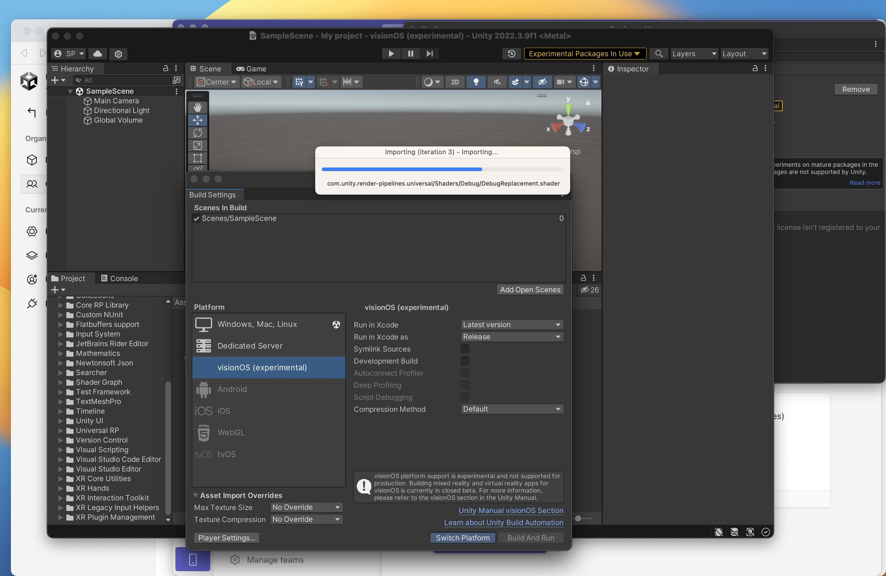
<figcaption>When you build, choose visionOs platform. Check xcode version if you encounter build issues later.</figcaption>
</figure>

<figure style="display: block; margin: 0 auto; text-align: center">
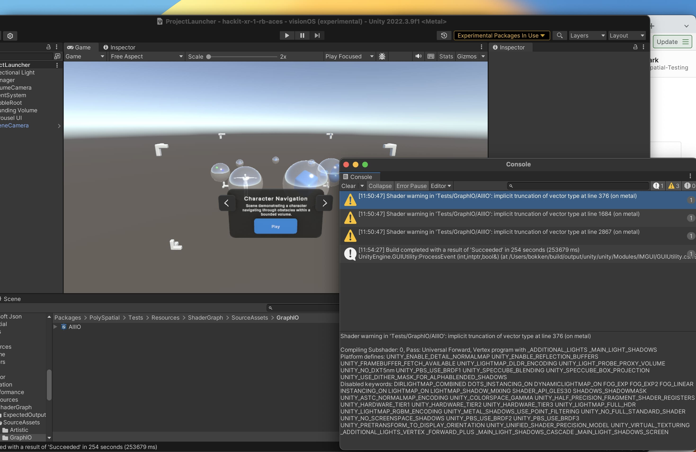
<figcaption>Building Apple Vision Pro Sample scenes with Unity. Warning message is due to graphics rendering difference between Unity and Apple Vision Pro.</figcaption>
</figure>

<figure style="display: block; margin: 0 auto; text-align: center">

<figcaption>URP material warning in Xcode build</figcaption>
</figure>

<figure style="display: block; margin: 0 auto; text-align: center">
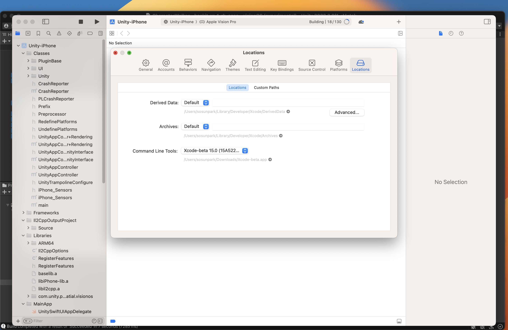
<figcaption>If you have multiple xcode versions, make sure you select the compatible one</figcaption>
</figure>
