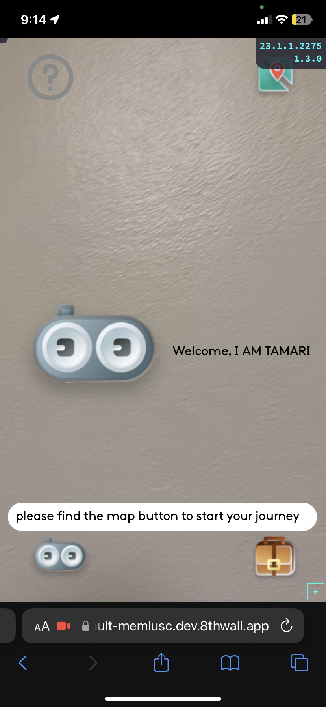
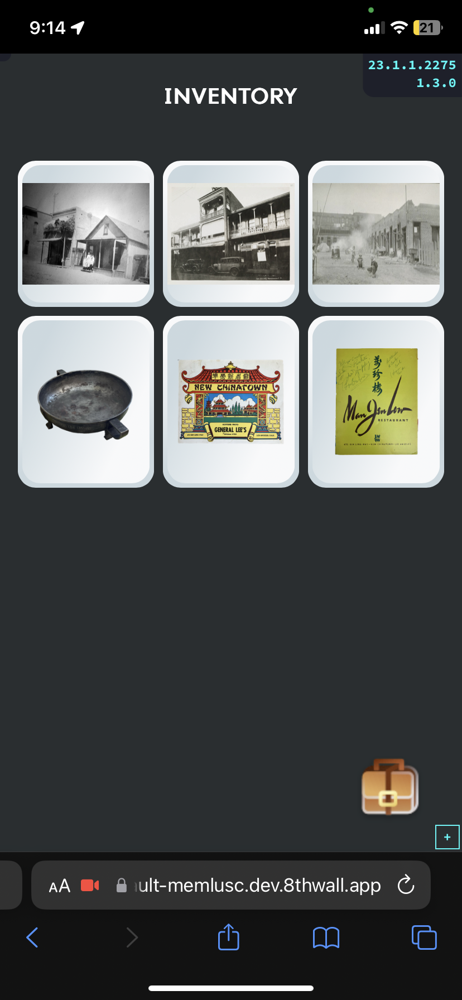
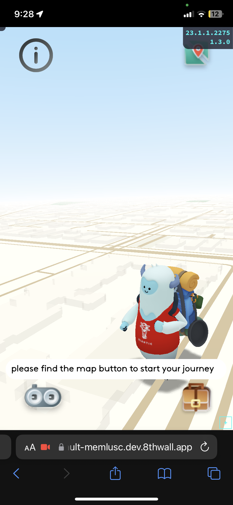
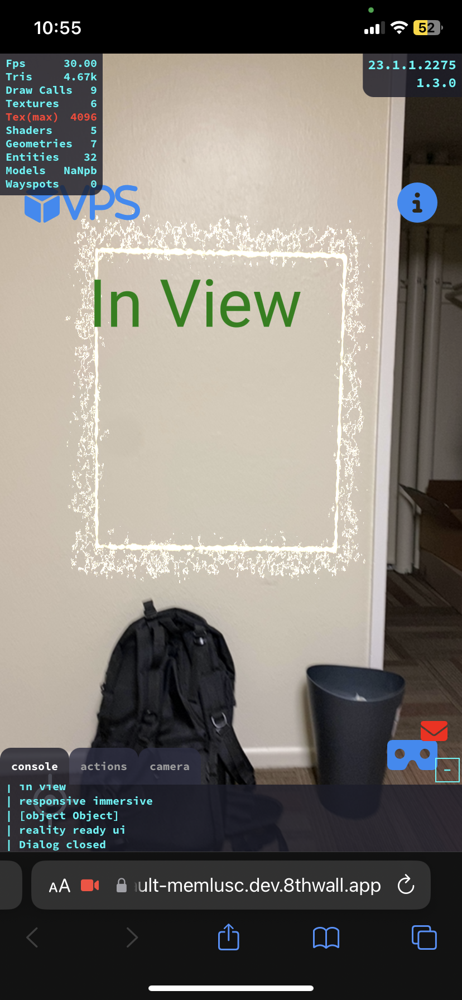

<figure style="display: block; margin: 0 auto; text-align: center">

<figcaption></figcaption>
</figure>

---

<b>Position:</b> Lead Developer (Web, AR)
<ul>
    <li><b>Project:</b> Chinatown AR Experience</li>
    <li><b>Sponsor:</b> NEH Foundation</li>
    <li><b>Location:</b> Huntington, LA Metro</li>
    <li><b>Date:</b> August 2023 - present</li>
</ul>

<b>Team:</b> USC Mobile & Environmental Media Lab (Led by Professor Scott Fisher)
<ul>
    <li>Directed cross-functional teams consisting of 10+ developers, designers, and producers.</li>
    <li>Actively coordinated with 8th Wall employees for technical solutions and bug reporting.</li>
</ul>

<b>Venue:</b> Union Station, Los Angeles Chinatown

<b>Type:</b> Web-based Augmented Reality Website

<b>Tools:</b>
<ul>
    <li>8th Wall</li>
    <li>AFRAME API</li>
    <li>Vanilla Javascript</li>
    <li>Blender</li>
</ul>

<figure style="display: block; margin: 0 auto; text-align: center">

<figcaption></figcaption>
</figure>
 

<b>Environment Construction:</b>
<ul>
    <li>Designed an 8th Wall Augmented Reality website spanning 5+ pages with scene transitions.</li>
    <li>Integrated the narrative of Chinatown history into the AR experience.</li>
    <li>Used the Visual Positioning System based on Aframe and 8th Wall API.</li>
</ul>

<b>Visual Effects:</b>
<ul>
    <li>Developed occlusion effects for the portal and embedded 3D models.</li>
    <li>Implemented UI/UX design, curating 5+ scene transitions between user menus and AR scenarios.</li>
</ul>

<b>Player Interaction:</b>
<ul>
    <li>Developed AR features, inventory management, and scenes using 8th Wall and AFRAME API.</li>
    <li>Incorporated camera raycasting for enhanced AR interactivity.</li>
    <li>Engineered a system to check the camera frustum for AR objects.</li>
    <li>Created a proximity detection system with the target to refine user experience during portal interactions.</li>
</ul>

<b>Infrastructure:</b>
<ul>
    <li>Guided the optimization process alongside 3 designers to refine GLB/GLTF models, focusing on texture management and Draco compression.</li>
</ul>

<figure style="display: block; margin: 0 auto; text-align: center">

<figcaption>Testing AR VPS mesh, 3D models, and occlusion effects on desktop debugging</figcaption>
</figure>
 

<figure style="display: block;width: 300px;height: auto; margin: 0 auto; text-align: center">

<figcaption>Mockup of intro scene (debug mode)</figcaption>
</figure>
 

<figure style="display: block;width: 300px;height: auto; margin: 0 auto; text-align: center">

<figcaption>Inventory UI menu for Chinatown storytelling</figcaption>
</figure>
 

<figure style="display: block;width: 300px;height: auto; margin: 0 auto; text-align: center">

<figcaption>8th wall map for GPS world map and cute doty </figcaption>
</figure>
 

<figure style="display: block;width: 300px;height: auto; margin: 0 auto; text-align: center">

<figcaption>8th wall map for VPS registered public wayspot</figcaption>
</figure>
 

<figure style="display: block;width: 300px;height: auto; margin: 0 auto; text-align: center">

<figcaption>8th wall VPS coaching overlay UI for GPS object detection</figcaption>
</figure>
 

<figure style="display: block; margin: 0 auto; text-align: center">

<figcaption>screenshot of desktop debugging of VPS and 3D AR objects</figcaption>
</figure>
 

<figure style="display: block; margin: 0 auto; text-align: center">

<figcaption>screeshot of code base</figcaption>
</figure>

<figure style="display: block;width: 300px;height: auto; margin: 0 auto; text-align: center">

<figcaption>In view component testing with camera raycast function</figcaption>
</figure>
 

<figure style="display: block;width: 300px;height: auto; margin: 0 auto; text-align: center">

<figcaption>On-site testing at Union Station, Los Angeles</figcaption>
</figure>
 
