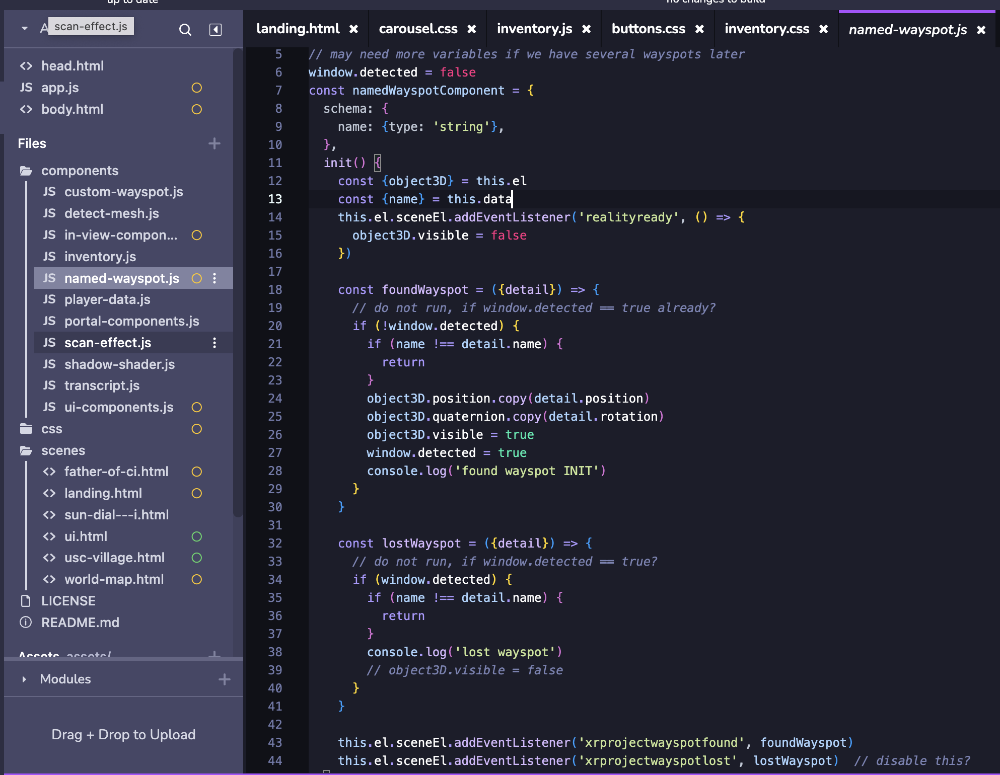

<figure style="display: block; margin: 0 auto; text-align: center">

<figcaption></figcaption>
</figure>

---

<iframe width="100%" height="640" src="https://www.youtube.com/embed/1yNCYzpc9Mg?si=QAMN62-GgQh94J9C" title="YouTube video player" frameborder="0" allow="accelerometer; autoplay; clipboard-write; encrypted-media; gyroscope; picture-in-picture; web-share" allowfullscreen></iframe>

### Please watch the video for the full on-site AR experience

<br />

<b>Position:</b> Lead Developer (Web, AR)
<ul>
    <li><b>Project:</b> Chinatown AR Experience</li>
    <li><b>Sponsor:</b> NEH Foundation</li>
    <li><b>Location:</b> Huntington, LA Metro</li>
    <li><b>Date:</b> August 2023 - present</li>
</ul>

<b>Team:</b> USC Mobile & Environmental Media Lab (Led by Professor Scott Fisher)
<ul>
    <li>Directed cross-functional teams consisting of 10+ developers, designers, and producers.</li>
    <li>Actively coordinated with 8th Wall employees for technical solutions and bug reporting.</li>
</ul>

<b>Venue:</b> Union Station, Los Angeles Chinatown

<b>Type:</b> Web-based Augmented Reality Website

<b>Tools:</b>
<ul>
    <li>8th Wall</li>
    <li>AFRAME API</li>
    <li>Vanilla Javascript</li>
    <li>Blender</li>
</ul>

<b>Environment Construction:</b>
<ul>
    <li>Designed an 8th Wall Augmented Reality website spanning 5+ pages with scene transitions.</li>
    <li>Integrated the narrative of Chinatown history into the AR experience.</li>
    <li>Used the Visual Positioning System based on Aframe and 8th Wall API.</li>
</ul>

<b>Visual Effects:</b>
<ul>
    <li>Developed occlusion effects for the portal and embedded 3D models.</li>
    <li>Implemented UI/UX design, curating 5+ scene transitions between user menus and AR scenarios.</li>
</ul>

<b>Player Interaction:</b>
<ul>
    <li>Developed AR features, inventory management, and scenes using 8th Wall and AFRAME API.</li>
    <li>Incorporated camera raycasting for enhanced AR interactivity.</li>
    <li>Engineered a system to check the camera frustum for AR objects.</li>
    <li>Created a proximity detection system with the target to refine user experience during portal interactions.</li>
</ul>

<b>Infrastructure:</b>
<ul>
    <li>Guided the optimization process alongside 3 designers to refine GLB/GLTF models, focusing on texture management and Draco compression.</li>
</ul>

## 3D modeling integration

- Used the metric reflecting the real distance relative to the wayspot
    - Measured the entire LA UNION STATION sundial wayspot venue
    - To make sure the AR 3D model to spawn at the desired location when the users scan the wayspot
- Optimization for web, app, XR
    - 1. Initially, the model's filesize was too big to be used in web
    - 2. Troubleshooted if it were Rhino problem, or mesh or texture issues
    - 3. Rhino uses NURBS, Maya and Blender you can use Polygon instead NURBS
    - 4. Texture file size was too big. The ideal or maximum size of texture would be 1024x1024.
    - 5. Texture file format: png to jpg. Reduce filesize
    - 6. Upload the entire 3D model with UV mapped to gltf.report website which allows you to optimize texture size as well as 3D modeling compression, using draco technology developed by google.
    - 7. 8th wall only supports glb 3D file format, which is preferred in most of web-based 3D assets even in other libraries such as threejs.
        - You can use draco compression on glb, gltf file format.
        - Maya doesn't support glb/gltf export, so we had to ultimately use Blender as the last part of 3D pipeline.
    - 8th Wall / A-frame API: simple way to integrate 3D or webVR into the website. A-frame is an eaiser wrapper library of threejs. 
    - draco: `gltf-model="dracoDecoderPath: https://cdn.8thwall.com/web/aframe/draco-decoder/`

<figure style="display: block; margin: 0 auto; text-align: center">

<figcaption>Niantic 8thwall Editor view. Optimized 3d model with less than 1MB</figcaption>
</figure>

```html
// loading in the beginning of the scene. 
<a-scene
  landing-page
  activate-portal
  vps-coaching-overlay
  background="color: #303030"
  renderer="colorManagement: true"
  gltf-model="dracoDecoderPath: https://cdn.8thwall.com/web/aframe/draco-decoder/"
  xrextras-runtime-error
  xrextras-loading
  ui-component="currentScene: mobileSundial;"
  xrweb="enableVps: true; allowedDevices: any">
  <a-assets>
    <a-asset-item id="vps-mesh" src="../assets/glb/sun-dial---i.glb"></a-asset-item>
    <a-asset-item
      id="men-jen-low"
      src="../assets/glb/2023-10-11_MenJenLowBlock_Frame_Without_extrusion-draco.glb"></a-asset-item>
    <a-asset-item id="portal-frame" src="../assets/glb/portal-frame.glb"></a-asset-item>
    
    <video
      id="portal-video"
      muted
      autoplay
      playsinline
      crossorigin="anonymous"
      loop="true"
      src=".././assets/video/manjenlow_monet_2.mp4"></video>

    
    
    
  </a-assets>
```

```html
// After you scan sun-dial, all the a-entity tags inside this will appear
<a-entity id="VPSMesh" named-wayspot="name: sun-dial---i">

     <!-- Made MJL model transparent in the beginning. -->
    <a-entity
    id="ghostBuilding"
    gltf-model="#men-jen-low"
    model-transparent="opacity: 0.3">
    </a-entity>

    <!-- all other AR objects you want to spawn -->

    <!-- Inside the portal. Same building without transparency -->
    <a-entity
        id="men-jen-low"
        gltf-model="#men-jen-low"
        reflections="type: realtime"
        shadow="receive: false">
    </a-entity>
</a-entity>
```

<figure style="display: block; margin: 0 auto; text-align: center">

<figcaption>Final App Design</figcaption>
</figure>
<br />

<figure style="display: block; margin: 0 auto; text-align: center">

<figcaption>screeshot of code base</figcaption>
</figure>
<br />

<figure style="display: block; margin: 0 auto; text-align: center">

<figcaption>Testing AR VPS mesh, 3D models, and occlusion effects on desktop debugging</figcaption>
</figure>
<br />

<figure style="display: block; margin: 0 auto; text-align: center">

<figcaption></figcaption>
</figure>
<br/>

<figure style="display: block;width: 300px;height: auto; margin: 0 auto; text-align: center">

<figcaption>8th wall map for VPS registered public wayspot</figcaption>
</figure>
<br />

<figure style="display: block;width: 300px;height: auto; margin: 0 auto; text-align: center">

<figcaption>8th wall VPS coaching overlay UI for GPS object detection</figcaption>
</figure>
<br />

<figure style="display: block; margin: 0 auto; text-align: center">

<figcaption>screenshot of desktop debugging of VPS and 3D AR objects</figcaption>
</figure>
<br />