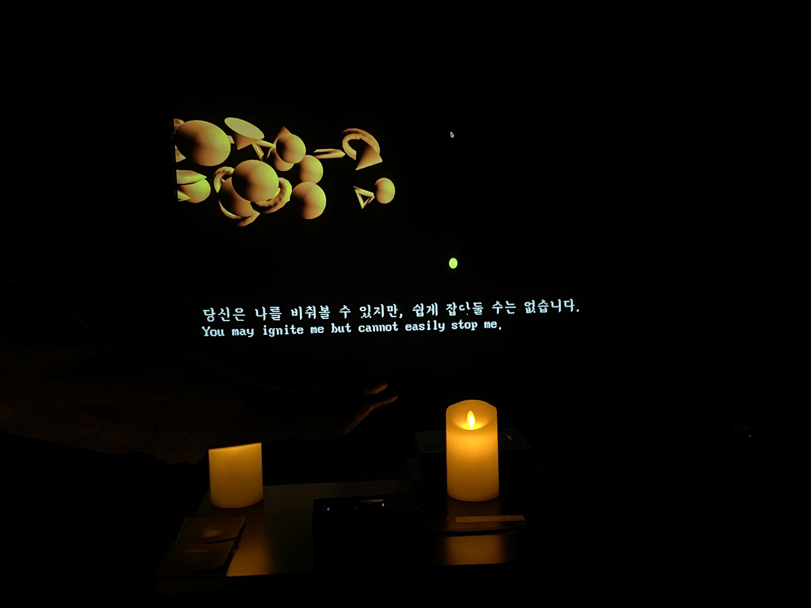

Creator: So Sun Park  
Venue: <a target="_blank" rel="noreferrer" href="https://www.instagram.com/chwihyang.gwan/">Chwi Hyang Gwan 취향관</a>, 합정 문화살롱 공간, cultural salon venue in Seoul  
Type: Interactive Media Installation with Pop-up event of music, bar, board games 
Tools: P5 JS, Leap Motion 립모션 
Date: 2021.5.21 ~ 22  
Thanks to: @azure_kisser curator | @doodlefingers @geo.ji_ @ok_hanna_ok for photos and videos 

<iframe width="100%" height="400" src="https://www.youtube.com/embed/aO-NJDvEL2o" title="YouTube video player" frameborder="0" allow="accelerometer; autoplay; clipboard-write; encrypted-media; gyroscope; picture-in-picture" allowfullscreen></iframe>

‘나’는 누구일까요?

《**무의식**》은 나의 의식, 잠재의식, 그리고 무의식을 찾아가는 여정을 선사한다.

이 작품은 게임처럼 각 장면마다 질문을 던지고, 당신의 손 제스쳐를 이용해 특별한 인터렉션을 만들어낸다. 명상 및 마인풀니스에서 배우는 바디스캐닝 기법에 영감받아 만든 작품이며, 새로운 나를 발견하는 과정을 인터렉티브하게 풀어냈다. 관객이 손의 움직임에 집중함으로써 지금 이 순간에 몰입하도록 경험을 연출한다.

관객은 화면 속의 글을 읽고 손을 어떻게 활용할지 예상하고 실험한다. 어두운 방의 희미한 불빛 속에서 명상 음악을 듣고, 손의 움직임에 따라 변하는 거대한 장면을 관찰하며 손의 감각에 더욱 집중한다. 

Who am ‘I’ ?

《**Subconscious**》 offers a journey of finding your own subconscious self. By leading the audience to focus on her hand's movement, it creates the experience of 'being present at the moment'.

At each scene, it throws a question like a game, and creates special interactions based on your hand motions. This work has been inspired by meditation and mindfulness, and interprets such practices of finding oneself in an interactive way.

사용 기술: Javascript, P5 JS, Leap Motion

<figure style="display: block; margin: 0 auto; text-align: center">

<figcaption></figcaption>
</figure>

<figure style="display: block; margin: 0 auto; text-align: center">

<figcaption></figcaption>
</figure>

<figure style="display: block; margin: 0 auto; text-align: center">

<figcaption></figcaption>
</figure>

<figure style="display: block; margin: 0 auto; text-align: center">

<figcaption></figcaption>
</figure>

<figure style="display: block; margin: 0 auto; text-align: center">

<figcaption></figcaption>
</figure>

<figure style="display: block; margin: 0 auto; text-align: center">

<figcaption></figcaption>
</figure>

<figure style="display: block; margin: 0 auto; text-align: center">

<figcaption></figcaption>
</figure>

<figure style="display: block; margin: 0 auto; text-align: center">

<figcaption></figcaption>
</figure>

<figure style="display: block; margin: 0 auto; text-align: center">

<figcaption></figcaption>
</figure>

<figure style="display: block; margin: 0 auto; text-align: center">

<figcaption></figcaption>
</figure>

<figure style="display: block; margin: 0 auto; text-align: center">

<figcaption></figcaption>
</figure>

<figure style="width: 70%; display: block; margin: 0 auto; text-align: center">

<figcaption>photo by @segaoni</figcaption>
</figure>

<figure style="width: 70%; display: block; margin: 0 auto; text-align: center">

<figcaption>photo by @segaoni</figcaption>
</figure>

<figure style="width: 70%; display: block; margin: 0 auto; text-align: center">

<figcaption>photo by @segaoni</figcaption>
</figure>

<figure style="width: 70%; display: block; margin: 0 auto; text-align: center">

<figcaption>photo by @segaoni</figcaption>
</figure>