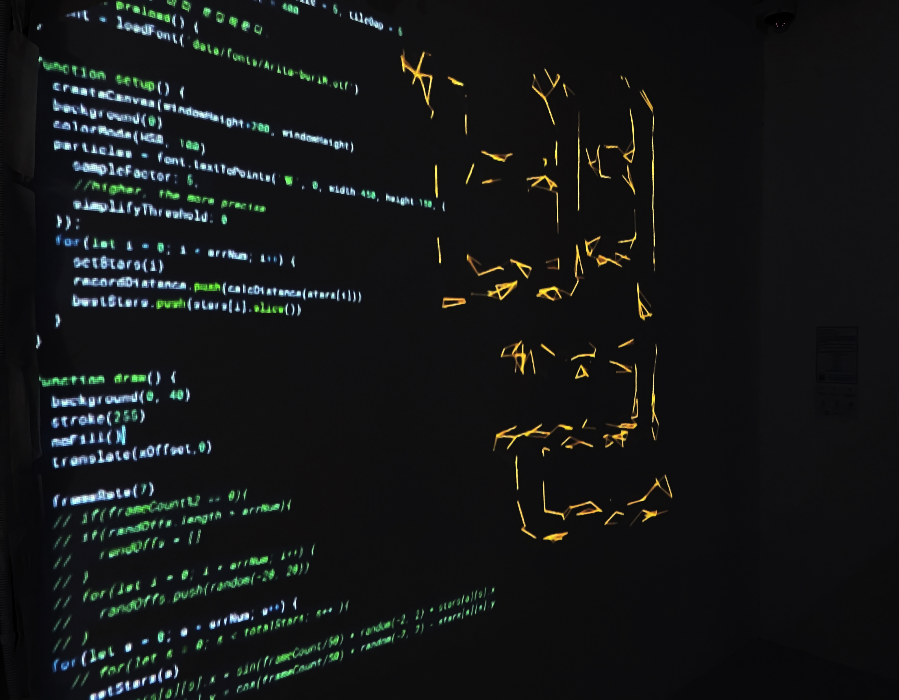
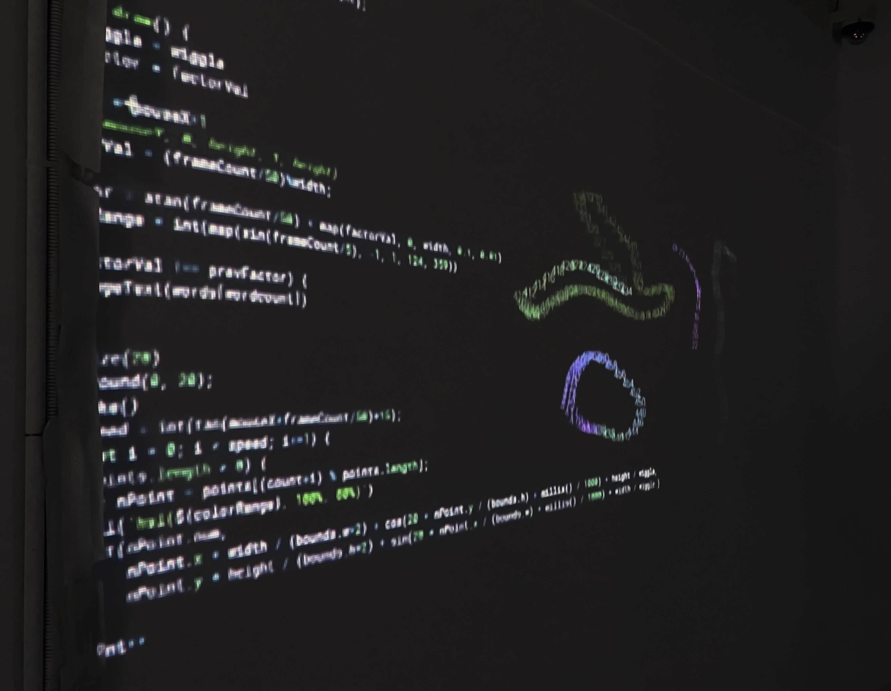
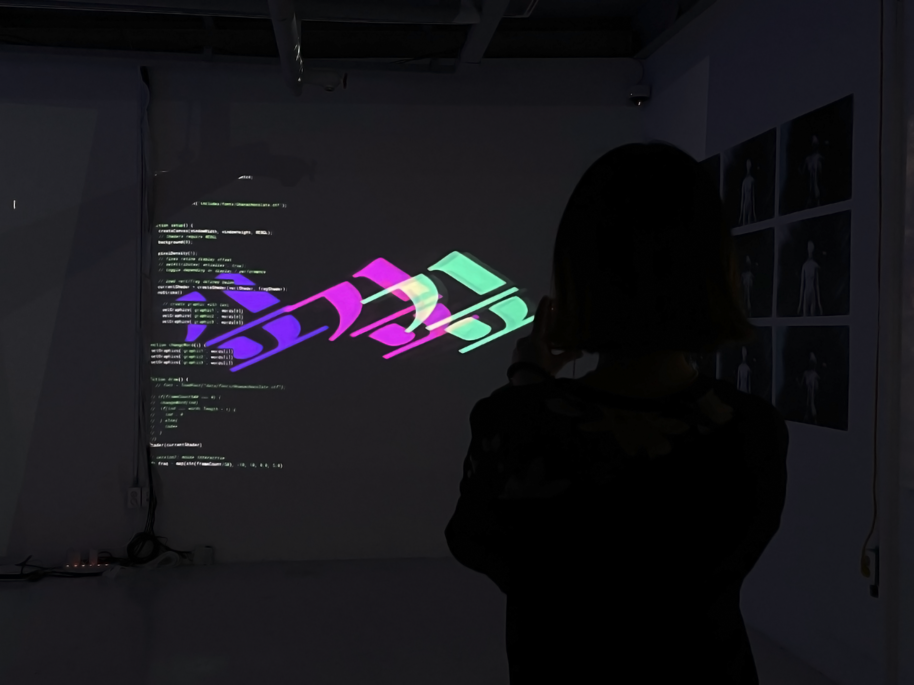
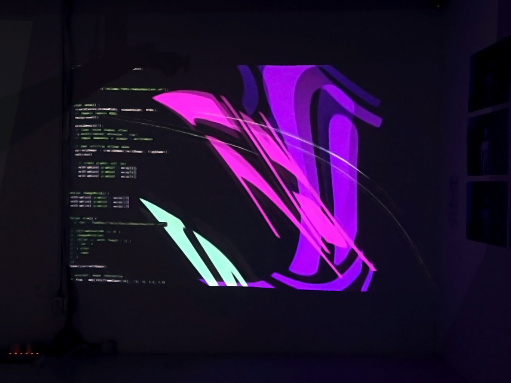
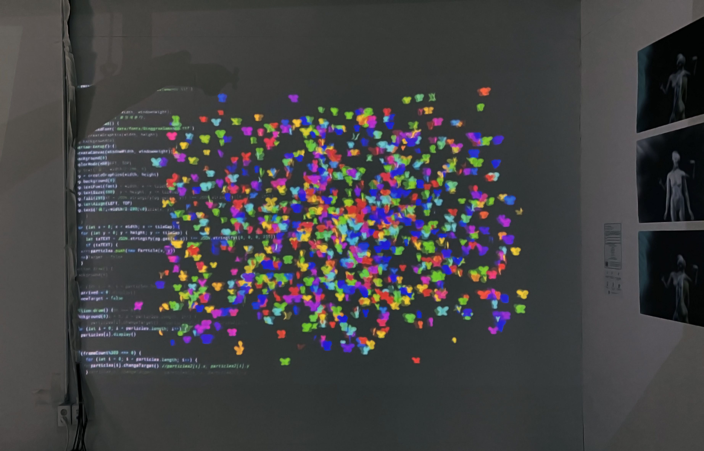
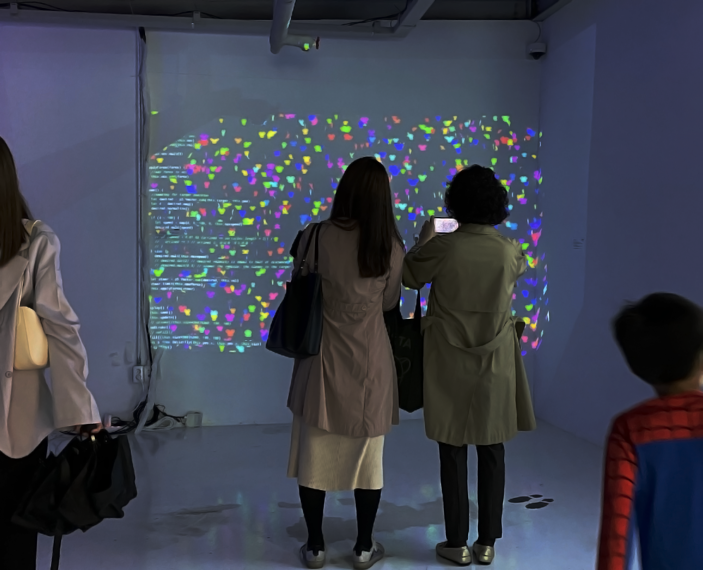
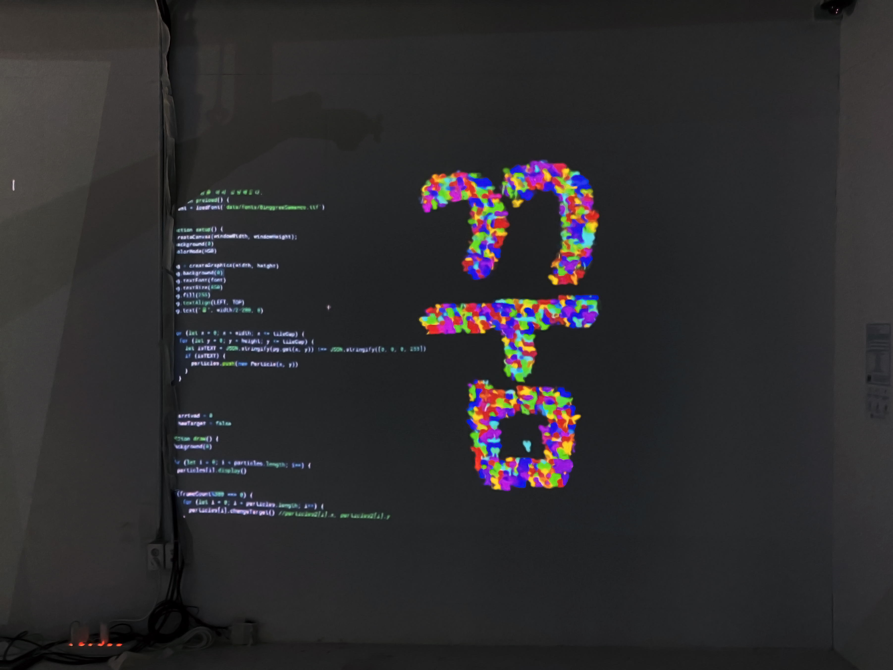

Position: Creative Technologist, Artist 
Topic: Creative Coding, Generative Arts  
Venue: <a target="_blank" rel="noreferrer" href="https://www.instagram.com/kote.kr/">인사동 KOTE Gallery</a>, Seoul  
Type: Video Installation @ Continuous Flow Group Exhibition 
Tools: P5 JS, Kinetic Typography, Matter JS, P5 LIVE, EPSON Projector, DIVIX 
Date: 2021.4.16 ~ 5.15  
Thanks to: @bektodam @minhee51 curator | @amazing_mina for photos and videos

<h3>
A video installation of generative kinetic typography works made with Javascript (p5js, matterjs) and WebGL, inspired by typography designs and #36DaysOfType. </h3>
 

<figure style="display: block; margin: 0 auto; text-align: center">

<figcaption>Instagram Screenshot</figcaption>
</figure>

<figure style="display: block; margin: 0 auto; text-align: center">

<figcaption>Exhibition Poster</figcaption>
</figure>

For 3 months, I created Kinetic Typography works with Korean alphabet(Hangeul) using creative coding, inspired by #36DaysOfType challenge. I <a target="_blank" rel="noreferrer" href="https://www.instagram.com/sosunnyproject/guide/kinetic-typo-w-creative-coding/17860081709387557/">uploaded them on Instagram</a> to take full advantage of its grid structure. After some recompilation and edits, I made a video of the series and installed at Media Arts group exhibition in KOTE gallery, Seoul.

Each syllable of Hangeul embeds either certain meaning or grammatical function. 
I filled each grid with one syllable and visualize its meaning or function.

9 letters in a row form a poetic sentence. I restructured the words from Park Hyo Shin's **I am A Dreamer** album's songs to make a sentence.

Made with P5 JS, Matter JS, P5 Live.

3개월간 <a target="_blank" rel="noreferrer" href="https://www.instagram.com/sosunnyproject/guide/kinetic-typo-w-creative-coding/17860081709387557/">인스타그램에서 자바스크립트 코딩으로 한글 키네틱 타이포그래피 작업을 연재했다.</a>
기존에서 인스타그램에 올렸던 작업을 하나의 영상으로 재편집해서 인사동 KOTE 갤러리에 영상 설치물로 전시했다.

알파벳을 하루에 하나씩 디자인해서 공유하는 #36daysOfType 을 보고 시작했다. 
음절 하나에도 의미나 구조가 담긴 한글은 인스타그램 그리드 구조에 적합했다.
각 음절의 의미를 살려서 모양을 시각화하거나 전치사 같은 문법적인 음절은 물리 엔진을 사용해서 표현했다.

9글자를 이으면 시적인 문장이 탄생하도록 기획함으로써 인스타그램의 연속적인 그리드를 효과적으로 사용했다.
가수 박효신의 정규 7집 **I am A Dreamer** 수록곡의 제목이나 가사에서 발췌한 음절들을 재구성해서 문장으로 만들었다.

<figure style="display: block; margin: 0 auto; text-align: center">

<figcaption>Star in Korean. Recorded on p5live website</figcaption>
</figure>

<figure style="display: block; margin: 0 auto; text-align: center">

<figcaption>'헤' in Korean. Inspired by numbers and matrix</figcaption>
</figure>

<figure style="display: block; margin: 0 auto; text-align: center">

<figcaption>Deep in Korean. WebGL x p5js</figcaption>
</figure>

<figure style="display: block; margin: 0 auto; text-align: center">

<figcaption>Deep in Korean. WebGL x p5js</figcaption>
</figure>

<figure style="display: block; margin: 0 auto; text-align: center">

<figcaption>Butterfly shapes with p5js</figcaption>
</figure>
<figure style="display: block; margin: 0 auto; text-align: center">

<figcaption>Exhibition site</figcaption>
</figure>
<figure style="display: block; margin: 0 auto; text-align: center">

<figcaption>Dream in Korean. </figcaption>
</figure>
