## Links
- [OpenProcessing](https://openprocessing.org/user/238026/?view=sketches&o=211): Open Source Archive for p5js / processing works
- [Instagram](https://www.instagram.com/sosunnyproject/)

<figure style="display: block; width: 70%; margin: 0 auto; text-align: center">
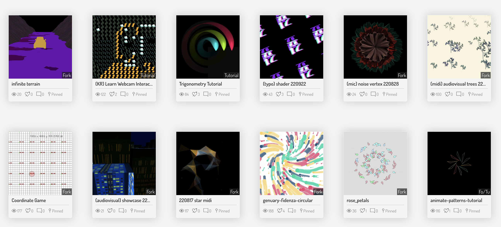
<figcaption>OpenProcessing: open source codes and resources for creative coding practices and teaching</figcaption>
</figure>

<hr >

## Here, I'd like to explain a few of my generative arts programming practices and algorithms. Please check the links above for more.

# 3D Spherical Vertex

<br />
<figure style="display: block; width: 70%; margin: 0 auto; text-align: center">
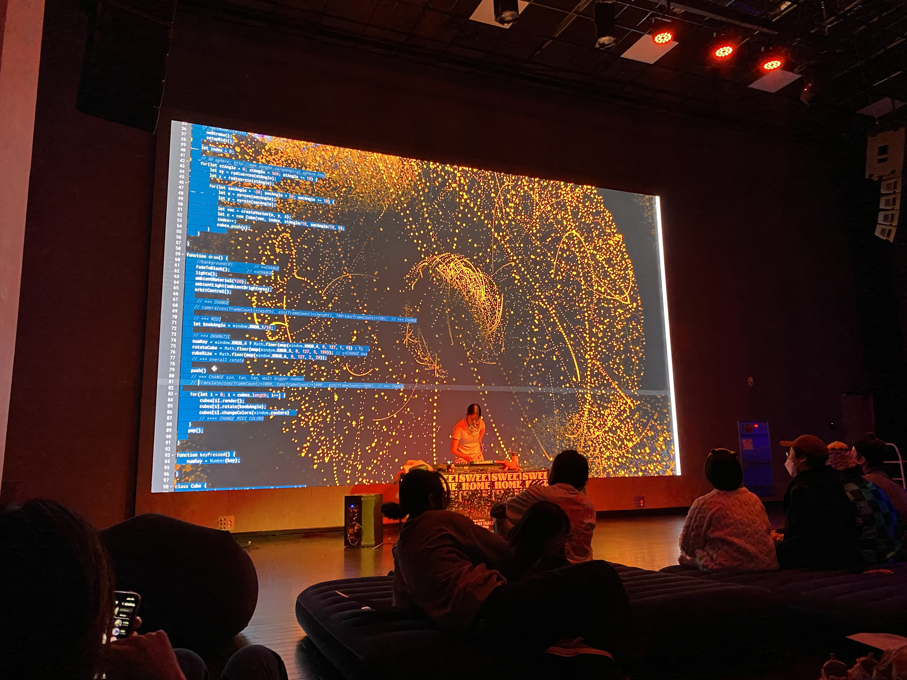
<figcaption>AudioVisual with P5js, P5LIVE, WEBGL, MIDI controller performance at Seoul Artists' Platform New & Young</figcaption>
</figure>
<br />

## Position small cubes into 3D Sphere vertex coordinates
- Similar concept/result of [Houdini's [CopyToPoints Node] with Sphere](https://www.youtube.com/watch?v=7Jg189FyFWs&list=PLdFfFRXT0K_gyA6VVBnYVDgAEGYeaJlKN&index=2) 
- Make class and properties for each cube. Each has a slightly different values for rotation, position, and colors.
- Instead of making thousands of cubes, I make limited instanced of cubes for the performance. 
  - I let the cubes to be rendered on the canvas and leave the rendering trace. And then, covering the canvas of black plane, imitaing as if the canvas is getting erased. 
- Reference: [OpenGL Sphere algorithm](http://www.songho.ca/opengl/gl_sphere.html)
- [Basic Version Code Live Preview 1](https://openprocessing.org/sketch/1627906)

```js
for(let stAngle = 0; stAngle < 360; stAngle += 10) {
  let xy = radius*cos(stAngle);  
  let z = radius*sin(stAngle);
  
  for(let secAngle = -40; secAngle < 40; secAngle += 10) {
    let x = xy*cos(secAngle);
    let y = xy*sin(secAngle);
    
    let vec = createVector(x, y, z);
    let c = new Cube(vec, index, stAngle/10, secAngle/10, 0);
    index++;
    cubes.push(c);
  }		
}
```

```js
class Cube {
	constructor(pos, ind, stIndex, secIndex, angle) {
		this.index = ind
		this.angle = angle;
		this.pos = pos;
		this.gap = 20;
		this.stIndex= stIndex;
		this.secIndex = secIndex;
		this.col = color(random(colors));
	}
	
	render() {
      rotateX(40+sin(frameCount/2)*(10*this.index));
      rotateZ(-100+sin(frameCount/2)*(10*this.index));
      push();
      translate(this.pos.x*this.gap, this.pos.y*this.gap, this.pos.z*this.gap);
      if(this.index%3 === 0) { 
        rotateX(this.angle);
      } else if(this.index%3 === 1) {
        rotateY(this.angle);
      } else if(this.index%3 === 2) {
        rotateZ(this.angle);
      }
      ambientMaterial(this.col);
      box(4);
      pop();
      if(this.index%numKey === 0) {
        this.gap = tan(frameCount/4) * 40;
      } else {
        this.gap = 10 + 20 * cos(frameCount/10);
      }
    }
	
	rotate(t) {
		this.angle += t;
	}
}
```

<figure style="display: block; width: 70%; margin: 0 auto; text-align: center;">
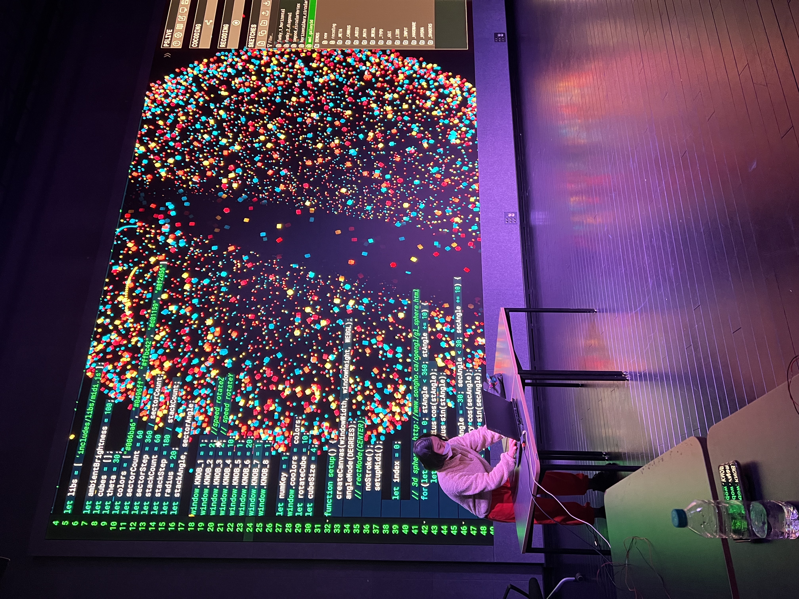
<figcaption>AudioVisual with P5js, P5LIVE, WEBGL, MIDI controller  LIVE CODING performance at Seoul Artists' Platform New & Young</figcaption>
</figure>
<br />


<hr >

# 2D Vertex + Bezier Manipulation

<figure style="display: block; width: 70%; margin: 0 auto; text-align: center">
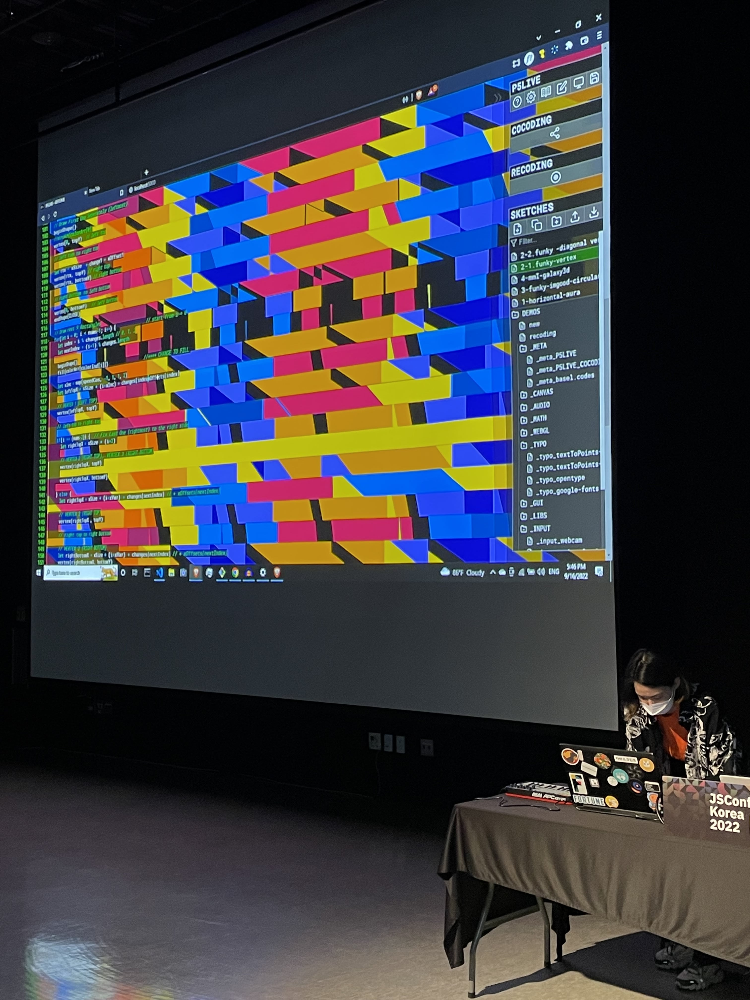
<figcaption>AudioVisual with P5js, P5LIVE, WEBGL, MIDI controller LIVE CODING performance at JSCONF Korea</figcaption>
</figure>
<br />

## Progress & Development
1. Divide each row, columns. Divide a row into several vertex points
2. Conditionally fill the space inide vertex or stroke only
- [code live preview](https://openprocessing.org/sketch/1615639)
- [code live preview 2](https://openprocessing.org/sketch/1637853)  

<figure style="display: block; width: 70%; margin: 0 auto; text-align: center">
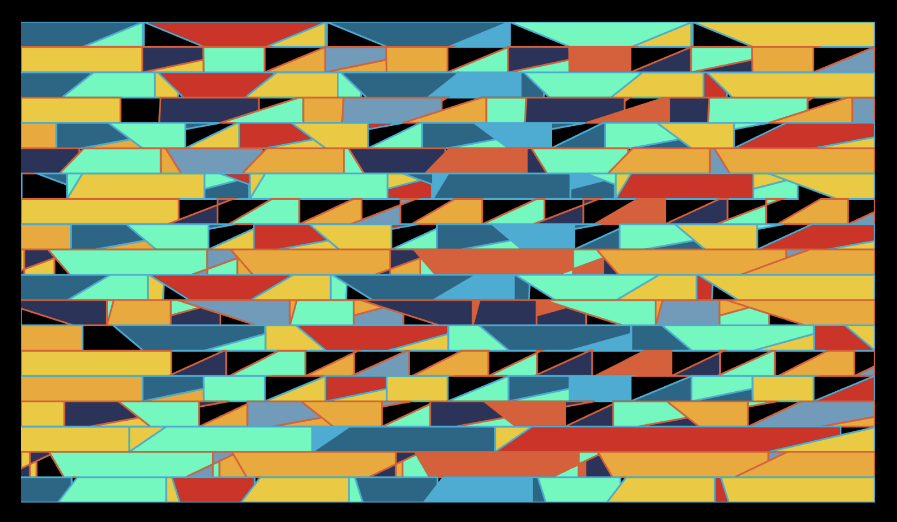
<figcaption>2D horizontal, vertical bezier vertex segments</figcaption>
</figure>

<figure style="display: block; width: 70%; margin: 0 auto; text-align: center">
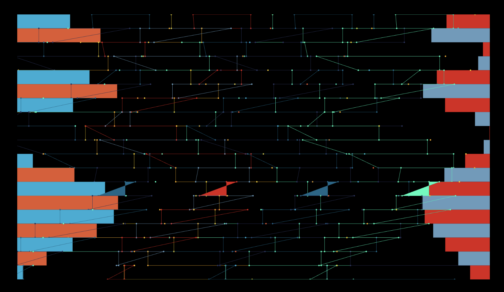
<figcaption>2D horizontal, vertical bezier vertex segments</figcaption>
</figure>

<figure style="display: block; width: 70%; margin: 0 auto; text-align: center">
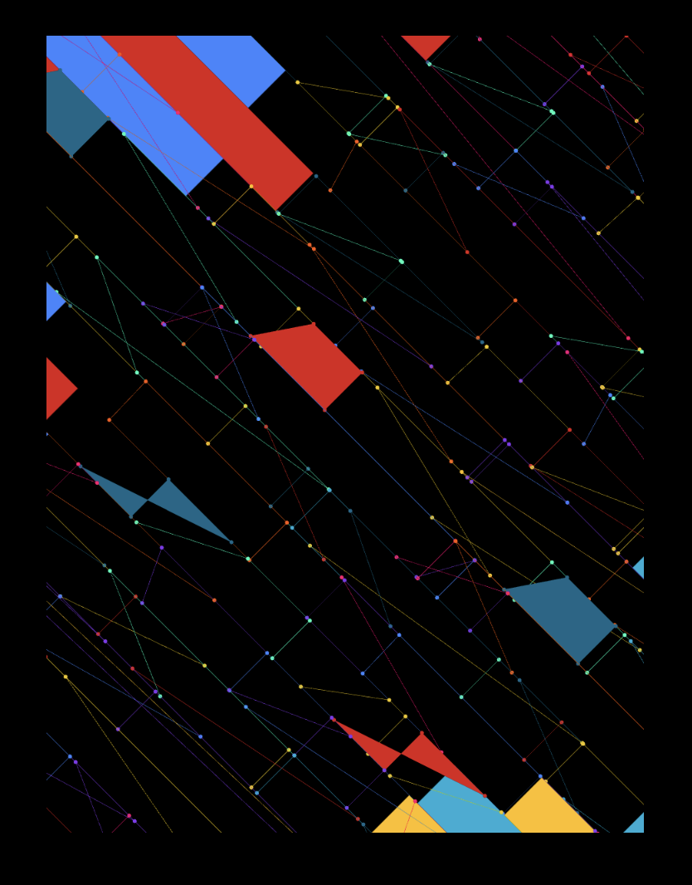
<figcaption>2D horizontal, vertical bezier vertex segments</figcaption>
</figure>

5. Change vertex to **Curve Vertex or Bezier Vertex** makes the **wavy, dynamic visuals**
- [code live preview: version2.js](https://openprocessing.org/sketch/1615640)

<figure style="display: block; width: 70%; margin: 0 auto; text-align: center">
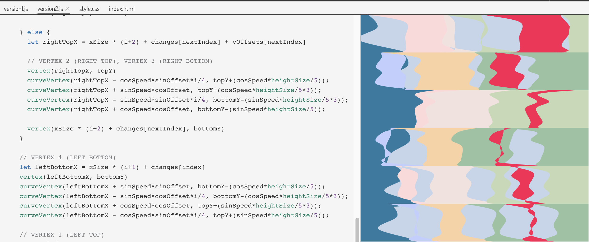
<figcaption>Bezier, Curve Vertex Update</figcaption>
</figure>

<figure style="display: block; width: 70%; margin: 0 auto; text-align: center">
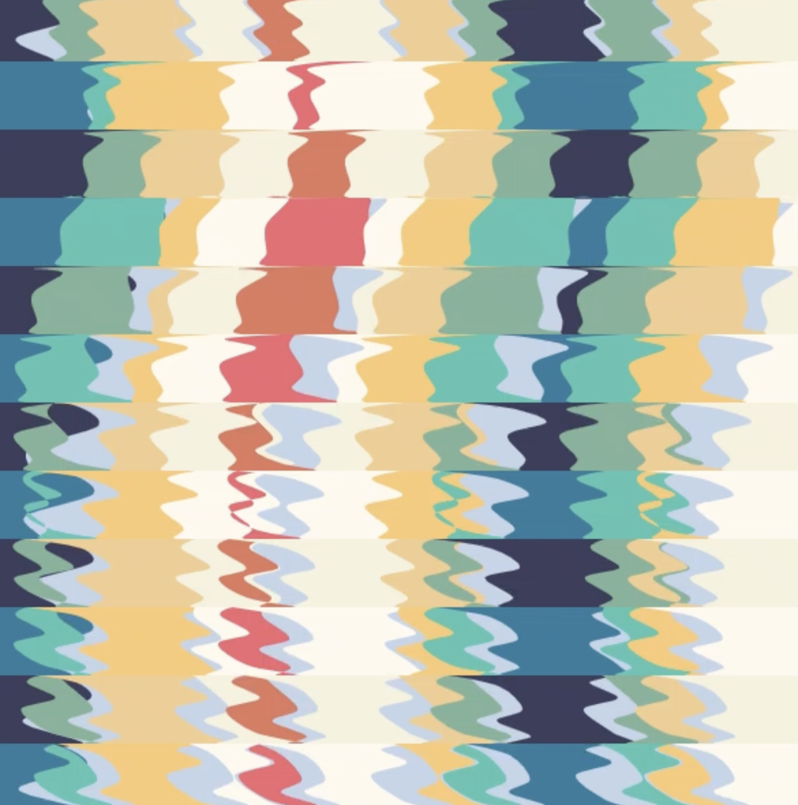
<figcaption>Bezier, Curve Vertex</figcaption>
</figure>

<figure style="display: block; width: 70%; margin: 0 auto; text-align: center">
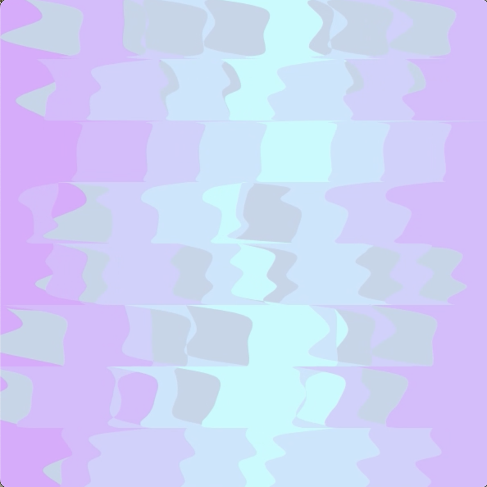
<figcaption>Bezier, Curve Vertex</figcaption>
</figure>


<hr >

# 2D Circular Vertex Animation (Trignometry)

- Trigonometry
- Animation of size: tangent function, audio volume input
- [Code & Live Preview](https://openprocessing.org/sketch/1637856)
- [Code version 2](https://openprocessing.org/sketch/1615636)

<figure style="display: block; width: 70%; margin: 0 auto; text-align: center">
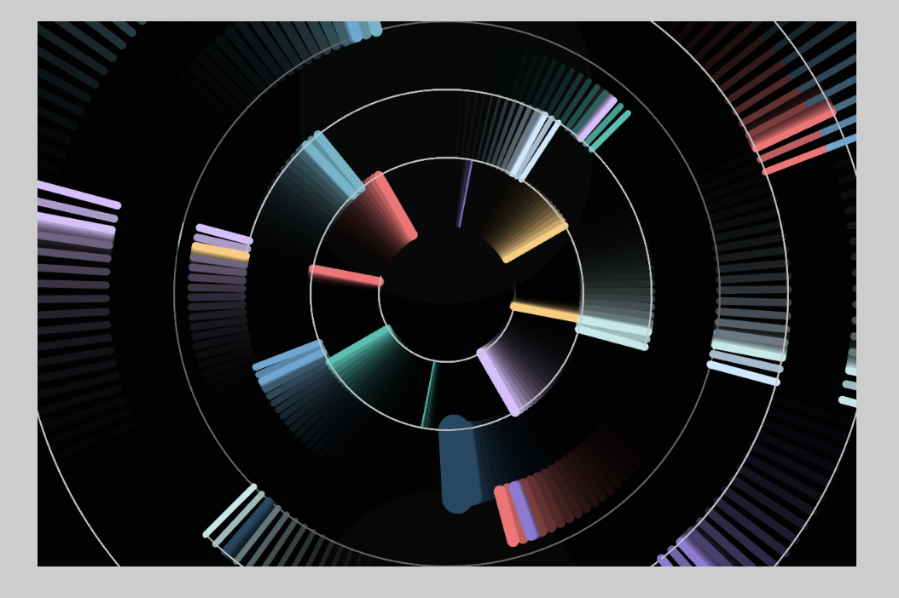
<figcaption>Circular Vertex Segments</figcaption>
</figure>

1. Define each circular segment. It should start after the last inner circle.
```js
function drawCircleSegments(speed, innerRadius, outerRadius, col) {
  let x1 = cos(speed)*innerRadius // change to tan, sin
  let y1 = sin(speed)*innerRadius 
  let x2 = cos(speed)*outerRadius
  let y2 = sin(speed)*outerRadius 
  let thickness = map(tan(speed), -5, 5, 1, strokeW) // change speed*2

  push()
  strokeWeight(thickness)
  stroke(col)
  point(x1, y1)
  point(x2, y2)
  line(x1, y1, x2, y2)
  pop()
}
```

2. For each segment, loop through the amount of numbers you want for rotating elements inside each segment
```js
for(let i = 0; i < 6; i++) {
  let speed = speed1
  if(i % 3 === 0) speed = speed2
  drawCircleSegments(speed + TWO_PI/10*i, r6, r6*1.25, colors[1][i])
}
// lines separating the segments at each radius
arc(0, 0, r6*1.25*2, r6*1.25*2, speed1 + TWO_PI/6*2, speed2 + TWO_PI/6*5)
arc(0, 0, r6*1.25*2, r6*1.25*2, speed2 + TWO_PI/6*1, speed1 + TWO_PI/6*5)
```

<figure style="display: block; width: 70%; margin: 0 auto; text-align: center">
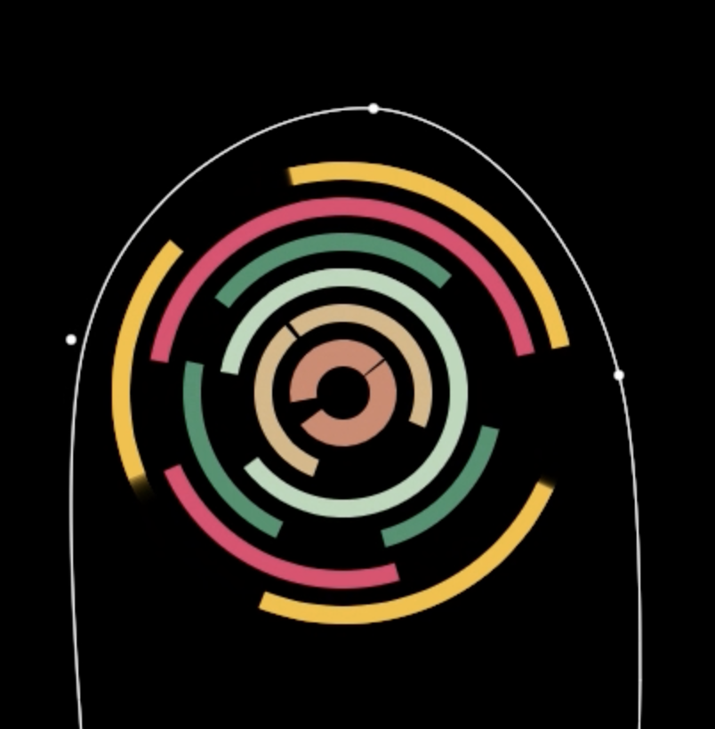
<figcaption>First version: Circular Vertex Segments</figcaption>
</figure>

<figure style="display: block; width: 70%; margin: 0 auto; text-align: center">
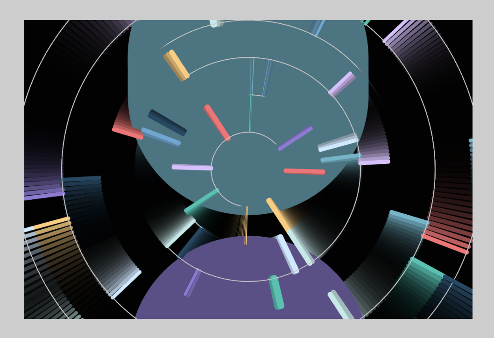
<figcaption>Second version: Circular Vertex Segments</figcaption>
</figure>

<hr >

# For More

### Tip for Cool Designer's eyes
- [coolors.co](https://coolors.co/)

### Instagram feed
<figure style="display: block; width: 70%; margin: 0 auto; text-align: center">
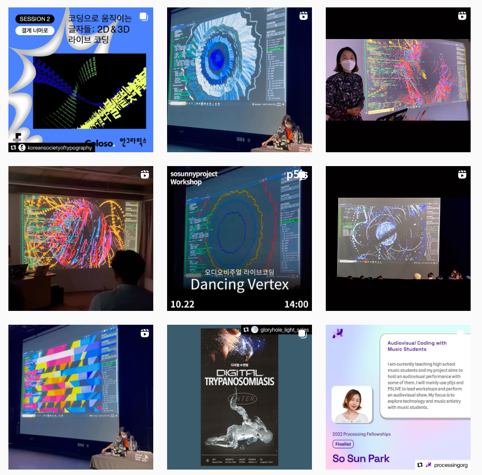
<figcaption>Snapshots of performances and keynotes</figcaption>
</figure>

### Youtube for tutorials and more
<figure style="display: block; width: 70%; margin: 0 auto; text-align: center">

<figcaption>Snapshots of youtube tutorials</figcaption>
</figure>
<br />

