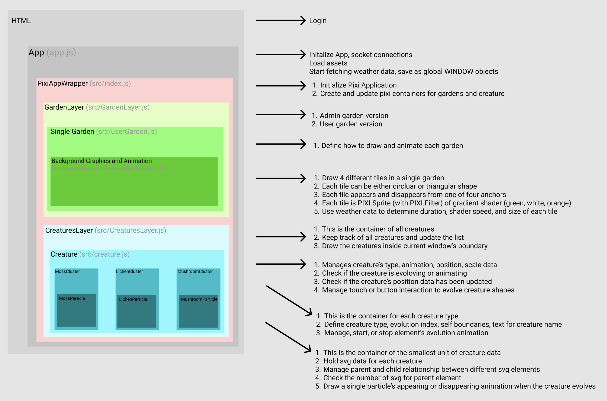

## Procedural / Generative Alogirhtm for Garden Animation

#### [Server / Config](https://github.com/gardenlocal/dwc-v3-socket-server/blob/main/server/controllers/garden.controller.js)
- Shape: Enums - DWC_META.tileShapes.TRIANGLE / CIRCLE
- Duration: Growing from one corner to the diagonal corner
- Anchor: [ 0, 1, 2, 3 ]
- Shader parameters: time seed, speed

#### Client / Rendering
- Troubleshooting process

- Color / Gradient: fragment shader tests: https://github.com/gardenlocal/dwc-v2/tree/main/canvas/src/render/shaders, https://www.shadertoy.com/user/sosunnyproject
- Shapes: Use Tessellation library to customize Triangulate function: https://www.glprogramming.com/red/chapter11.html, https://github.com/memononen/tess2.js
- Send Uniform data to shader
- Weather Data
  - https://github.com/gardenlocal/dwc-v2/blob/main/canvas/src/render/userGarden.js#L54
  - Replicate the real ecosystem and weather relationship
    - higher temperature and higher humidity, higher entrophy and more lively
```js
  async animateBackgrounds() {

    // params based on weather data
    const duration = map(this.temperature, -5, 20, 85000, 25000) // hotter, faster, shorter duration
    const shaderSpeed = map(this.humidity, 40, 80, 1, 0.1)  // more humid, faster    
    const targetSize = map(this.humidity, 40, 80, 0.25, 0.75)  // more humid, larger size

    for(let i = 0; i < this.tilesContainer.children.length; i++) {
      const currentTile = this.userGarden.tileProps[i];
      const currentLoop = currentTile[this.bgAnimationParams.currentTile];
      const shaderRand = shaderSpeed * map(i, 0, 4, 5, 10)

      await this.tilesContainer.children[i].appear(targetSize, duration, currentLoop.shape, currentLoop.anchor, shaderRand) 
      // appear at 0, disappear after bg2+bg3+bg4_duration
    }
    //...
  }
```

Add more variety to Creature SVG logics
- Make a recursive loop to create more children nodes of SVG shapes (smaller SVG shapes attached to a main bigger SVG)
- Adjust/randomize the position of children SVG nodes to overlap slightly
- Adjust the transparency of overall SVG shapes
- https://github.com/gardenlocal/dwc-v3-socket-server/blob/main/shared-constants.js
- https://github.com/gardenlocal/dwc-v2-2022/blob/main/canvas/src/render/Creatures/MushroomCluster.js 

## Technical Documentation

### Client Side: Pixi JS, Garden and Creature Rendering

<figure style="display: block; margin: 0 auto; text-align: center">

<figcaption><garden.local>App Structure Diagram</figcaption>
</figure>

### User Login, Accessibility, Web Service

<figure style="display: block; margin: 0 auto; text-align: center">

<figcaption><garden.local> User Flowchart of Web Application </figcaption>
</figure>


## Key Accomplishments
- Frontend & Graphics Engineer
  - Designed UI UX and developed a mobile website where users could interact with their own virtual garden and creatures
  - Incorporated real-time environmental data, utilizing temperature and humidity readings from Raspberry Pi to 
  dynamically alter animation speeds and garden gradient colors.
  - Collaborated with server-side development utilizing nodejs, socket communication. 
  - Supported transitioning API and database from a local nedb to Supabase, a cloud-based database system.
- Project Manager
  - Successfully managed the 2022 development phase, ensuring timely updates to requirements
  - Revised the SVG generation algorithm, and spearheading graphic code refactoring.


## Technical Highlights
- Enhanced interactive visual experience using pixi js, WebGL, socket, nodejs, and Raspberry Pi.
- Engineered an immersive mobile website experience linked to physical drawing installations, innovative mesh wifi networks, and user-interactive features.
- Ensured website accessibility exclusively through unique mesh wifi networks, named to augment the exhibition theme.


Debrief from Taeyoon
- https://taeyoonchoi.com/garden-local-2022/