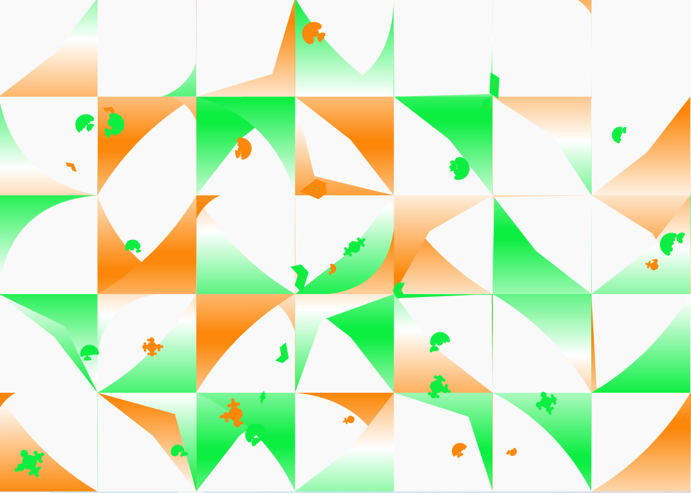
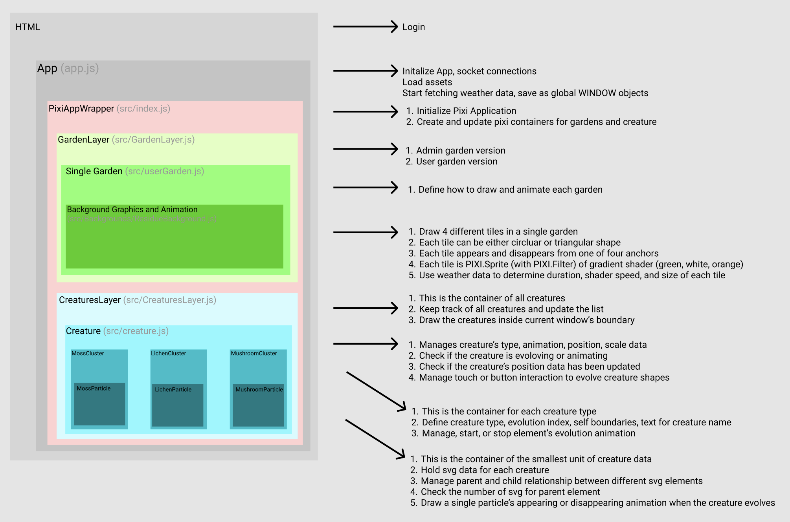
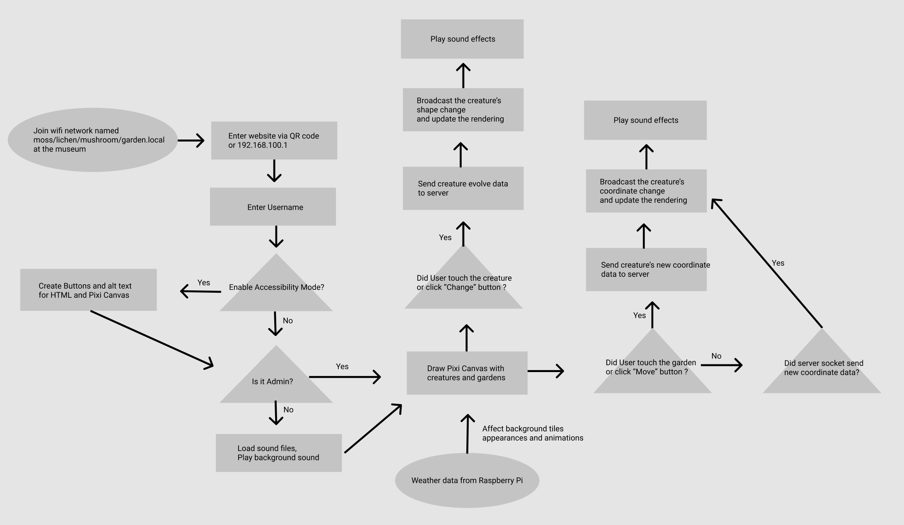

<iframe width="100%" height="400" src="https://www.youtube.com/embed/4rHwXSdUtBs" title="YouTube video player" frameborder="0" allow="accelerometer; autoplay; clipboard-write; encrypted-media; gyroscope; picture-in-picture" allowfullscreen></iframe>

<h2>Project Overview</h2>
<ul>
  <li><b>Position</b>: Frontend Web Developer (2021) | Web Developer & Product Manager (2022)</li>
  <li><b>Team</b>: Taeyoon Choi and Collaborators</li>
  <li><b>Venue</b>: WhiteBlock Art Center, Paju, South Korea</li>
  <li><b>Type</b>: Interactive & Accessible Mobile Website with Distributed Mesh Network</li>
  <li><b>Tools Used</b>: pixijs, nodejs, pm2, nginx, raspberry pi</li>
  <li><b>Date</b>: November 20, 2021 - November 28, 2021</li>
</ul>

<h2>Project Concept</h2>
<ul>
  <li>The concept was a thought experiment: "What if the Internet was a garden full of moss, lichens, and mushrooms? A place where humans could visit this lush, natural environment, listen to tales of software-plants, rest against the hardware-earth, and interact with data-creatures?"</li>
</ul>

<figure style="display: block; margin: 0 auto; text-align: center">

<figcaption><garden.local> Geometric gardens and creatures in master view</figcaption>
</figure>

# My Contribution
## Key Accomplishments
- Frontend & Graphics Engineer
  - **Constantly communicated with artist and designer about their drawings and vision to implement/realize them into procedural graphics with programming and algorithms**
  - Designed UI UX and developed a mobile website where users could interact with their own virtual garden and creatures
  - Incorporated real-time environmental data, utilizing temperature and humidity readings from Raspberry Pi to dynamically alter animation speeds and garden gradient colors.
  - Collaborated with server-side development utilizing nodejs, socket communication. 
  - Supported transitioning API and database from a local nedb to Supabase, a cloud-based database system.
- Project Manager
  - Successfully managed the 2022 development phase, ensuring timely updates to requirements
  - Revised the SVG generation algorithm, and spearheading graphic code refactoring.


## Technical Highlights
- Enhanced interactive visual experience using pixi js, WebGL, socket, nodejs, and Raspberry Pi.
- Engineered an immersive mobile website experience linked to physical drawing installations, mesh wifi networks, and user-interactive features.
- Ensured website accessibility exclusively through unique mesh wifi networks, named to augment the exhibition theme.

<hr >

# Procedural / Generative Algorithm for Garden Animation
- Main Goals
  - Each garden is square and has 4 anchors (corners). Each garden is randomly asisgned to have either triangle or arc shapes appearing.
  - It animates between 2 transition types
    - TO_FULL: start from the anchor and grow
    - TO_EMPTY: After finished growing, shrinks back to the anchor
  - Triangle / Arc shapes have gradient color animation. This animation's speed, duration, and size of the growing shape would change based on connected hardware Rasberry PI's weather data.

## Here are some parts of codes to explain how we achieved these ideas 
- disclaimer: Below are cut and edited parts of the entire codebase to show the highlight of the features.

## [Server / Config](https://github.com/gardenlocal/dwc-v3-socket-server/blob/main/server/controllers/garden.controller.js)
- Enums of Shapes: DWC_META.tileShapes.TRIANGLE / CIRCLE
- Animation: Growing from one corner to the diagonal corner
- Anchor: [ 0, 1, 2, 3 ] corner of square garden
- Shader 
```js
// createGardenSection
const shapeTypes = getConfig().backgroundTypes;
const shape = randomElementFromArray(shapeTypes);
const target =
  shape == DWC_META.tileShapes.TRIANGLE
    ? randomElementFromArray([0.25, 0.4, 0.5, 0.6, 0.75])
    : randomElementFromArray([0.25, 0.3, 0.4, 0.75]);
currTile.push({
  target: target,
  duration: randomIntInRange(25000, 75000),
  shape: shape,
  anchor: randomElementFromArray([0, 1, 2, 3]),
});
// ... 
newGarden.shaderProps = {
  shaderTimeSeed: Math.random() * 10,
  shaderSpeed: Math.random() * 10 + 1,
};
```

## Client / Rendering
- Shapes: Used Tessellation library to customize polygon shapes and smoothness
  - https://www.glprogramming.com/red/chapter11.html
  - https://github.com/memononen/tess2.js
- Send uniform data to shader parameters
- [Weather Data](https://github.com/gardenlocal/dwc-v2/blob/main/canvas/src/render/userGarden.js#L54)
  - Replicate the real ecosystem and weather relationship
    - higher temperature and higher humidity, higher entrophy and more lively
- Define Background rendering properties
  - Used PIXI.JS Filter and Mask features to apply shader material to the White PIXI Sprite

```js
// ResidueBackground.js
// Shader Parameters
this.gradientUniforms = {
  u_time: 1.0,
  u_point1: [0.5, 0.0], u_radius1: 0.1, u_color1: [12.0 / 256.0, 239.0 / 256.0, 66.0 / 256.0],
  u_point2: [0.5, 1.0], u_radius2: 0.1, u_color2: [253.0 / 256.0, 136.0 / 256.0, 11.0 / 256.0],
  u_offset: [0.0, - window.DWCApp.stage.pivot.y * this.s * 2],
  u_resolution: [this.W * 1.0, this.H * 1.0],
  u_scale: this.s * 1.0
}
// Fragment shader get masked over the WHITE SPRITE
const gradientFilter = new PIXI.Filter(null, HorizontalGradientFrag, this.gradientUniforms);
const gradientSprite = new PIXI.Sprite(PIXI.Texture.WHITE)
gradientSprite.width = this.W
gradientSprite.height = this.H
gradientSprite.filters = [gradientFilter]  
this.addChild(gradientSprite)

// Bring the predefined properties, Render and animate
// Use Bezier points and lerp for smooth animation of PIXI Sprite
drawCircle() {
  if (this.currentShape != SHAPES.CIRCLE) {
    this.circleTransitionContainer.alpha = 0
    return
  }
  this.circleTransitionContainer.alpha = 1
  if (!this.isAnimating && this.firstRenderCount >= 2) return
  this.firstRenderCount++

  let bezierAlpha = this.transitionAlpha// + Math.cos(this.frame / 5) / 800
  const WIDTH = this.W
  const HEIGHT = this.H
  this.circleTransition.clear()
  this.circleTransition.beginFill(0xffffff)
  this.circleTransition.moveTo(0, 0)
  this.circleTransition.lineTo(WIDTH, 0)  
  this.circleTransition.lineTo(WIDTH, HEIGHT)

  const bezierMaxStretch = 0.35
  const pA0 = { x: WIDTH * (1 + bezierMaxStretch), y: 0 }
  const pB0 = { x: WIDTH, y: -HEIGHT * bezierMaxStretch }
  const pA1 = { x: 0, y: HEIGHT * (1 + bezierMaxStretch) }    
  const pB1 = { x: -WIDTH * bezierMaxStretch, y: HEIGHT }
  const pA = lerpPoint(pA0, pA1, bezierAlpha)
  const pB = lerpPoint(pB0, pB1, bezierAlpha)
  
  this.circleTransition.bezierCurveTo(pA.x, pA.y, pB.x, pB.y, 0, 0)
  this.circleTransition.closePath();
  this.mask = this.circleTransition;
}
```

```js
async init() {
  this.bgContainer = new PIXI.Graphics()
  this.bgContainer.beginFill(0xf9f9f9)
  this.bgContainer.drawRect(0, 0, 1000, 1000)
  this.addChild(this.bgContainer)
  this.drawBackgrounds()    
}

async animateBackgrounds() {
  // params based on weather data
  const duration = map(this.temperature, -5, 20, 85000, 25000) // hotter, faster, shorter duration
  const shaderSpeed = map(this.humidity, 40, 80, 1, 0.1)  // more humid, faster    
  const targetSize = map(this.humidity, 40, 80, 0.25, 0.75)  // more humid, larger size

  for(let i = 0; i < this.tilesContainer.children.length; i++) {
    const currentTile = this.userGarden.tileProps[i];
    const currentLoop = currentTile[this.bgAnimationParams.currentTile];
    const shaderRand = shaderSpeed * map(i, 0, 4, 5, 10)

    await this.tilesContainer.children[i].appear(targetSize, duration, currentLoop.shape, currentLoop.anchor, shaderRand) 
    // appear at 0, disappear after bg2+bg3+bg4_duration
  }
  //...
  tick() {
    this.tilesContainer?.children.forEach(bg => {
      if(bg.tick) bg.tick()
    })
  }
}
```

- Color / Gradient: [fragment shader tests](https://github.com/gardenlocal/dwc-v2/tree/main/canvas/src/render/shaders)
  - Simple horizontal gradient shader
  - Horizontally sliding up and down, transitioning the colors orange - white - green
  - Below is a snippet, not the entire code.

```glsl
// ...
highp float dist(vec2 a, vec2 b) {
  return abs(a.y - b.y);  // linear
}

void main() {
    vec2 st = (gl_FragCoord.xy - u_offset.xy) / u_resolution / u_scale;
    float gradientScale = 4.0;
    st.y += u_time;
    st.y = st.y - (gradientScale * floor(st.y / gradientScale));

    vec3 color;
    vec2 u_point1 = vec2(0.50,gradientScale * 1.0);
    vec2 u_point2 = vec2(0.50,gradientScale * 0.75);
    vec2 u_point3 = vec2(0.50,gradientScale * 0.50);
    vec2 u_point4 = vec2(0.50,gradientScale * 0.25);
    vec2 u_point5 = vec2(0.50,gradientScale * 0.0);

    vec3 u_color1 = vec3(1.0, 1.0, 1.0);  // middle white
    vec3 u_color2 = vec3(253.0 / 256.0, 136.0 / 256.0, 11.0 / 256.0); // orange
    vec3 u_color3 = vec3(1.0, 1.0, 1.0);  // middle white
    vec3 u_color4 = vec3(12.0 / 256.0, 239.0 / 256.0, 66.0 / 256.0); // green
    vec3 u_color5 = vec3(1.0, 1.0, 1.0);  // middle white
	
    float u_radius1 = 0.001;
    float u_radius2 = 0.05;
    float u_radius3 = 0.001;
    float u_radius4 = 0.05;
    float u_radius5 = 0.001;

    if (st.y < u_radius5) {
      color = u_color5;
    } else if (st.y < u_point4.y - u_radius4) {
      float alpha = (st.y - u_radius5) / (u_point4.y - u_radius4 - u_radius5);
      color = mix(u_color5, u_color4, alpha);
    } else if (st.y < u_point4.y + u_radius4) {
      color = u_color4;
    } else if (st.y < u_point3.y - u_radius3) {
      float alpha = (st.y - u_point4.y - u_radius4) / (u_point3.y - u_radius3 - u_point4.y - u_radius4);
      color = mix(u_color4, u_color3, alpha);
    } // ...
    else {
      color = u_color1;
    }

    gl_FragColor = vec4(color, 1.0);
}
```

## Add more variety to Creature SVG logics
- My co-worker Cezar implemented a generative SVG creature evolution code in 2021. It had a fixed amount of children particles.
- In 2022, I had to update the features due to **artist's request to make the creatures more recursive and include more children particles** (smaller SVG shapes attached to a main bigger SVG)
1. First, tested hard-code to attach more children SVG particles
2. [Then, made a recursive loop to create more children nodes until the limit](https://github.com/gardenlocal/dwc-v3-socket-server/blob/main/shared-constants.js)
```js
// Shared-Constant.js, where we define the properties of the creatures
// recursion
let recursionNum = 20;    
const recursionLimit = 1; // end threshold
const connectorCount = 4; // num of corners where children SVG can be attached to
//...
const lichenConnectors = [0, 1, 2, 3];
function recur(parent, deductBoolean) {
  // choose the possible corner index, avoid the ones already occupied by other node
  const parentOccupiedConnector = parent.parentConnector;
  let avoidIndex = (parentOccupiedConnector+2)%4;
  const possibleIndices = lichenConnectors.filter(i => i !== avoidIndex);
  let chosenIndices = [];
  const rand = randomIntInRange(1, possibleIndices.length);
  for(let i = 0; i < rand; i++ ){
    chosenIndices.push(randomElementFromArray(possibleIndices));
  }
  const children = chosenIndices.map(index => createLichenChildTemplate(index));
  parent.children = children;    
  
  if(deductBoolean == true) {
    recursionNum -= 1;
  }
  if(recursionNum > recursionLimit) {
    for(let i = 0; i< parent.children.length; i++) {
      let nextParent = parent.children[i];      
      let deductRecursion = false;
      if(i == 0) deductRecursion = true;
      // Set this child as a new parent and recur again.
      recur(nextParent, deductRecursion);
    }
  }
}
```
**Other things I updated include...**
- Adjust/randomize the position of children SVG nodes to overlap slightly
- Adjust the transparency of overall SVG shapes

<hr >

# Technical Documentation

## Client Side: Pixi JS, Garden and Creature Rendering

<figure style="display: block; margin: 0 auto; text-align: center">

<figcaption><garden.local>App Structure Diagram</figcaption>
</figure>

## User Login, Accessibility, Web Service

<figure style="display: block; margin: 0 auto; text-align: center">

<figcaption><garden.local> User Flowchart of Web Application </figcaption>
</figure>

<hr >

<h2>Personal Reflection</h2>
<ul>
  <li>Collaborating with revered artist Taeyoon Choi, a personal inspiration since my exposure to SFPC in 2016, was an honor and a pivotal moment in my career. Working closely with Cezar Mocan from NYU ITP, I took the lead in WebGL generative design via pixi.js, enhanced website accessibility, integrated immersive audio, and crafted intuitive touch interactions. This project uniquely fused the digital and physical realms, with website access restricted to the exhibition's bespoke wifi setup.</li>
</ul>


SFPC '시적 컴퓨팅을 위한 학교'를 뉴욕에서 알게 된 시점부터 최태윤 작가님의 큰 팬이었는데 이번 기회에 함께 일할 수 있어서 매우 즐거웠다! 이 프로젝트에는 프론트엔드 웹 개발자로 참여했다. 사용자가 터치를 할 수 있는 인터렉티브 모바일 웹사이트를 개발했으며, 크리쳐가 돌아다니는 배경화면 webgl 애니메이션, 오디오 사운드, 접근성 기능, 사용자 인터렉션 등의 기능을 구현했다. 본 웹사이트는 전시 기간동안 분산 매쉬 네트워크로 만들어진 현장 와이파이 접속을 통해서만 접속할 수 있었다.


```
garden.local is a project that combines drawing installations, wifi networks, and a mobile app based on those same drawings and networks. At the same time, garden.local is committed to accessibility for all, and working to construct a system that is barrier-conscious. In the current exhibition, audience members may use their own smartphones or those provided by the gallery to enter the virtual garden. Once inside, everyone is able to experience the transformation of Art Center White Block, witnessing and cultivating the growing mosses, lichens, and mushrooms within.

-- quoted from taeyoonchoi medium.com
```

최태윤 작가 블로그 Read more from the artist's own writing [HERE](https://tchoi8.medium.com/distributed-web-of-care-garden-local-1b8976f38606)

분산된 돌봄의 웹이란 ? What is Distributed Web of Care? [ [garden.local](http://distributedweb.care/) ]

갤러리 전시 게시물 Watch gallery exhibition poster [HERE](https://whiteblock.org/%EC%A0%84%EC%8B%9C/view/2792034)

Photographs below are taken by Chulki Hong.

<figure style="display: block; margin: 0 auto; text-align: center">

<figcaption><garden.local> 2021, LED monitor, paintings, Raspberry Pi, Installation view, Art Center White Block, Paju</figcaption>
</figure>

<figure style="display: block; margin: 0 auto; text-align: center">

<figcaption></figcaption>
</figure>

<figure style="display: block; margin: 0 auto; text-align: center">

<figcaption></figcaption>
</figure>

<figure style="display: block; margin: 0 auto; text-align: center">

<figcaption></figcaption>
</figure>

<figure style="display: block; margin: 0 auto; text-align: center">

<figcaption></figcaption>
</figure>

<figure style="display: block; margin: 0 auto; text-align: center">

<figcaption></figcaption>
</figure>

<figure style="display: block; margin: 0 auto; text-align: center">

<figcaption></figcaption>
</figure>

<figure style="display: block; margin: 0 auto; text-align: center">

<figcaption></figcaption>
</figure>

<figure style="display: block; margin: 0 auto; text-align: center">

<figcaption></figcaption>
</figure>

<figure style="display: block; margin: 0 auto; text-align: center">

<figcaption></figcaption>
</figure>

<figure style="display: block; margin: 0 auto; text-align: center">

<figcaption></figcaption>
</figure>

<figure style="display: block; margin: 0 auto; text-align: center">

<figcaption></figcaption>
</figure>

<figure style="display: block; margin: 0 auto; text-align: center">

<figcaption></figcaption>
</figure>

<figure style="display: block; margin: 0 auto; text-align: center">

<figcaption></figcaption>
</figure>
