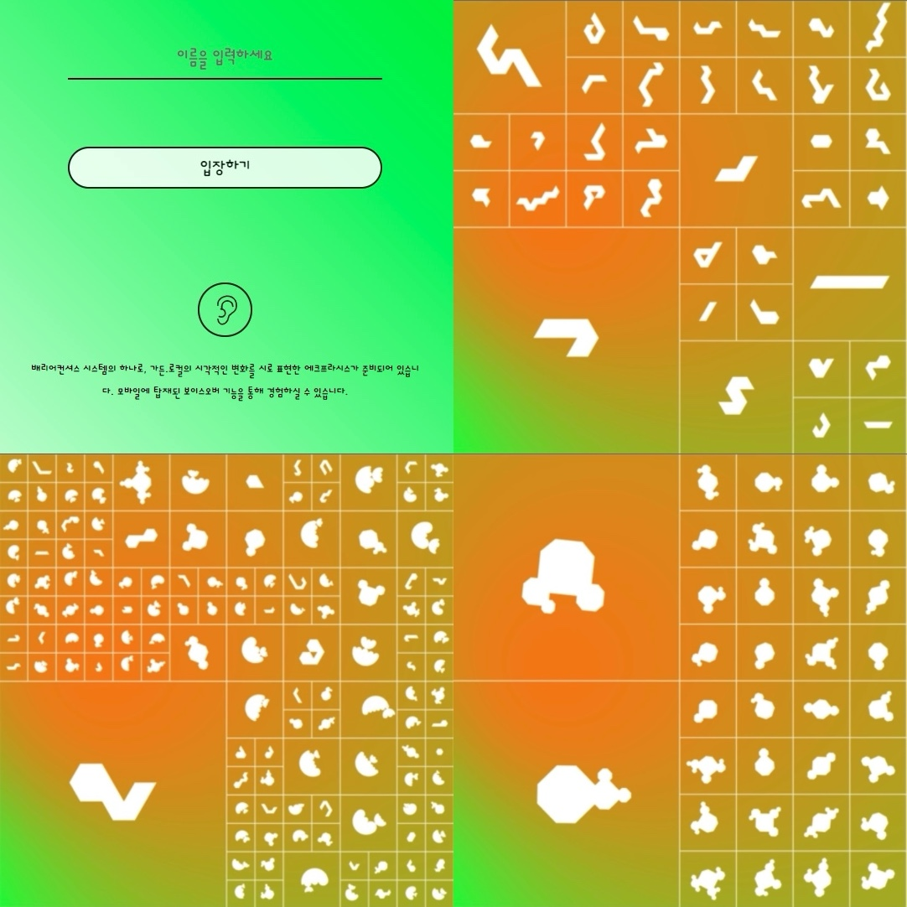

<iframe width="100%" height="400" src="https://www.youtube.com/embed/4rHwXSdUtBs" title="YouTube video player" frameborder="0" allow="accelerometer; autoplay; clipboard-write; encrypted-media; gyroscope; picture-in-picture" allowfullscreen></iframe>

<hr />
<b>Web Development Project: "Nature and Tech"</b>
<ul>
  <li><b>Position</b>: Frontend Web Developer (2021) | Web Developer & Product Manager (2022)</li>
  <li><b>Team</b>: Taeyoon Choi and Collaborators</li>
  <li><b>Venue</b>: WhiteBlock Art Center, Paju, South Korea</li>
  <li><b>Type</b>: Interactive & Accessible Mobile Website with Distributed Mesh Network</li>
  <li><b>Tools Used</b>: pixijs, nodejs, pm2, nginx, raspberry pi</li>
  <li><b>Date</b>: November 20, 2021 - November 28, 2021</li>
</ul>

<b>Project Concept</b>
<ul>
  <li>The concept was a thought experiment: "What if the Internet was a garden full of moss, lichens, and mushrooms? A place where humans could visit this lush, natural environment, listen to tales of software-plants, rest against the hardware-earth, and interact with data-creatures?"</li>
</ul>

<b>Implementation</b>
<ul>
  <li>Created a mobile website accessible only through the local network via a user's local IP address. Each user was presented with their own virtual garden and creatures.</li>
  <li>The animation speed and gradient color of the garden were influenced by temperature and humidity data from a local Raspberry Pi.</li>
  <li>In 2022, I managed updated development requirements, adjusted the SVG generation algorithm for the creatures, and oversaw general graphic code refactoring. Additionally, I assisted with server code based on nodejs, socket integration, and the cloud database migration process.</li>
</ul>

<b>Technical Features</b>
<ul>
  <li>The website made use of pixi js (a web 2D rendering engine), WebGL, socket, nodejs, and Raspberry PI.</li>
  <li>The experience was meant to be immersive, tying the mobile website to drawing installations, mesh wifi networks, and interactive features.</li>
  <li>The site was kept local, being accessible only when connected to a specific wifi network from a distributed mesh network. This network was set up with wifi names such as "lichen", "moss", and "mushroom".</li>
</ul>

<b>Technical Diagrams</b>
<ul>
<li><a target="_blank" href="https://www.figma.com/file/w2HzFecg65sds39SEc4S6Z/Software-Diagram?node-id=0%3A1">Structure</a></li>
<li><a target="_blank" href="https://www.figma.com/file/w2HzFecg65sds39SEc4S6Z/Software-Diagram?node-id=9%3A4">Flow</a></li>
</ul>


<b>Personal Note</b>
<ul>
  <li>Having admired Taeyoon Choi since my introduction to SFPC in 2016 in NYC, collaborating on this project was a rewarding experience. Alongside Cezar Mocan from NYU ITP, I primarily contributed to WebGL generative design using pixi.js, developed accessibility features, integrated audio, and designed touch interactions. The website was made LIVE only in a local environment, intricately tied to the unique wifi setup of the exhibition.</li>
</ul>


SFPC '시적 컴퓨팅을 위한 학교'를 뉴욕에서 알게 된 시점부터 최태윤 작가님의 큰 팬이었는데 이번 기회에 함께 일할 수 있어서 매우 즐거웠다! 이 프로젝트에는 프론트엔드 웹 개발자로 참여했다. 사용자가 터치를 할 수 있는 인터렉티브 모바일 웹사이트를 개발했으며, 크리쳐가 돌아다니는 배경화면 webgl 애니메이션, 오디오 사운드, 접근성 기능, 사용자 인터렉션 등의 기능을 구현했다. 본 웹사이트는 전시 기간동안 분산 매쉬 네트워크로 만들어진 현장 와이파이 접속을 통해서만 접속할 수 있었다.


```
garden.local is a project that combines drawing installations, wifi networks, and a mobile app based on those same drawings and networks. At the same time, garden.local is committed to accessibility for all, and working to construct a system that is barrier-conscious. In the current exhibition, audience members may use their own smartphones or those provided by the gallery to enter the virtual garden. Once inside, everyone is able to experience the transformation of Art Center White Block, witnessing and cultivating the growing mosses, lichens, and mushrooms within.

-- quoted from taeyoonchoi medium.com
```

최태윤 작가 블로그 Read more from the artist's own writing [HERE](https://tchoi8.medium.com/distributed-web-of-care-garden-local-1b8976f38606)

분산된 돌봄의 웹이란 ? What is Distributed Web of Care? [ [garden.local](http://distributedweb.care/) ]

갤러리 전시 게시물 Watch gallery exhibition poster [HERE](https://whiteblock.org/%EC%A0%84%EC%8B%9C/view/2792034)

Photographs below are taken by Chulki Hong.

<figure style="display: block; margin: 0 auto; text-align: center">

<figcaption><garden.local> 2021, LED monitor, paintings, Raspberry Pi, Installation view, Art Center White Block, Paju</figcaption>
</figure>

<figure style="display: block; margin: 0 auto; text-align: center">

<figcaption></figcaption>
</figure>

<figure style="display: block; margin: 0 auto; text-align: center">

<figcaption></figcaption>
</figure>

<figure style="display: block; margin: 0 auto; text-align: center">

<figcaption></figcaption>
</figure>

<figure style="display: block; margin: 0 auto; text-align: center">

<figcaption></figcaption>
</figure>

<figure style="display: block; margin: 0 auto; text-align: center">

<figcaption></figcaption>
</figure>

<figure style="display: block; margin: 0 auto; text-align: center">

<figcaption></figcaption>
</figure>

<figure style="display: block; margin: 0 auto; text-align: center">

<figcaption></figcaption>
</figure>

<figure style="display: block; margin: 0 auto; text-align: center">

<figcaption></figcaption>
</figure>

<figure style="display: block; margin: 0 auto; text-align: center">

<figcaption></figcaption>
</figure>

<figure style="display: block; margin: 0 auto; text-align: center">

<figcaption></figcaption>
</figure>

<figure style="display: block; margin: 0 auto; text-align: center">

<figcaption></figcaption>
</figure>

<figure style="display: block; margin: 0 auto; text-align: center">

<figcaption></figcaption>
</figure>

<figure style="display: block; margin: 0 auto; text-align: center">

<figcaption></figcaption>
</figure>
