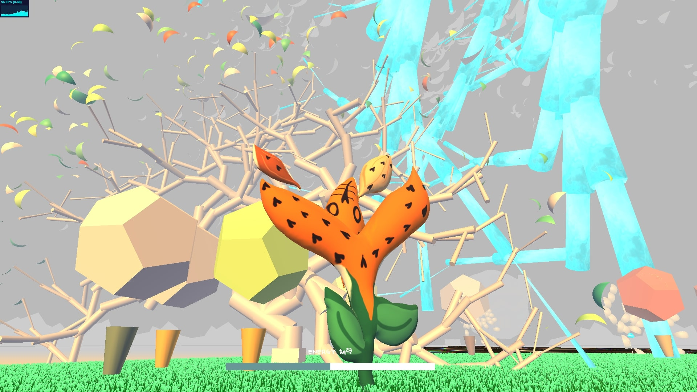
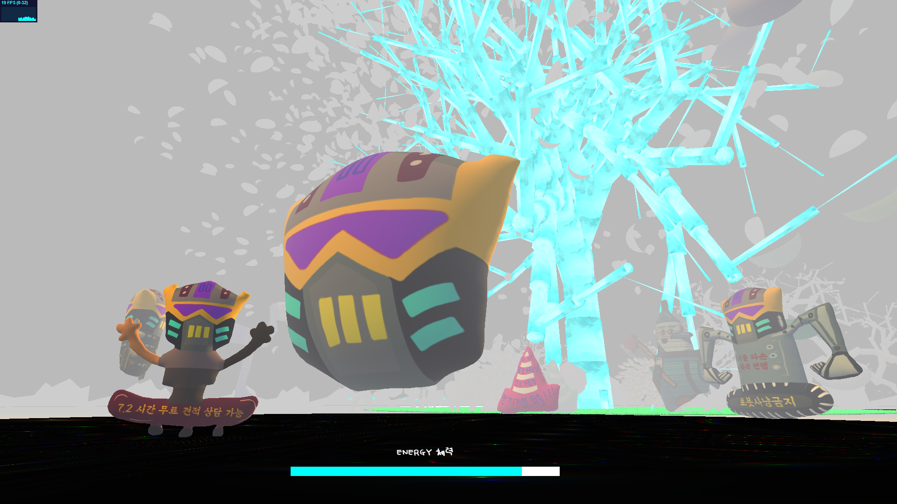
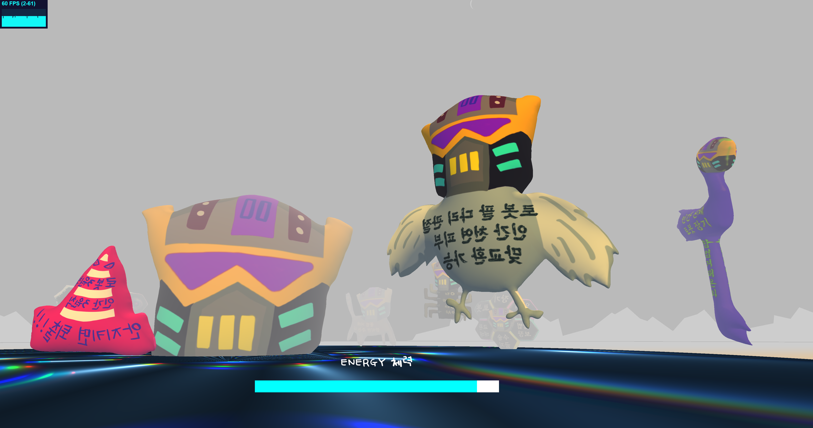
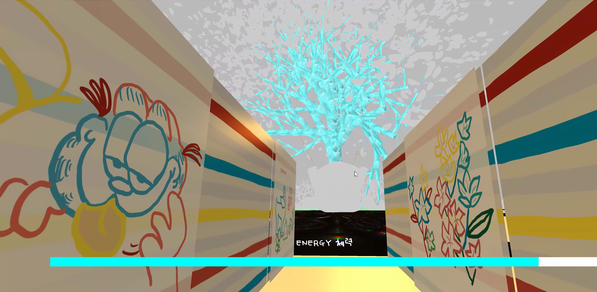
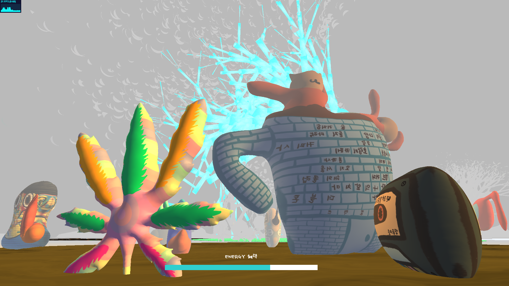
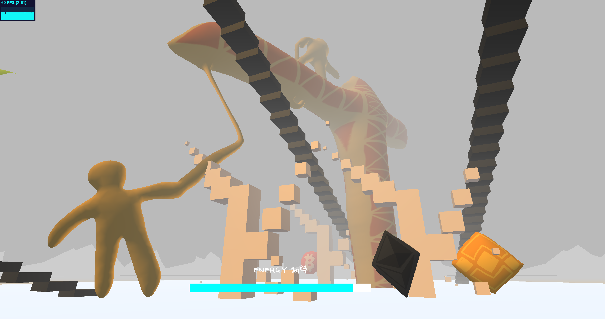
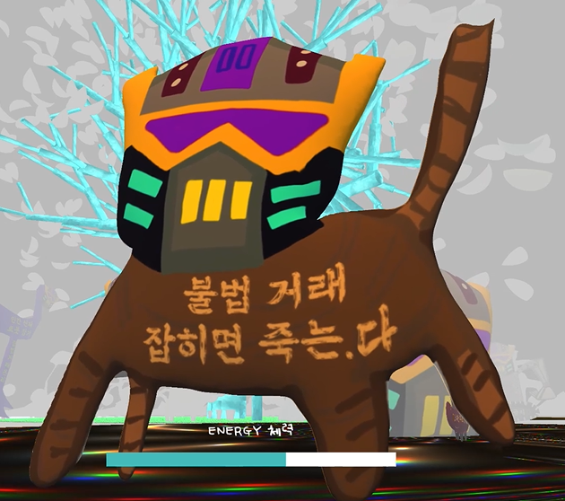

Creator: So Sun Park  
Venue: <a target="_blank" rel="noreferrer" href="https://www.instagram.com/c.enter_official">Eulji Art Center 을지예술센터</a> or website <a target="_blank" rel="noreferrer" href="https://www.euljiro.lol">euljiro.lol</a>  
Type: Interactive 3D website 
Tools: threejs, xbox gamepad, monstermash.zone, Procreate (iPad), netlify 
Date: 2021.11.27 ~ 2022.1.23 
Thanks to: <a target="_blank" rel="noreferrer" href="https://readymag.com/u16519807/1261048/">Producer Yoo Jun Lee</a>, <a target="_blank" rel="noreferrer" href="https://klovesmart.wixsite.com/mypage">Sound Designer Ja Hyun Kim</a>

As of Januray 2022, I recommend you to enjoy this artwork on online, <a target="_blank" rel="noreferrer" href="https://www.euljiro.lol">euljiro.lol</a>. (It would work better if your graphic card is Nvidia GTX 1060 or higher.)

<iframe width="100%" height="400" src="https://www.youtube.com/embed/HJYgOmYNM3U" title="YouTube video player" frameborder="0" allow="accelerometer; autoplay; clipboard-write; encrypted-media; gyroscope; picture-in-picture" allowfullscreen></iframe>

I made an interactive website/artwork with powerful threejs library. The general concept, 3D models, and gamification elements are inspired by my experience at Euljiro district in Seoul, South Korea. This is an artwork from my imagination of how this district will be shaped in the future.

Euljiro district is known for its diverse generations, historical manufacturing shops and merchants, hipster places,
and political tension of gentrification. Yet, I observed it lacks the place with nature and public space where diverse population can (indirectly) interact or connect with one another. So I imagined a park in its virtual world. Also, I made a system of world - you can only charge 'energy' in the park and use the energy as you roam around other places.

This was a part of ongoing exhibition 'Folding of the City' at Eulji Art Center, inspired by Jingfang Hao's SF novel "Folding Beijing".

Thanks to 서울문화재단 (Seoul Foundation of Arts and Culture) sponsorship, 을지예술센터 (Eulji Art Center), 이유준 PD, 김자현 Composer/Sound Artist.

Full explainer video and optimized website is coming soon!

<figure style="display: block; margin: 0 auto; text-align: center">

<figcaption>park</figcaption>
</figure>

<figure style="display: block; margin: 0 auto; text-align: center">

<figcaption>tiger lily flower in the park</figcaption>
</figure>

<figure style="display: block; margin: 0 auto; text-align: center">

<figcaption>squirrel in the park</figcaption>
</figure>

<figure style="display: block; margin: 0 auto; text-align: center">

<figcaption>entering zone 1</figcaption>
</figure>

<figure style="display: block; margin: 0 auto; text-align: center">

<figcaption>zone 1: manufacturing area</figcaption>
</figure>

<figure style="display: block; margin: 0 auto; text-align: center">

<figcaption>low energy view</figcaption>
</figure>

<figure style="display: block; margin: 0 auto; text-align: center">

<figcaption>zone 1</figcaption>
</figure>

<figure style="display: block; margin: 0 auto; text-align: center">

<figcaption>entrance</figcaption>
</figure>

<figure style="display: block; margin: 0 auto; text-align: center">

<figcaption>zone 2</figcaption>
</figure>

<figure style="display: block; margin: 0 auto; text-align: center">

<figcaption>zone 2</figcaption>
</figure>

<figure style="display: block; margin: 0 auto; text-align: center">

<figcaption>zone 3</figcaption>
</figure>

<figure style="display: block; margin: 0 auto; text-align: center">

<figcaption></figcaption>
</figure>
