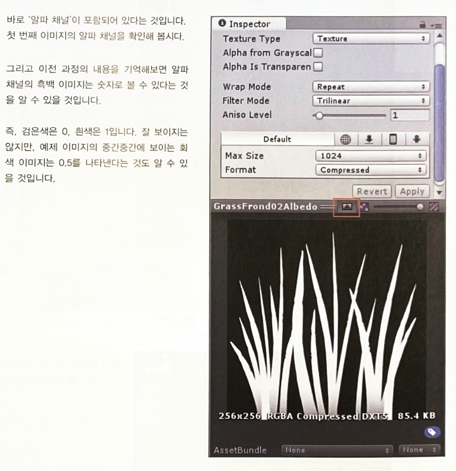
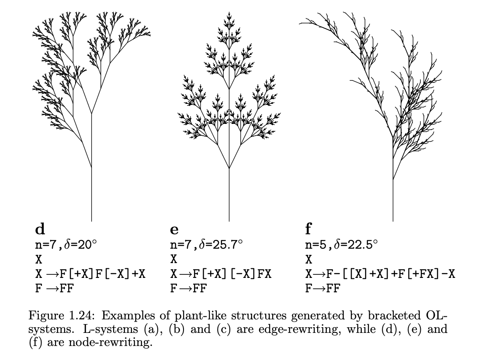

## GPU Instancing - Grass
- Used InstancedMesh to render 1000+ grass objects to reduce the number of draw calls and improve rendering performance, as all grass can look the same, which means sharing same mesh and material
- Position the grass instances inside the circular PARK area
- Material: Used vertex and fragment shaders. I will go through more shaders examples in other items. 

```js
const leavesMaterial = new THREE.ShaderMaterial({
  vertexShader,
  fragmentShader,
  uniforms,
  side: THREE.DoubleSide
});
  
const instanceNumber = 100000;
const dummy = new THREE.Object3D();

const geometry = new THREE.PlaneGeometry( 3, 6, 1, 4 );
geometry.translate( 0, 1, 0 );

const instancedMesh = new THREE.InstancedMesh( geometry, leavesMaterial, instanceNumber );
instancedMesh.name = "shader grass"
scene.add( instancedMesh );

const r = ZONE_RADIUS.GARDEN

for ( let i=0 ; i<instanceNumber ; i++ ) {
  // https://stackoverflow.com/questions/5837572/generate-a-random-point-within-a-circle-uniformly
  const t = 2*Math.PI*Math.random()
  const u = getRandomArbitrary(0, r) + getRandomArbitrary(0, r)
  let radius;
  if(u > r) {
    radius = r*2 - u
  } else {
    radius = u 
  }
  dummy.position.set(radius * Math.cos(t), 0, radius * Math.sin(t))
  dummy.scale.setScalar( 0.5 + Math.random() * 0.5 );
  dummy.rotation.y = Math.random() * Math.PI;
  dummy.updateMatrix();
  instancedMesh.setMatrixAt( i, dummy.matrix );
} 
  
instancedMesh.translateX(position.x)
instancedMesh.translateZ(position.z)
```
- Normally in games, you would want to draw more realistic grass shapes and thus, use special texture with alpha-transparent area like the example below. But in this low poly aesthetics, the rectangular grass shape worked well. Also I didn't want to add another rendering work with alpha texture. 
<figure style="display: block; margin: 0 auto; text-align: center">

<figcaption>From the book: Unity Shader Startup</figcaption>
</figure>

<figure style="display: block; margin: 0 auto; text-align: center">

<figcaption>From the book: Unity Shader Startup</figcaption>
</figure>

## Rose Algorithm to Make Spiral Flower Petals

6. Nature: flower petals
- Rose Algorithm
  - smaller bezier vertex
    - https://openprocessing.org/sketch/1409491
    - https://openprocessing.org/sketch/1410080
    - https://openprocessing.org/sketch/1415793
    - https://openprocessing.org/sketch/1409489
    - https://openprocessing.org/sketch/1414163
  - longer bezierVertex: https://openprocessing.org/sketch/1416027
  - arc: https://openprocessing.org/sketch/1416020
  - bezierVertex: https://openprocessing.org/sketch/1409255

7. Nature: Animated flower petals
- Generative equation
```js
 this.n = numerator || 4;
  this.d = denominator || 7;
  this.angle = angleGap || 0.5; 
  this.k = this.n/this.d;
  this.amplitude = 30;
  this.rotationY = Math.PI/2.0;
  this.scaleNum = size;
```
- ref: https://jsfiddle.net/sosunny/fjr8s9t3/2/


## Shader 
- Used to decorate each ZONE's bottom circular planes and materials of a few world objects
- cellular noise
- fractcals
- cloud
- coffee liquid
- fog
- glow
- metallic
- sky
- turbulence
- water

- Used references from shadertoy and The Book of Shaders.
- https://www.shadertoy.com/profile/?show=shaders 


- Vertex shader: Here's a quick summary of how threejs uses vertex shader and coordinates. 
```
In Three.js, the vertex shader is responsible for transforming the vertices of a 3D object from their local coordinate space to the final position on the screen. This transformation involves applying a series of matrix operations to each vertex.

The reason for calculating matrices in the vertex shader is to ensure that the vertices are transformed correctly based on the current state of the scene and the camera. The matrices used in the vertex shader include modelMatrix (local space), viewMatrix (camera space), projectionMatrix (3D space to 2D). 

vertex position => model matrix => view matrix => projection matrix => Final position in 3D space & Camera view
```


## L system & Shader
- I used the L-system algorithm to generate geometric trees, especially the biggest tree in this virtual world. 
  - Using f, A, B, ^, +, - symbols to make generative rules of growing trees and branches
- Used cylinder geometries and shader material for the branches
- If the branch radius reaches certain number, stop drawing branches and draw flower/leaf petals instead
```js
if(branchRadius < 0.24) {
    branchMesh = new THREE.Mesh(petalClone, randomMat);

} else {
    branchMesh = new THREE.Mesh(branchCylinder, material);
    if(material.name === "shader") branchMesh.name = "shader"
}
```
- Example of axiom, rules of L-system 
```js
if (axiom.charAt(i) === "f") {
  topPoint = branchInsert(
      branchLength * (1 - j * lengthReductionFactor),
      branchRadius * (1 - j * radiusReductionFactor), 
      topPoint, 
      angle * rightX + preXAngle,
      angle * rightY + preYAngle, 
      angle * rightZ + preZAngle);
  j += 1;

  preXAngle += angle * rightX;
  preYAngle += angle * rightY;
  preZAngle += angle * rightZ;
  rightX = 0;
  rightY = 0;
  rightZ = 0;
}
```
- Good First Step into L system: p5js demo with recursive function
```js
function tree(xpos, len) {
  push()
  translate(xpos, height);
  line(0, 0, 0, -100);
  
  branch(len)
  pop()
}

function branch(len) {
  line(0, 0, 0, -len)
  translate(0, -len)
  len *= 0.7;
  if(len > 1) {
    push()
    rotate(PI/theta1)
    branch(len)
    pop()

    push()
    rotate(-PI/theta2)
    branch(len)
    pop()    
  }
}
```
2. Then, expand into the algorithm of axiom, rules like this book describes. 
  - http://algorithmicbotany.org/papers/abop/abop.pdf 
<figure style="display: block; margin: 0 auto; text-align: center">

<figcaption>From the book: Botany of Algorithm</figcaption>
</figure>

- References
  - Fractal Algorithms
  - https://www.carl-olsson.com/project/l-system/
  - https://github.com/FrancescoGradi/L-System-Trees
 

## Physics - Collision & Raycasting
- Inside tick(), keep checking if the camera's position is inside or outside of bounding boxes of several paths (zone 1, 2, 3, park)
  - tick() function is as same as Unity C# script's Update() function.
  - If the camera collides with the bounding box / walls, update the camera (aka pointerLockControls) position or velocity to offset the movement.
- Raycast
  - Shoot a ray to check the object intersecting or close enough to the camera (first person controller)
  - If the camera's ray hits the object in the scene, it shows a certain text
- Checking ZONE location
  - Using "distance squared" comparison between each ZONE's circular area and Camera position
  ```js
    // Zone 1
    const centerX1 = ZONE_POS.ONE.x
    const centerZ1 = ZONE_POS.ONE.z
    const radius1 = ZONE_RADIUS.ONE

    const dx1 = Math.abs(currentPos.x - centerX1)
    const dz1 = Math.abs(currentPos.z - centerZ1)

    let inZone1 = dx1*dx1 + dz1*dz1 <= radius1*radius1
  ```
  - Save current ZONE location data in web browser's localStorage
- Threejs API
  - Create a (invisible) mesh for bounding box or use the pre-existing mesh
  - Update World Position of Mesh
  - Compute Bounding Box of geometry data of the Mesh
  - Create a variable to save AABB bounding box of the Mesh
  - Update the AABB world position with the Mesh's world matrix.
  - https://threejs.org/docs/?q=box3#api/en/math/Box3

## Game Mechanism & Renderer
- Energy Feedback System
  - Negative Feedback: If the user uses all the given energy, give post-processing Blurred effect.
  - Used Nodepost Renderer Processing
  - Blur effect: mosaic pixelated effect on screen
    `blurScreen = new Nodes.BlurNode( new Nodes.ScreenNode() );`
- Threejs uses WebGLRenderer by default.


## 12. Animation
Animating Static geometries
- Limited range of random PI values for positions x, z
- Animate the scale of each mesh by traversing the objects in main tick() function

Animating Skinned Mesh
- Threejs Animation System
  - Animation Mixer
    - Include Animation Clips

- Animaiton Mixer
  - Save all animation mixer data in the global array
  - Loop and play them inside the main tick() function

- Character Assets
  - glbLoader: GLB formats
  - dracoLoader: Draco Compression

## First Person Camera
- Perspective Camera: Assign values for fov, aspect, near plane, far plane
- PointerLockControls
  - First Person Body attached to Main Camera
  - mouse: Eye Direction
  - keyboard WASD, Arrows, xboxGamepad: Walking Direction
  - Control the values of velocity, position
  - Lock / Unlock: Press ESC to Retrieve the mouse pointer
    - Used addEventListeners to check lock/unlock status
    - When locked, show UI instructions


