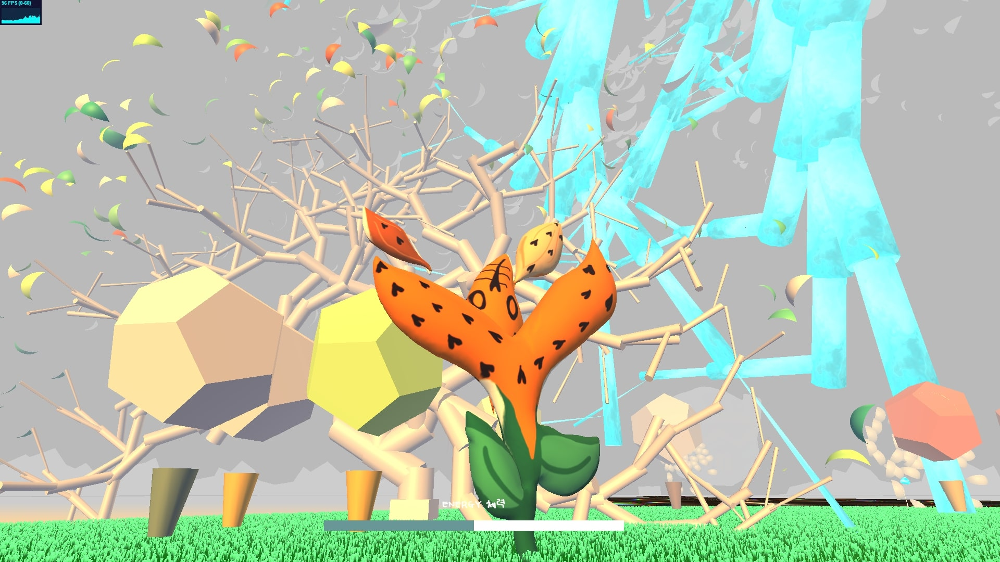
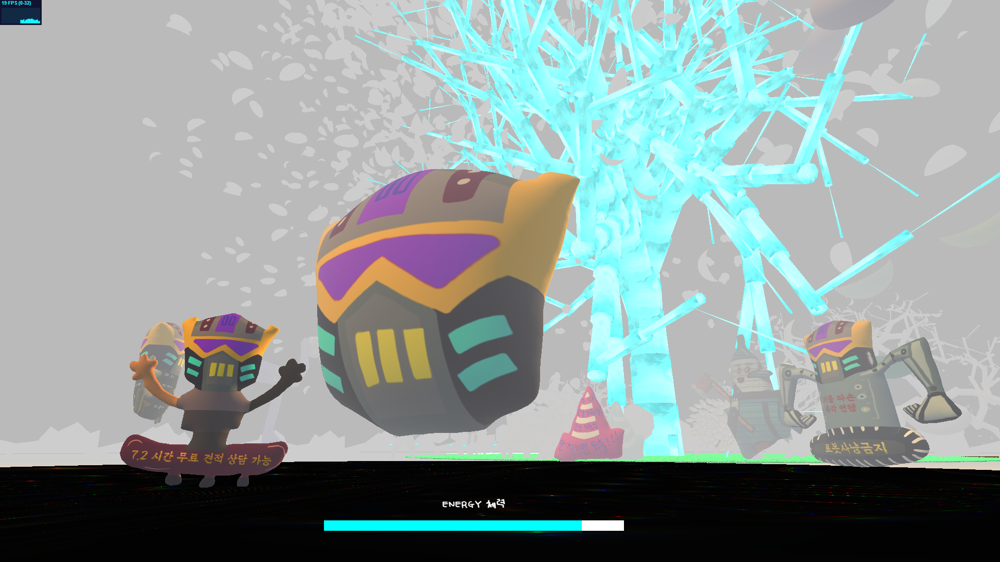
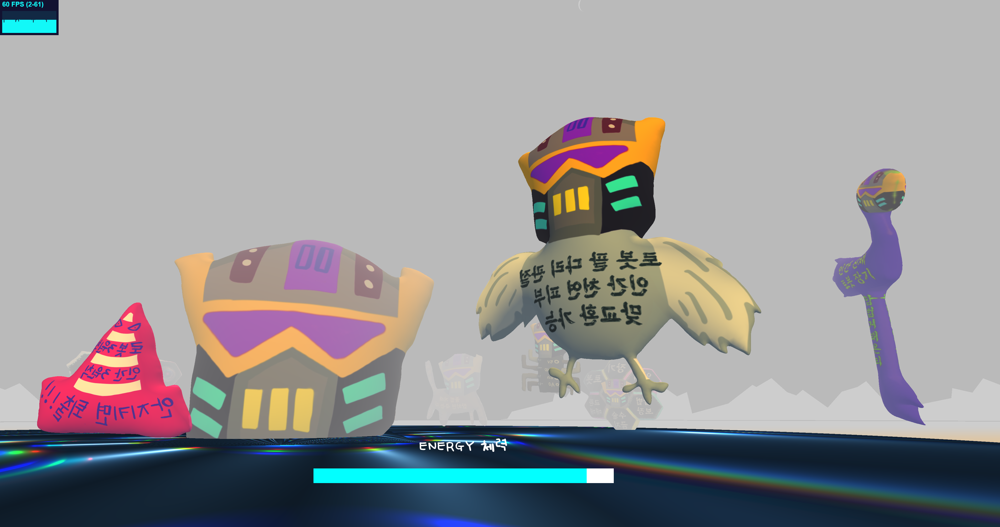
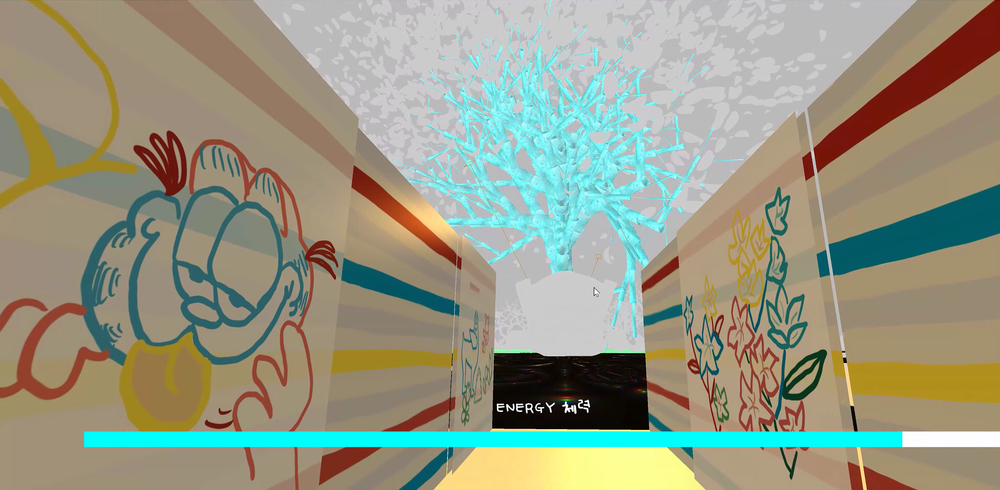
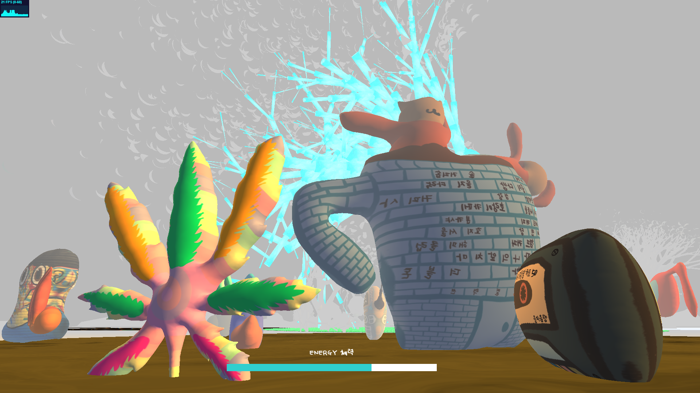
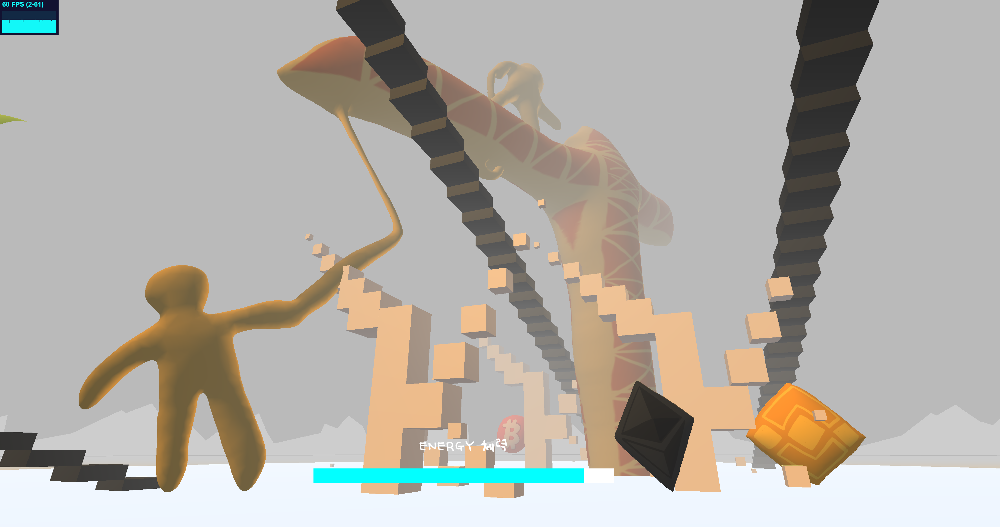

<iframe width="100%" height="400" src="https://www.youtube.com/embed/HJYgOmYNM3U" title="YouTube video player" frameborder="0" allow="accelerometer; autoplay; clipboard-write; encrypted-media; gyroscope; picture-in-picture" allowfullscreen></iframe>
<i>As of Januray 2022, I recommend you to enjoy this artwork online, <a target="_blank" rel="noreferrer" href="https://www.euljiro.xyz">euljiro.xyz</a>. (It would work better if your graphic card is Nvidia GTX 1060 or higher.) </i>

<li><b>Position</b>: [Director] Developer, Designer</li> 
<li><b>Topic</b>: Web 3D, Urban Environment</li>
<li><b>Venue</b>: <a target="_blank" rel="noreferrer" href="https://www.instagram.com/c.enter_official">Eulji Art Center 을지예술센터</a> or website <a target="_blank" rel="noreferrer" href="https://www.euljiro.xyz">euljiro.xyz</a>  </li>
<li><b>Tools</b>: threejs, XBOX gamepad (Web API), monstermash, Procreate, netlify </li>
<li><b>Development Period</b>: 2021.07.01 ~ 2021.12.1  </li>
<li><b>Offline Exhibition Date</b>: 2021.11.27 ~ 2022.1.23 </li>
<li><b>Thanks to</b>: <a target="_blank" rel="noreferrer" href="https://readymag.com/u16519807/1261048/">Producer Yoo Jun Lee</a>, <a target="_blank" rel="noreferrer" href="https://klovesmart.wixsite.com/mypage">Sound Designer Ja Hyun Kim </a></li>
 

<figure style="display: block; margin: 0 auto; text-align: center">

<figcaption>park</figcaption>
</figure>

<figure style="display: block; margin: 0 auto; text-align: center">

<figcaption>low energy view (environment lighting)</figcaption>
</figure>

<figure style="display: block; margin: 0 auto; text-align: center">

<figcaption>Development Process</figcaption>
</figure>

<ul>
<li><b>Environment Construction</b>: Utilized the Three.js library to construct a comprehensive environment, including trees, grass, change of scene lighting based on progress bar, and raycasting events. </li>  

<li><b>Tree Modeling</b>: Employed the L-system algorithm for procedural tree generation. The material of the prominent "Tree of Life" in the center was rendered using WebGL shader code. (Reference: Botanical algorithm, L-system simulator).</li> 

<li><b>Dynamic Lighting & Visual Effects</b>: Implemented a feature where, as the player's energy diminishes, the lighting progressively darkens, and filters blur, simulating pixel deterioration.</li> 

<li><b>Player Interaction</b>: Players can navigate using the arrow keys. Utilized raycasting to sense the distance between the player and characters. When in close proximity, a contextual message window appears.</li>
 

<li><b>Character Design & Animation</b>: Converted hand-drawn 2D character sketches from Procreate into 3D using the Monstermash.zone application. Produced short animations for these characters.</li> 

<li><b>Optimized Animations</b>: To ensure optimal performance, animations were selectively applied to specific character models.</li> 

<li><b>Exhibition Interactivity</b>: During the exhibition period, incorporated the Gamepad API to enable user interaction via gamepad consoles.</li> 

<li><b>Web Infrastructure</b>: Built the website using webpack and vite bundling frameworks and deployed through the Netlify service."</li> 
</ul>

---

Euljiro district (Seoul, South Korea) stands as a melting pot of generations, a fusion of historical manufacturers and modern merchants, a juxtaposition of vintage charm and hipster allure, all underscored by the palpable tension of gentrification. However, in my observations, a crucial element appeared absent: a natural public space where its eclectic inhabitants could indirectly connect and interact. This prompted me to conceptualize a virtual park. Within this digital realm, users can only recharge their 'energy' within the park, which is then expended as they explore the broader environment.

This work was featured in the group exhibition 'Folding of the City' at Eulji Art Center and drew inspiration from Jingfang Hao's science fiction novel, "Folding Beijing."

The artwork delves into the multifaceted aspects of Euljiro, portraying the dichotomies of young versus old, time-honored manufacturing outlets versus contemporary cafes, and the looming shadows of gentrification amidst a lack of nature. This piece is my sci-fi vision of Euljiro's potential evolution.

Special gratitude to 서울문화재단 (Seoul Foundation of Arts and Culture), 을지예술센터 (Eulji Art Center), 이유준 PD, and 김자현, a renowned Composer and Sound Artist, for their invaluable support and contribution.

---

<h3>Updated 2022.02</h3>
Removed animations from a number of models, considering the optimization for more devices. 

<figure style="display: block; margin: 0 auto; text-align: center">

<figcaption>tiger lily flower in the park</figcaption>
</figure>

<figure style="display: block; margin: 0 auto; text-align: center">

<figcaption>squirrel in the park</figcaption>
</figure>

<figure style="display: block; margin: 0 auto; text-align: center">

<figcaption>entering zone 1</figcaption>
</figure>

<figure style="display: block; margin: 0 auto; text-align: center">

<figcaption>zone 1: manufacturing area</figcaption>
</figure>

<figure style="display: block; margin: 0 auto; text-align: center">

<figcaption>zone 1</figcaption>
</figure>

<figure style="display: block; margin: 0 auto; text-align: center">

<figcaption>entrance</figcaption>
</figure>

<figure style="display: block; margin: 0 auto; text-align: center">

<figcaption>zone 2</figcaption>
</figure>

<figure style="display: block; margin: 0 auto; text-align: center">

<figcaption>zone 2</figcaption>
</figure>

<figure style="display: block; margin: 0 auto; text-align: center">

<figcaption>zone 3</figcaption>
</figure>

<figure style="display: block; margin: 0 auto; text-align: center">

<figcaption></figcaption>
</figure>
