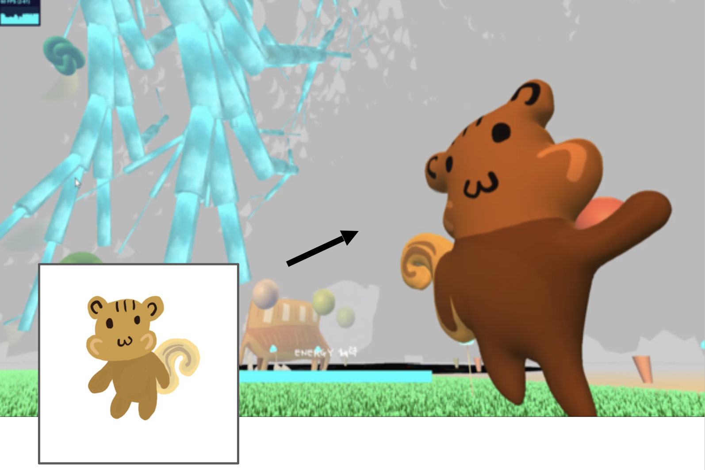
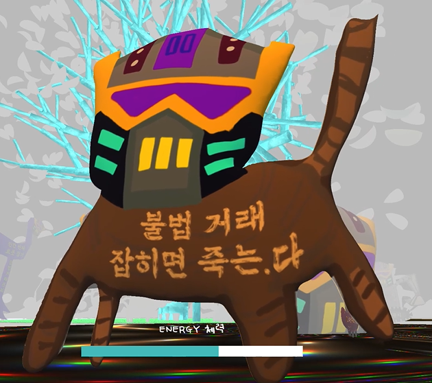

<iframe width="100%" height="540" src="https://www.youtube.com/embed/HJYgOmYNM3U" title="YouTube video player" frameborder="0" allow="accelerometer; autoplay; clipboard-write; encrypted-media; gyroscope; picture-in-picture" allowfullscreen></iframe>
<i>As of Januray 2022, I recommend to enjoy this artwork online, <a target="_blank" rel="noreferrer" href="https://www.euljiro.xyz">euljiro.xyz</a>. (It would work better if your graphic card is Nvidia GTX 1060 or higher.) </i>

<hr />

<li><b>Position</b>: [Director] Developer, Designer</li> 
<li><b>Topic</b>: Web 3D, Urban Environment</li>
<li><b>Venue</b>: <a target="_blank" rel="noreferrer" href="https://www.instagram.com/c.enter_official">Eulji Art Center 을지예술센터</a> or website <a target="_blank" rel="noreferrer" href="https://www.euljiro.xyz">euljiro.xyz</a>  </li>
<li><b>Tools</b>: threejs, XBOX gamepad (Web API), monstermash, Procreate, netlify </li>
<li><b>Development Period</b>: 2021.07.01 ~ 2021.12.1  </li>
<li><b>Offline Exhibition Date</b>: 2021.11.27 ~ 2022.1.23 </li>
<li><b>Thanks to</b>: <a target="_blank" rel="noreferrer" href="https://readymag.com/u16519807/1261048/">Producer Yoo Jun Lee</a>, <a target="_blank" rel="noreferrer" href="https://klovesmart.wixsite.com/mypage">Sound Designer Ja Hyun Kim </a></li>
<br />

<figure style="display: block; margin: 0 auto; text-align: center">

<figcaption>park</figcaption>
</figure>

<figure style="display: block; margin: 0 auto; text-align: center">

<figcaption>Development Process: modeling with <a href="https://monstermash.zone/" target="_blank"> SIGGRAPH Demo MonsterMash.ZONE</a> </figcaption>
</figure>

# GPU Instancing - Grass
- Used InstancedMesh to render 1000+ grass objects to reduce the number of draw calls and improve rendering performance, as all grass can look the same, which means sharing same mesh and material
- Position the grass instances inside the circular PARK area

```js
const leavesMaterial = new THREE.ShaderMaterial({
  vertexShader,
  fragmentShader,
  uniforms,
  side: THREE.DoubleSide
});
  
const instanceNumber = 100000;
const grass = new THREE.Object3D();
const geometry = new THREE.PlaneGeometry( 3, 6, 1, 4 );
const instancedMesh = new THREE.InstancedMesh( geometry, leavesMaterial, instanceNumber );
instancedMesh.name = "shader grass"
scene.add( instancedMesh );

const r = ZONE_RADIUS.GARDEN

for ( let i=0 ; i<instanceNumber ; i++ ) {
  // https://stackoverflow.com/questions/5837572/generate-a-random-point-within-a-circle-uniformly
  const t = 2*Math.PI*Math.random()
  const u = getRandomArbitrary(0, r) + getRandomArbitrary(0, r)
  let radius;
  if(u > r) {
    radius = r*2 - u
  } else {
    radius = u 
  }
  grass.position.set(radius * Math.cos(t), 0, radius * Math.sin(t))
  grass.scale.setScalar( 0.5 + Math.random() * 0.5 );
  grass.rotation.y = Math.random() * Math.PI;
  grass.updateMatrix();
  instancedMesh.setMatrixAt( i, grass.matrix );
} 
  
instancedMesh.translateX(position.x)
instancedMesh.translateZ(position.z)
```
- Normally in games, you would want to draw more realistic grass shapes and thus, use special texture with alpha-transparent area like the example below. 
- But in this low poly aesthetics, the rectangular grass shape worked well. Also I didn't want to add another rendering work with alpha texture. 
<figure style="display: block; width:50%; margin: 0 auto; text-align: center">

<figcaption>From the book: Unity Shader Startup</figcaption>
</figure>

<figure style="display: block; width:50%; margin: 0 auto; text-align: center">

<figcaption>From the book: Unity Shader Startup</figcaption>
</figure>

<hr >

# Rose Algorithm to Make Spiral Flower Petals

<figure style="display: block; width:70%; margin: 0 auto; text-align: center">

<figcaption>low energy view (environment lighting)</figcaption>
</figure>

### Nature Objects: Flower petals
- Rose Algorithm

- Define class and Animating flower petals
```js
constructor(params) {
  const { numerator, denominator, angleGap, size } = params;
  // ...
  this.n = numerator || 4;
  this.d = denominator || 7;
  this.angle = angleGap || 0.5; 
  this.k = this.n/this.d;
  this.amplitude = 30;
  this.rotationY = Math.PI/2.0;
  this.scaleNum = size;
}

renderPetal(){
  //...
  for(let i = 0; i < Math.PI * 2.0 * this.d; i += this.angle) {
      let radial = this.amplitude * Math.cos(this.k * i)
      let x = radial * Math.cos(i)
      let y = radial * Math.sin(i)
      var m = mesh.clone()
      m.rotateZ(i * Math.PI/4.0)
      m.position.set(x, y, 0)
      this.add(m)
    }
}

tick(){
  let petalN = Math.abs(Math.cos(time/3000)*4) + 1
  let petalD = Math.abs(Math.sin(time/3000)*9) + 1
  this.n = petalN
  this.d = petalD
  this.renderPetal()
}
```

## Research Background
  - Used from previous practices of Rose Algorithm in creative coding. Here are some open source of my codes.
    - [Code: Parameter Variation Playground](https://openprocessing.org/sketch/1410080)
    - [Code collection preview](https://openprocessing.org/sketch/1415793)
    - version: longer Bezier Vertex: https://openprocessing.org/sketch/1416027
    - [Code: Parameter Variation Playground3: Bezier Vertex](https://openprocessing.org/sketch/1409255)
  
<figure style="display: block; width:50%; margin: 0 auto; text-align: center">

<figcaption>Rose  Algorithm: different numbers, different visuals</figcaption>
</figure>

<figure style="display: block; width:50%; margin: 0 auto; text-align: center">

<figcaption><a href="https://openprocessing.org/sketch/1422109" target="_blank">Rose  Algorithm: bezier vertex and thin strokes</a></figcaption>
</figure>

<figure style="display: block; width:50%; margin: 0 auto; text-align: center">

<figcaption><a href="https://openprocessing.org/sketch/1422109" target="_blank">Rose  Algorithm: bezier vertex and thin strokes</a> </figcaption>
</figure>

<figure style="display: block; width:50%; margin: 0 auto; text-align: center">

<figcaption><a href="https://openprocessing.org/sketch/1409255" target="_blank">Rose  Algorithm with UI inputs</a></figcaption>
</figure>

<figure style="display: block; width:50%; margin: 0 auto; text-align: center">

<figcaption><a href="https://openprocessing.org/sketch/1409255" target="_blank">Rose  Algorithm with UI inputs</a></figcaption>
</figure>


<hr >

# Shader 

Used to decorate each ZONE's bottom circular planes and materials for Main Tree, each Zone's bottom plane (metallics kaleidoscope, coffee colored liquid visual)
  - cellular noise
  - fractals
  - noise
  - turbulence
<figure style="display: block; width:70%; margin: 0 auto; text-align: center">

<figcaption>Bottom Plane of Zone 1 is Metallic Fragment Shader Material</figcaption>
</figure>
<figure style="display: block; width:70%; margin: 0 auto; text-align: center">

<figcaption>Testing Variation of cellular noise algorithm</figcaption>
</figure>

<figure style="display: block; width:70%; margin: 0 auto; text-align: center">

<figcaption>Testing Variation for liquid material</figcaption>
</figure>

- Referred to shadertoy and The Book of Shaders.

- Vertex shader: Here's a quick summary of how threejs uses vertex shader and coordinates. 
```
In Three.js, the vertex shader is responsible for transforming the vertices of a 3D object from their local coordinate space to the final position on the screen. This transformation involves applying a series of matrix operations to each vertex.

The reason for calculating matrices in the vertex shader is to ensure that the vertices are transformed correctly based on the current state of the scene and the camera. The matrices used in the vertex shader include modelMatrix (local space), viewMatrix (camera space), projectionMatrix (3D space to 2D). 

vertex position => model matrix => view matrix => projection matrix => Final position in 3D space & Camera view
```

<hr >

# L system
<figure style="display: block; width:70%;  margin: 0 auto; text-align: center">

<figcaption>Low poly, L-system trees in the PARK</figcaption>
</figure>

- I used the L-system algorithm to generate geometric trees, especially the biggest tree in this virtual world. 
  - Using f, A, B, ^, +, - symbols to make generative rules of growing trees and branches
- Used cylinder geometries and shader material for the branches
- If the branch radius reaches certain number, stop drawing branches and draw flower/leaf petals instead
```js
if(branchRadius < 0.24) {
    branchMesh = new THREE.Mesh(petalClone, randomMat);

} else {
    branchMesh = new THREE.Mesh(branchCylinder, material);
    if(material.name === "shader") branchMesh.name = "shader"
}
```
- Example of axiom, rules of L-system 
```js
if (axiom.charAt(i) === "f") {
  topPoint = branchInsert(
      branchLength * (1 - j * lengthReductionFactor),
      branchRadius * (1 - j * radiusReductionFactor), 
      topPoint, 
      angle * rightX + preXAngle,
      angle * rightY + preYAngle, 
      angle * rightZ + preZAngle);
  j += 1;

  preXAngle += angle * rightX;
  preYAngle += angle * rightY;
  preZAngle += angle * rightZ;
  rightX = 0;
  rightY = 0;
  rightZ = 0;
}
```
- Good First Step into L system: p5js demo with recursive function
```js
function tree(xpos, len) {
  push()
  translate(xpos, height);
  line(0, 0, 0, -100);
  branch(len)
  pop()
}

function branch(len) {
  line(0, 0, 0, -len)
  translate(0, -len)
  len *= 0.7;
  if(len > 1) {
    push()
    rotate(PI/theta1)
    branch(len)
    pop()
    push()
    rotate(-PI/theta2)
    branch(len)
    pop()    
  }
}
```
<figure style="display: block; width:50%; margin: 0 auto; text-align: center">

<figcaption>p5js demo preview</figcaption>
</figure>

2. Then, expand into the algorithm of L-system using axiom, rules like this book describes. 
  - http://algorithmicbotany.org/papers/abop/abop.pdf 
<figure style="display: block; width:50%; margin: 0 auto; text-align: center">

<figcaption>From the book: Botany of Algorithm</figcaption>
</figure>

- References
  - Fractal Algorithms
  - https://www.carl-olsson.com/project/l-system/
  - https://github.com/FrancescoGradi/L-System-Trees

<hr >

# Physics - Collision & Raycasting
- Inside tick(), keep checking if the camera's position is inside or outside of bounding boxes of several paths (zone 1, 2, 3, park)
  - tick() function is as same as Unity C# script's Update() function.
  - If the camera collides with the bounding box / walls, update the camera (aka pointerLockControls) position or velocity to offset the movement.
- Raycast
  - Shoot a ray to check the object intersecting or close enough to the camera (first person controller)
  - If the camera's ray hits the object in the scene, it shows a certain text
- Checking ZONE location
  - Using "distance squared" comparison between each ZONE's circular area and Camera position
  ```js
    // Zone 1
    const centerX1 = ZONE_POS.ONE.x
    const centerZ1 = ZONE_POS.ONE.z
    const radius1 = ZONE_RADIUS.ONE

    const dx1 = Math.abs(currentPos.x - centerX1)
    const dz1 = Math.abs(currentPos.z - centerZ1)

    let inZone1 = dx1*dx1 + dz1*dz1 <= radius1*radius1
  ```
  - Save current ZONE location data in web browser's localStorage
- Bounding Volume Check
  - Create a (invisible) mesh for bounding box or use the pre-existing mesh
  - Update World Position of Mesh
  - Compute Bounding Box of geometry data of the Mesh
  - Create a variable to save AABB bounding box of the Mesh
  - Update the AABB world position with the Mesh's world matrix.
  - https://threejs.org/docs/?q=box3#api/en/math/Box3
```js
let shutterBB_left, shutterBB_right, shutterBB_back;
{
  // x: 6051 ~ 7061, z: -50
  // x: 6051 ~ 7061, z: 50
  const shutterGeometry = new THREE.BoxGeometry( 1000, 100, 20 ); 
  const shutterMaterial = new THREE.MeshBasicMaterial( {color: 0x00ff00} ); 
  const _leftShutterBBMesh = new THREE.Mesh( shutterGeometry, shutterMaterial ); 
  _leftShutterBBMesh.position.set(6051 + 500, 50, 50)
  // scene.add( _leftShutterBBMesh );

  // Update mesh matrix world
  _leftShutterBBMesh.updateMatrixWorld();

  // Update shutter bounding box
  _leftShutterBBMesh.geometry.computeBoundingBox();
  shutterBB_left = new THREE.Box3();
  shutterBB_left.copy(_leftShutterBBMesh.geometry.boundingBox).applyMatrix4(_leftShutterBBMesh.matrixWorld);
}
function tick() {
  //...
  let currentPos = pointerControls.getObject().position
    if(shutterBB_left){
      const dist = shutterBB_left.distanceToPoint(currentPos)
      if(dist < 20){
        console.log("close to shutter left")
        // velocity.x += velocity.x * 0.005;
        // pointerControls.moveRight(velocity.x);
        pointerControls.getObject().position.z -= 6;
      }
    }
  // ...
}
```
<figure style="display: block; width:70%; margin: 0 auto; text-align: center">

<figcaption>Bounding Volumes for entrance path</figcaption>
</figure>

<hr >

# Game Mechanism & Renderer
- Energy Feedback System
  - Negative Feedback: If the user uses all the given energy, give post-processing Blurred effect.
  - Used Nodepost Renderer Processing
  - Blur effect: mosaic pixelated effect on screen
- Threejs uses WebGLRenderer.
```js
  // init NodePostProcessing
  blurScreen = new Nodes.BlurNode( new Nodes.ScreenNode() );
  blurScreen.size = new THREE.Vector2( size.width, size.height );
  nodepost.output = blurScreen;
  blurScreen.radius.x = 0;
  blurScreen.radius.y = 0;

  // check energy progress
  let energyPercent = ((window.ACC_STEPS/window.STEP_LIMIT)*100) 
  if( energyPercent < 30 ) {
    warnLowEnergy(scene)
    gradientBlurScreen(0.005)
  } else if ( energyPercent > 30 ) {
    retrieveEnergy(scene)
    gradientBlurScreen(-0.005)
  }

  function gradientBlurScreen(delta) {
  if(delta < 0) {  // to CLEAR
    while(blurScreen.radius.x >= 0) {
      blurScreen.radius.x += delta
      blurScreen.radius.y += delta
    }
    return;
  }
  if(delta > 0) {  // to BLUR
    while(blurScreen.radius.x <= 5) {
      blurScreen.radius.x += delta
      blurScreen.radius.y += delta 
    }
  }
}
```

<hr >

# Others

## Animation
*Animating Static Geometries*
- Limited range of random PI values for positions x, z
- Animate the scale of each mesh by traversing the objects in main tick() function

*Animating Skinned Mesh*
- Threejs Animation System
  - Animation Mixer
    - Include Animation Clips

- Animaiton Mixer
  - Save all animation mixer data in the global array
  - Loop and play them inside the main tick() function

- Character Assets
  - glbLoader: GLB formats
  - dracoLoader: Draco Compression

## First Person Camera
- Perspective Camera: Assign values for fov, aspect, near plane, far plane
- PointerLockControls
  - First Person Body attached to Main Camera
  - mouse: Eye Direction
  - keyboard WASD, Arrows, xboxGamepad: Walking Direction
  - Control the values of velocity, position
  - Lock / Unlock: Press ESC to Retrieve the mouse pointer
    - Used addEventListeners to check lock/unlock status
    - When locked, show UI instructions


<li><b>Player Interaction</b>: Players can navigate using the arrow keys. Utilized raycasting to sense the distance between the player and characters. When in close proximity, a contextual message window appears.</li>
<br />

<li><b>Character Design & Animation</b>: Converted hand-drawn 2D character sketches from Procreate into 3D using the Monstermash.zone application. Produced short animations for these characters.</li><br />

<li><b>Exhibition Interactivity</b>: During the exhibition period, incorporated the Gamepad API to enable user interaction via gamepad consoles.</li><br />

<li><b>Web Infrastructure</b>: Built the website using webpack and vite bundling frameworks and deployed through the Netlify service.</li><br />
</ul>

---

Euljiro district (Seoul, South Korea) stands as a melting pot of generations, a fusion of historical manufacturers and modern merchants, a juxtaposition of vintage charm and hipster allure, all underscored by the palpable tension of gentrification. However, in my observations, a crucial element appeared absent: a natural public space where its eclectic inhabitants could indirectly connect and interact. This prompted me to conceptualize a virtual park. Within this digital realm, users can only recharge their 'energy' within the park, which is then expended as they explore the broader environment.

This work was featured in the group exhibition 'Folding of the City' at Eulji Art Center and drew inspiration from Jingfang Hao's science fiction novel, "Folding Beijing."

The artwork delves into the multifaceted aspects of Euljiro, portraying the dichotomies of young versus old, time-honored manufacturing outlets versus contemporary cafes, and the looming shadows of gentrification amidst a lack of nature. This piece is my sci-fi vision of Euljiro's potential evolution.

Special gratitude to 서울문화재단 (Seoul Foundation of Arts and Culture), 을지예술센터 (Eulji Art Center), 이유준 PD, and 김자현, a renowned Composer and Sound Artist, for their invaluable support and contribution.

---

<h3>Updated 2022.02</h3>
Removed animations from a number of models, considering the tech specs for more devices. 

<figure style="display: block; margin: 0 auto; text-align: center">

<figcaption>squirrel in the park</figcaption>
</figure>

<figure style="display: block; margin: 0 auto; text-align: center">

<figcaption>entering zone 1</figcaption>
</figure>

<figure style="display: block; margin: 0 auto; text-align: center">

<figcaption>zone 1: manufacturing area</figcaption>
</figure>

<figure style="display: block; margin: 0 auto; text-align: center">

<figcaption>zone 2</figcaption>
</figure>

<figure style="display: block; margin: 0 auto; text-align: center">

<figcaption>zone 2</figcaption>
</figure>

<figure style="display: block; margin: 0 auto; text-align: center">

<figcaption>zone 3</figcaption>
</figure>

<figure style="display: block; margin: 0 auto; text-align: center">

<figcaption></figcaption>
</figure>
