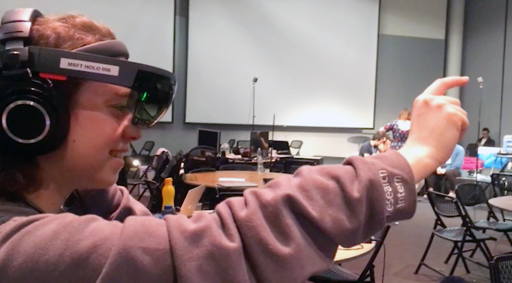
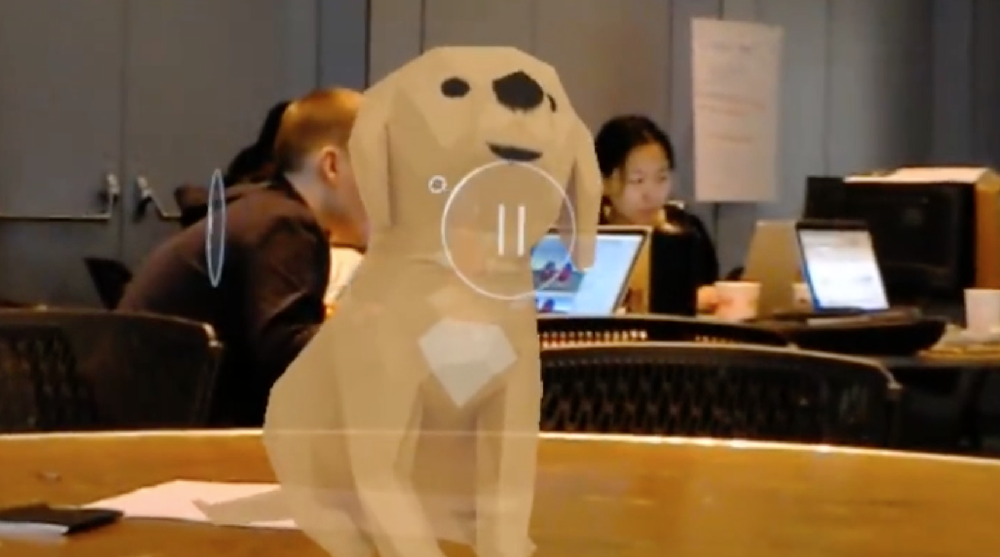
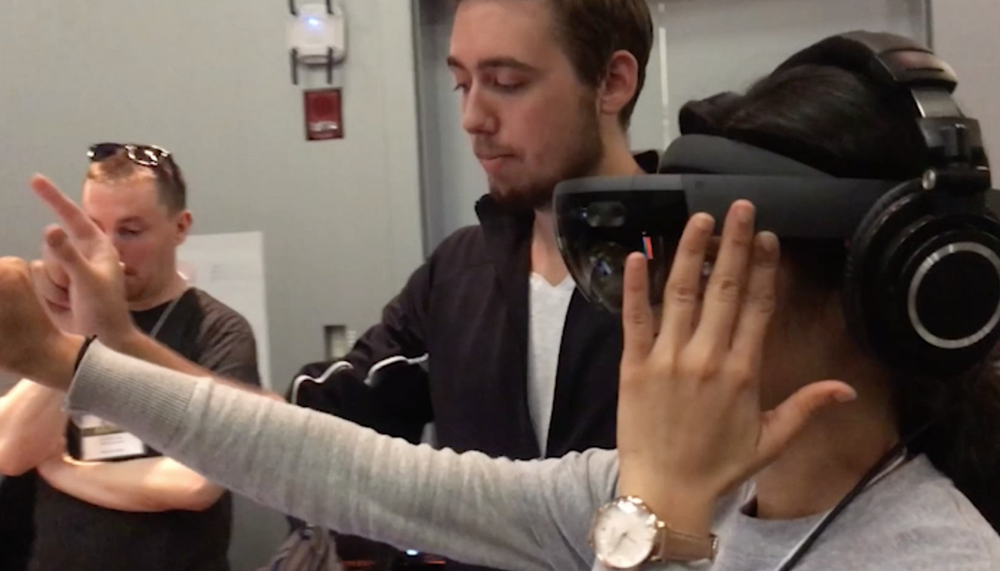
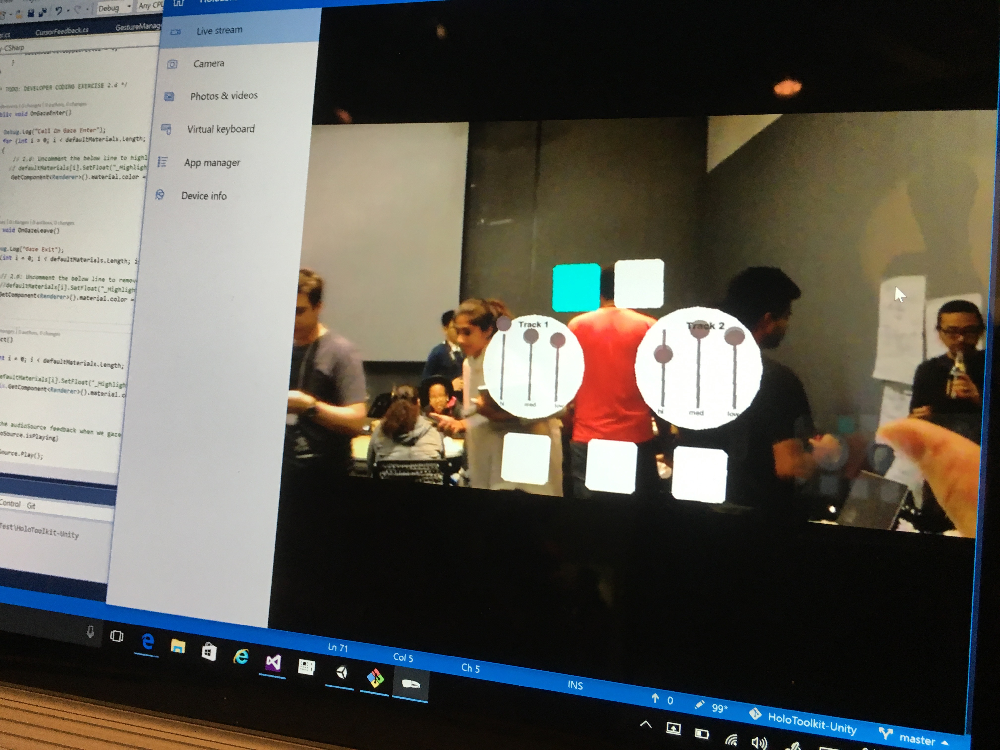
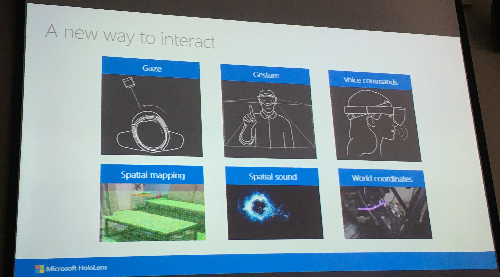
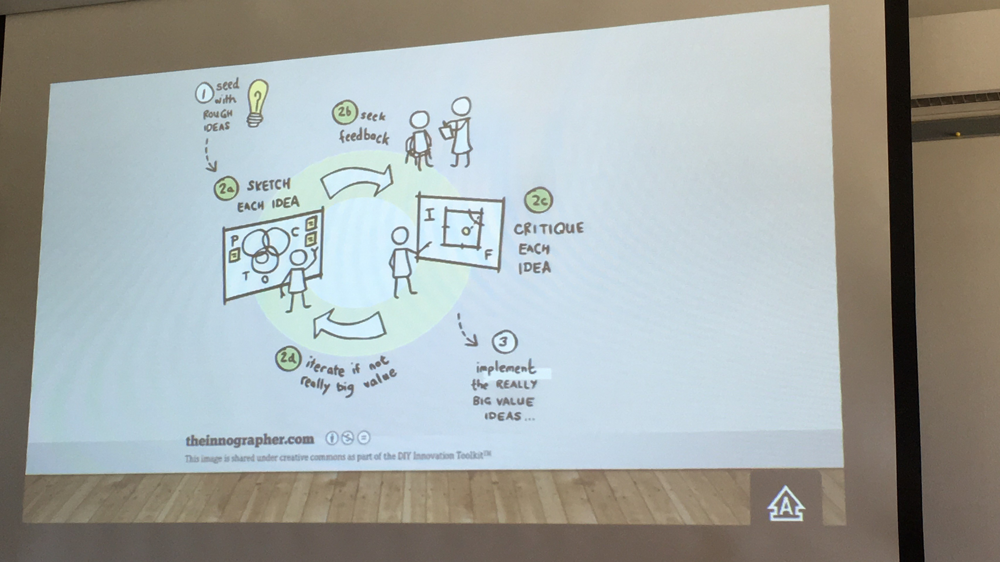
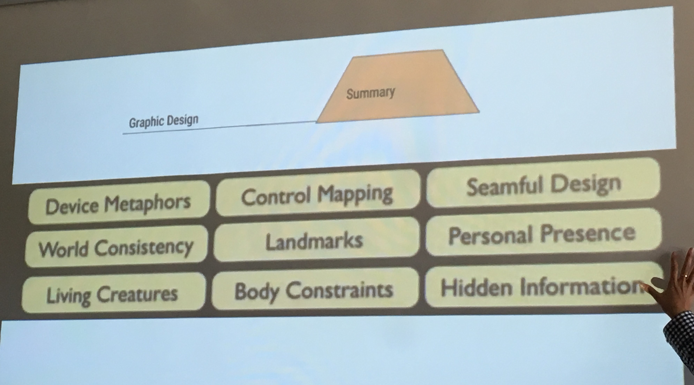

Creator: So Sun Park with Team Augmented Beatz (<a target="_blank" rel="noreferrer" href="https://www.linkedin.com/in/randspence/">Randall Spence</a>, <a target="_blank" rel="noreferrer" href="https://www.linkedin.com/in/tomstrissel/">Tom Strissel</a>) 
Venue: MIT Media Lab 
Type: Reality, Virtually Hackathon 2016 - VR/AR  
Tools: Unity Engine, Hololens  
Date: 2016. 10.

#### English Below

<iframe width="100%" height="400" src="https://www.youtube.com/embed/x7IioDo0Luo" frameborder="0" allow="accelerometer; autoplay; clipboard-write; encrypted-media; gyroscope; picture-in-picture" allowfullscreen></iframe>

<figure style="display: block; margin: 0 auto; text-align: center">

<figcaption>우리 팀의 홀로렌즈 작품을 감상 중인 해커톤 참여자</figcaption>
</figure>

<figure style="display: block; margin: 0 auto; text-align: center">

<figcaption>홀로렌즈 기본 에셋 테스팅</figcaption>
</figure>

<figure style="display: block; margin: 0 auto; text-align: center">

<figcaption>우리 팀의 홀로렌즈 작품을 감상 중인 심사위원</figcaption>
</figure>

<figure style="display: block; margin: 0 auto; text-align: center">

<figcaption>작품 만드는 도중 홀로렌즈 소프트웨어 스크린샷</figcaption>
</figure>

<figure style="display: block; margin: 0 auto; text-align: center">

<figcaption>마이크로소프트가 진행한 홀로렌즈 워크샵</figcaption>
</figure>

<figure style="display: block; margin: 0 auto; text-align: center">

<figcaption>해커톤 참여 기업 IDEO가 진행한 워크샵</figcaption>
</figure>

<figure style="display: block; margin: 0 auto; text-align: center">

<figcaption>해커톤 참여 기업이 진행한 워크샵</figcaption>
</figure>

MIT media lab이 주최한 해커톤에서 [마이크로소프트 홀로렌즈](https://www.microsoft.com/microsoft-hololens/en-us) 기기를 대여해서 증강현실 (AR) 플랫폼에 프로젝트를 만들었습니다. 음악 공연이 더 다양한 곳에서 이뤄진다면 어떨까라는 아이디어를 기획해서 3명의 개발자를 모아 AR 디제잉 세트를 만들었습니다. 이 프로그램이 제대로 개발된다면 DJ 장비를 풀로 가지고 다니지 않아도 홀로렌즈 하나로 더 유동적으로 음악을 연주하고 관객들과 만날 수 있지 않을까요?

이 영상은 저희 프로젝트를 위주로 편집한 짧은 데모 영상입니다. 3일동안 프로토타입을 연구해서 만들었습니다. 홀로렌즈가 현재 기술적으로 부족한 부분들이 있어 손으로 자유롭게 인터페이스를 조종하는 데에 한계가 있었지만, 시야 컨트롤, 손가락 컨트롤만을 이용해 디제잉 세트를 만들었습니다. 가상현실이 아닌 증강현실로 이 프로젝트를 만든 이유는 가상현실의 경우 VR 헤드셋을 쓰면 본인만이 즐길 수 있는 컨텐츠가 되지만, AR로 한다면 뮤지션이 관객들을 그대로 볼 수 있고, 소리도 블루투스를 이용해 쉽게 스피커로 전달할 수 있기 때문입니다.

### Hackathon in MIT

In October 2016, I traveled to Boston from New York to attend 'Reality, Virtually, Hackathon' hosted by MIT Media Lab with numerous sponsors. It was 4 days events including workshops, hacking, and demo day.

I met two other developers at the event and formed a team. **We created the DJ mixer set in Hololens (augmented reality) platform. We used gaze control/gesture control/audio trigger/color change for User Experience.**

- Simplified design of DJ mixer; 2 circles are main soundtracks & 5 square buttons are sound fillers.
- First version: changes into skyblue when clicked, back to white when sound file ends.
- Second version: changes into blue when gazed, red when clicked, back to green when sound file ends.

It is often useful to set a goal in your mind when you attend a hackathon, which is a short-term/hyper-stressed/unpredictable event. I set it up as **'Let's try something new that I will not be able to easily play around with'**, and thus, I chose Microsoft Hololens, augmented reality device with the latest update.

### DJ-ing in Augmented Reality

As I wanted to continue my experience of using music with VR/AR programs, I pitched my idea of 'DJ-ing in AR'. My initial idea was that if DJ/musicians are able to play mobile and ubiquitous, more street music shows and outdoor gigs can prosper, and hopefully such music x tech application may increase the communal musical experience in public spaces.

Click [here](https://devpost.com/software/augmented-beatz-7fiare) for more info about 'Augmented Beatz' project or [Github Repo](https://github.com/arc4randall/augmentedbeatz)

Luckily, few people contacted me with my pitch and with a slight change in members, I ended up with 3 junior developers. They never had Unity experience, which is crucial and helpful for any VR/AR hackathon. So I was half-teaching them how Unity front/back-end is constructed and communicate with one another. Then, we broke down our tasks—modelling, rendering, Unity x Hololens scripting for gaze control, finger pinch control, and etc.

It was overall a lot of fun and trying out new gears/tech skills. Since Hololens is extremely expensive, this event was a great opportunity for me to hack it and build something. Microsoft not only has quite a number of hololens built-in apps and games, but also has an incubator program which seems to produce AR-related tech/products. If you're getting indifferent with VR, AR would be good to look into.

### Hackathon Side-notes

- Great workshops on Friday, 24 hours before the actual hackathon starts
- My favorites were UI UX, Samsung Web VR, Msft Hololens workshops.
- 3D Modelling, Unity (C# or javascript), Design UI UX are all great handy skills
- Winner contents: Kids Education/Game x VR, Pharmaceutical x AR, Dynamic Game/Music Activity x VR, Psychological (social anxiety) x AR
- Hololens has a very limited gesture controls, so something too dynamic wouldn't be ideal for now. You can only pinch, drag, and zoom with your fingers.
- Unity and Hololens teams are working on better synchronization and building more documentation and reference materials. Currently, two platforms still have some conflicting scripts and functions that make harder to hack.

### MIT 해커톤을 통해 배운 것
- 트렌드를 앞서가는 기술과 연구에 대한 [발표 및 워크샵들](http://www.realityvirtuallyhack.com/workshops/)
-  VR/AR 산업에서 3d 모델링, Unity (C#), 디자인 UI UX 기술의 중요성
- 우승 작품: 어린이 교육 및 게임 컨텐츠(VR), 약/의학(AR), 다이내믹한 게임/음악 활동 (VR), 심리학/정신심리치료(AR)

### Thanks to ...

마이크로소프트 본사의 직원들이 아직 불안정한 홀로렌즈와 유니티 엔진 간의 API 연동에서 발생하는 버그 해결에 적극적으로 도와주어 감사했습니다.