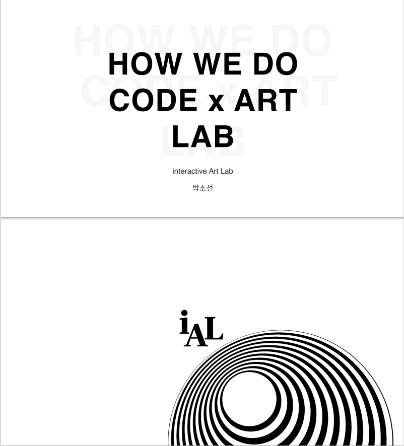
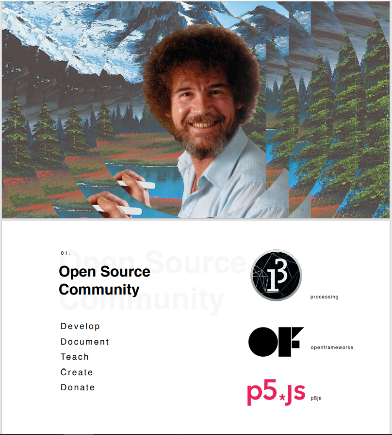
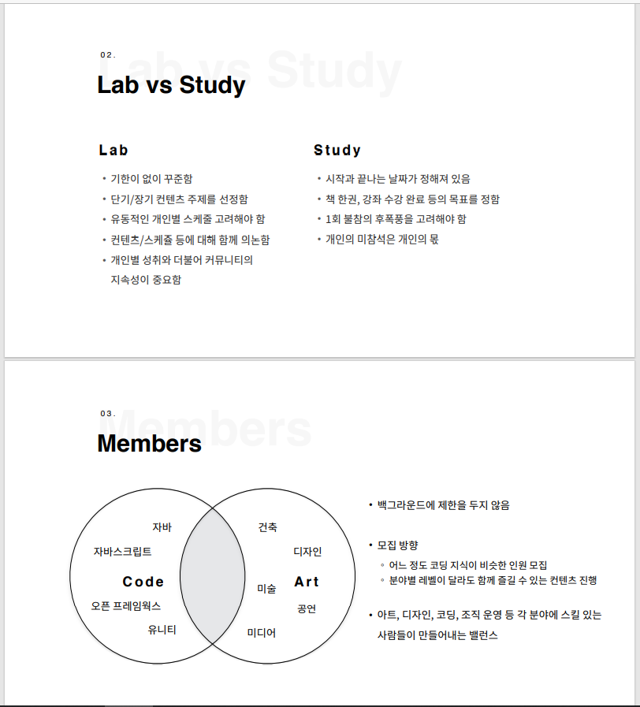
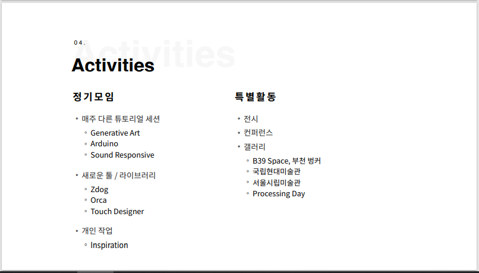
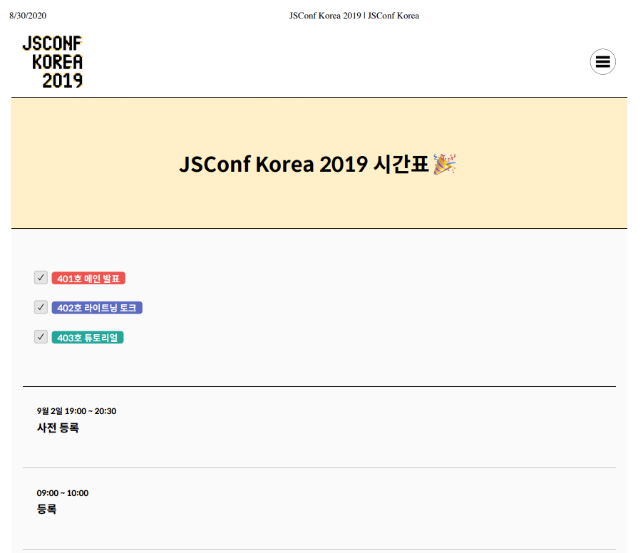
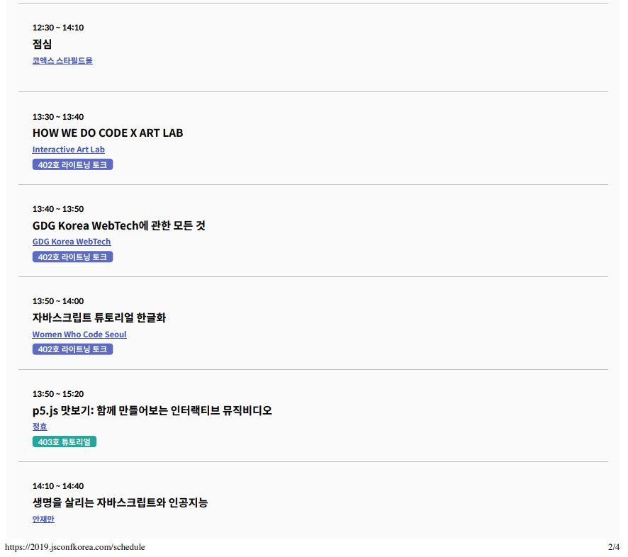

Creator: 박소선 (스피커) (발표자료 디자인: 조예지, 영상: 정효)  
Venue: 2019 JSCONF  <a target="_blank" rel="noreferrer" href="https://2019.jsconfkorea.com/">자바스크립트 컨퍼런스</a> 코엑스 
Type: 커뮤니티 라이트닝 토크  
Date: 2019-09-03

#### [인터렉티브 아트 랩](https://www.instagram.com/interactive_art_lab/)의 팀원으로써 JSCONF 부스에 참여하였습니다.

#### 스피커로 참여해서 라이트닝 토크에서 기술과 예술을 융합하는 랩 활동에 대해 소개하고 커뮤니티 활동을 통해 느낀 시사점을 공유했습니다.

### jsconf 참여 후기 영상

<iframe width="100%" height="400" src="https://www.youtube.com/embed/ToEU3z3ssYs" frameborder="0" allow="accelerometer; autoplay; clipboard-write; encrypted-media; gyroscope; picture-in-picture" allowfullscreen></iframe>

### jsconf 발표 자료

<iframe width="100%" height="400" src="https://www.youtube.com/embed/5v37C480CaY" frameborder="0" allow="accelerometer; autoplay; clipboard-write; encrypted-media; gyroscope; picture-in-picture" allowfullscreen></iframe>

<figure style="display: block; margin: 0 auto; text-align: center">

<figcaption></figcaption>
</figure>

<figure style="display: block; margin: 0 auto; text-align: center">

<figcaption></figcaption>
</figure>
<figure style="display: block; margin: 0 auto; text-align: center">

<figcaption></figcaption>
</figure>
<figure style="display: block; margin: 0 auto; text-align: center">

<figcaption></figcaption>
</figure>

<figure style="display: block; margin: 0 auto; text-align: center">

<figcaption></figcaption>
</figure>
<figure style="display: block; margin: 0 auto; text-align: center">

<figcaption></figcaption>
</figure>