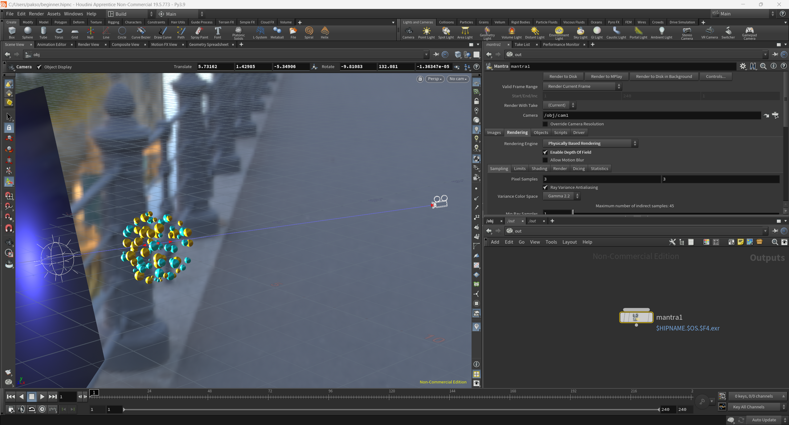

## Renders

<figure style="display: block; margin: 0 auto; text-align: center">

<figcaption>Maya</figcaption>
</figure>

<figure style="display: block; margin: 0 auto; text-align: center">

<figcaption>Maya</figcaption>
</figure>

<iframe width="100%" height="400" src="https://youtu.be/Cx2OjNhi1ys" frameborder="0" allow="accelerometer; autoplay; clipboard-write; encrypted-media; gyroscope; picture-in-picture" allowfullscreen></iframe>

<figure style="display: block; margin: 0 auto; text-align: center">

<figcaption>Houdini</figcaption>
</figure>

<figure style="display: block; margin: 0 auto; text-align: center">

<figcaption>Houdini</figcaption>
</figure>

<figure style="display: block; margin: 0 auto; text-align: center">

<figcaption>Blender</figcaption>
</figure>

<figure style="display: block; margin: 0 auto; text-align: center">

<figcaption>Blender</figcaption>
</figure>

<figure style="display: block; margin: 0 auto; text-align: center">

<figcaption>Maya (2015)</figcaption>
</figure>

<figure style="display: block; margin: 0 auto; text-align: center">

<figcaption>Maya (2015)</figcaption>
</figure>

<figure style="display: block; margin: 0 auto; text-align: center">

<figcaption>Maya (2015)</figcaption>
</figure>

<figure style="display: block; margin: 0 auto; text-align: center">

<figcaption>Maya (2015)</figcaption>
</figure>

## Maya

<figure style="display: block; margin: 0 auto; text-align: center">

<figcaption> </figcaption>
</figure>

## Houdini

<figure style="display: block; margin: 0 auto; text-align: center">

<figcaption> </figcaption>
</figure>

<figure style="display: block; margin: 0 auto; text-align: center">

<figcaption> </figcaption>
</figure>

<figure style="display: block; margin: 0 auto; text-align: center">

<figcaption> </figcaption>
</figure>

<figure style="display: block; margin: 0 auto; text-align: center">

<figcaption> </figcaption>
</figure>

<figure style="display: block; margin: 0 auto; text-align: center">

<figcaption> </figcaption>
</figure>

## Blender

<figure style="display: block; margin: 0 auto; text-align: center">

<figcaption> </figcaption>
</figure>

<figure style="display: block; margin: 0 auto; text-align: center">

<figcaption> </figcaption>
</figure>