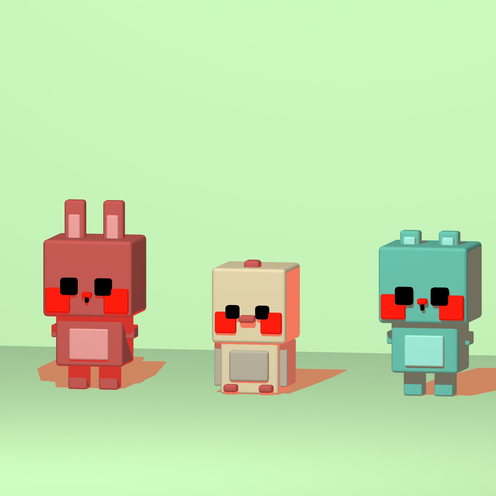

## Renders

<figure style="display: block; margin: 0 auto; text-align: center">

<figcaption>Maya</figcaption>
</figure>

<figure style="display: block; margin: 0 auto; text-align: center">

<figcaption>Maya</figcaption>
</figure>

<figure style="display: block; margin: 0 auto; text-align: center">

<figcaption>Maya, modeling, lighting, rendering </figcaption>
</figure>

<figure style="display: block; margin: 0 auto; text-align: center">

<figcaption>Maya, modeling, lighting, rendering </figcaption>
</figure>

<iframe width="100%" height="360" src="https://www.youtube.com/embed/Cx2OjNhi1ys?si=kFlT1zW25E0rXQ2z" title="YouTube video player" frameborder="0" allow="accelerometer; autoplay; clipboard-write; encrypted-media; gyroscope; picture-in-picture; web-share" allowfullscreen></iframe>

<figure style="display: block; margin: 0 auto; text-align: center">

<figcaption>Houdini</figcaption>
</figure>

<figure style="display: block; margin: 0 auto; text-align: center">

<figcaption>Houdini</figcaption>
</figure>

<figure style="display: block; margin: 0 auto; text-align: center">

<figcaption>Blender, modeling, texture painting, lighting, rendering</figcaption>
</figure>

<figure style="display: block; margin: 0 auto; text-align: center">

<figcaption>Blender, modeling, sculpting, texturing, lighting, rendering</figcaption>
</figure>

<figure style="display: block; margin: 0 auto; text-align: center">

<figcaption>Maya, modeling, animation, rigging, texturing (2015)</figcaption>
</figure>

<figure style="display: block; margin: 0 auto; text-align: center">

<figcaption>Maya, modeling, animation, rigging, particles (2015)</figcaption>
</figure>

<figure style="display: block; margin: 0 auto; text-align: center">

<figcaption>Maya, modeling, animation, rigging, particles (2015)</figcaption>
</figure>

<figure style="display: block; margin: 0 auto; text-align: center">

<figcaption>Maya, modeling, animation, rigging, particles, lighting, reflective materials (2015)</figcaption>
</figure>

## Process

### Maya

<figure style="display: block; margin: 0 auto; text-align: center">

<figcaption> </figcaption>
</figure>

<figure style="display: block; margin: 0 auto; text-align: center">

<figcaption>Maya, modeling, lighting, rendering </figcaption>
</figure>

<figure style="display: block; margin: 0 auto; text-align: center">

<figcaption>Maya, modeling, lighting, rendering </figcaption>
</figure>

### Houdini

<figure style="display: block; margin: 0 auto; text-align: center">

<figcaption> </figcaption>
</figure>

<figure style="display: block; margin: 0 auto; text-align: center">

<figcaption> </figcaption>
</figure>

<figure style="display: block; margin: 0 auto; text-align: center">

<figcaption> </figcaption>
</figure>

<figure style="display: block; margin: 0 auto; text-align: center">

<figcaption> </figcaption>
</figure>

<figure style="display: block; margin: 0 auto; text-align: center">

<figcaption> </figcaption>
</figure>

### Blender

<figure style="display: block; margin: 0 auto; text-align: center">

<figcaption> </figcaption>
</figure>

<figure style="display: block; margin: 0 auto; text-align: center">

<figcaption> </figcaption>
</figure>