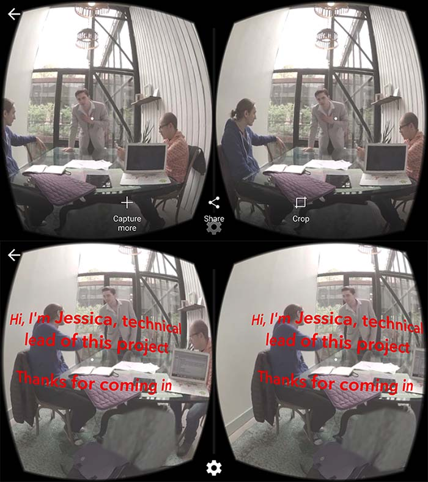
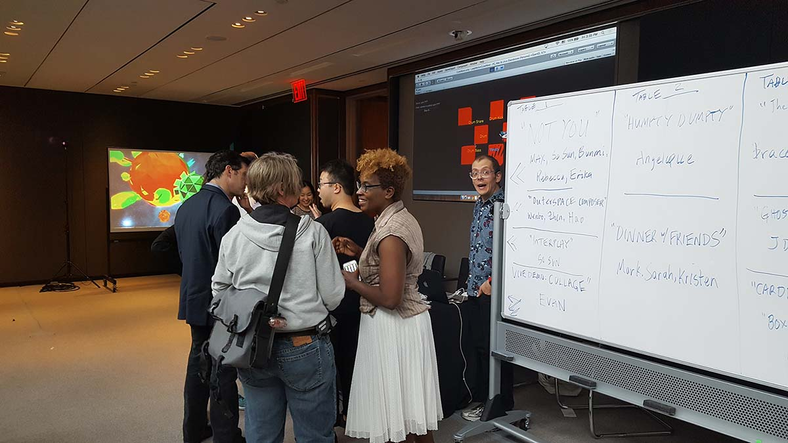
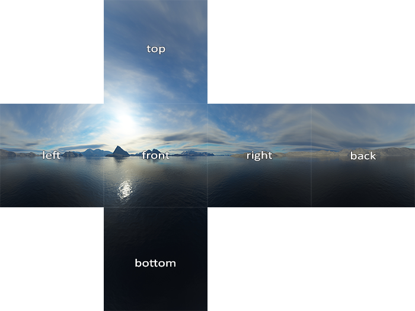

Title: Not You 
Position: [Collaborator] Co-Producer, Developer, Voice Actor  
Topic: AR / VR / XR, Gender Discrimination  
Team: Maxwell Foxman, Erika Scott, Bunmi Sijuwade, Rebecca Poulson, So Sun Park, Mark Ryan Anderson, Maxwell Foxman, Ulysses Popple 
Tools: Unity, 360 Heroes, Adobe Premiere, Freesound.org, AutoPano, Audacity, Theta 360, and a binaural audio recorder, Cardboard, Gear VR 
Type: <a target="_blank" rel="noreferrer" href="http://timewavefestival.com/virtualrealitylab-2016-projects/">TimeWave Lab VR/AR Festival 2016</a> in NYC  
Venue: <a target="_blank" rel="noreferrer" href="http://timewavefestival.com/2016-demo-day-gallery/">Hearst Tower(Showcase)</a>, Kickstarter (Production), NYU Gaming Center (Making)  
Date: May 2016

<h3>
A short interactive VR film about gender discrimination that females go through in professional workplaces. Made with Unity, GoPro 360, Gear VR.
</h3>  

 

<iframe width="100%" height="400" src="https://www.youtube.com/embed/UJM_2lbgim4" frameborder="0" allow="accelerometer; autoplay; clipboard-write; encrypted-media; gyroscope; picture-in-picture" allowfullscreen></iframe>

<figure style="display: block; margin: 0 auto; text-align: center">

<figcaption>Demo Day at Hearst Tower, New York</figcaption>
</figure>

<figure style="display: block; margin: 0 auto; text-align: center">

<figcaption>TimeWave VR Lab Website</figcaption>
</figure>

### Project Summary

Experience what it is like to be in someone else’s shoes in real life. This VR film is specifically directed to experience gender discrimination that females experience in professional workplaces.

VR is another great medium to explore storytelling and to share experiences. With Not You, users will be able to experience a few minutes in the day of a life of a female project manager named Jessica. In this scene, she is interviewing a potential vendor with her male colleagues. By taking Jessica's point of view, our goal is to raise awareness on the subtleties of how gender stereotypes and discrimination are experienced by women, even in professional workplaces. This is just one Not You story out of many to be experienced.

### How to Play 
- Please feel free to use Google Cardboard version if available.
- Please select the best HD quality in the setting.
- Be mindful that this video is the demo version, and thus, you won't be able to choose the option. In real application, the player is able to choose the option.

### Review/Feedback

- Options are made to disappear quickly even before the audience clicks to deliver a sense of helplessness to the player, considering the scenario of discrimination at work.
- (Fake) Interactivity to make the player feel like one has a choice but not really..
- Tested out with Ricoh Theata (not this video) before GoPro Heroes in terms of distance and getting used to 360 shooting.
- In the future, should prep better with stitching borderline, lighting, and camera HD quality (device limitation)
- Workflow: After building characters and plot, we drew open cube map and tried to figure out seating, position, and distance.

<figure style="display: block; margin: 0 auto; text-align: center">

<figcaption>From: http://learnopengl.com/#!Advanced-OpenGL/Cubemaps</figcaption>
</figure>

- During many test shoots, we tried to get used to 'clap' signal in the beginning of every shoot for easier post-production—stitching with GoPro/Autopano.

## 작업 소개

본 프로젝트는 사회문제와 관련된 주제로 360 VR 체험 영상을 만들어보는 것이 목적이었습니다. 같이 프로젝트에 참여한 조원들 중 여러명이 테크 쪽에서 일하지만 여성이라는 이유로 무시당하거나 차별받은 경험이 자주 있어 그 이야기들을 바탕으로 픽션 시나리오를 작성했습니다. 사용자는 심즈와 같이 말풍선 선택 옵션을 보지만 매우 빠르게 지나가기 때문에 선택지는 있으나 마나이며 누른다고 해도 크게 달라지는 줄거리가 아닙니다. 즉, 본 VR 픽션은 여성들이 직장에서 겪는 성차별 스트레스를 사용자가 느낄 수 있게끔 무시감이라는 감정을 전달하고자 연출했습니다.

### 작동 방법
- 마우스 드래그 혹은 VR 헤드셋을 이용하면 360도 회전이 가능한 영상입니다.
- 구글 카드보드나 VR 헤드셋이 있다면 사용하길 추천합니다.
- 영상의 설정 버튼을 클릭하여 최상의 화질을 선택해주세요.
- 유튜브 영상으로는 직접 버튼을 클릭할 수가 없습니다. 다만 원본과 시나리오는 동일합니다. 
