## INTRODUCTION
A developer and storyteller who uses interactive digital mediums. Passionate about making technology more accessible, approachable, enjoyable through creative applications.

## 1. WEB PROJECTS 웹 개발
- [Euljiro Has No Park, 2021](#web-1)
- [garden.local, distributed web of care, 2021 - 2022](#web-2)
- [Digital Trypanosomiasis, 2022](#web-3)
- [Tripbtoz, 2020 - 2021](#web-4)
- [Saving Okja, Global Jeju Hackathon, 2017](#web-5)

## 3. XR (AR, VR, MR) 증강현실, 가상현실
- [POSCO DX R&D Center: AR.VR 가상현실 글래스 앱 연구](#xr-1)
- [2021 Frankenstein, 2021](#xr-2)
- [Reviving 5 Pointz, 2017](#xr-3)

## 2. GENERATIVE ARTS 알고리즘 생성 아트
- [Audiovisual live-coding performance, 2022](#ga-1)
- [Creative coding classes and performances, 2022](#ga-2)
- [Creative coding works on social media](#ga-4)

## 4. INTERACTIVE INSTALLATION 인터렉티브 설치물
- [Dance x Tech Lab,  2021](#ii-1)
- [Subconscious,  2021](#ii-2)
- [Bloom Together,  2019](#ii-4)
- [Stars in Your Hands,  2017](#ii-5)
- [Interplaying, 2016](#ii-6)
- [Theater, Vassar College, 2012-2015](#ii-7)

## 5. PRESENTATION 발표
- [List of Talks](#pp-1)
- [List of Workshops](#pp-2)

<h3 id="web-1"><a target="_blank" rel="noreferrer"  href="https://sosunnyproject.github.io/portfolio/euljiro-xyz/"> 을지로에는 공원이 없다. Euljiro Has No Park, 2021</a></h3>

Topic: Urban Environment

<figure style="display: block; margin: 0 auto; text-align: center">

<figcaption>December 2021, Euljiro Has No Park v.1,   <i>The Folding of the City</i> group exhibition, Eulji Art Center, Seoul</figcaption>
</figure>

<figure style="display: block; margin: 0 auto; text-align: center">

<figcaption>low energy view</figcaption>
</figure>

<figure style="display: block; margin: 0 auto; text-align: center">
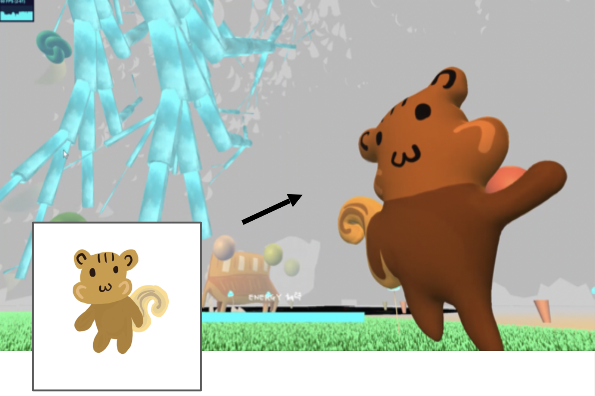
<figcaption>Development Process</figcaption>
</figure>

An interactive 3D web-based artwork about the future of Euljiro district in Seoul, South Korea.

- Threejs 라이브러리를 사용해서 나무, 잔디 등 전체 환경을 구성했습니다.
- L-system 알고리즘을 응용하여 나무를 모델링하고, 중앙의 큰 생명나무의 매터리얼은 webGL 쉐이더 코드를 사용했습니다.
    - 참고: [보타니컬 알고리즘](http://algorithmicbotany.org/), [l-system 시뮬레이터](https://www.carl-olsson.com/project/l-system/)
- 캐릭터는 프로크리에이트에서 직접 드로잉한 2D 스케치를 [Monstermash.zone](Monstermash.zone) 어플리케이션으로 3D화 하고 짧은 애니메이션을 생성했습니다.
    - 캐릭터별 애니메이션은 최적화를 위해 몇몇 모델에만 적용했습니다.
- 유저의 에너지가 떨어지면 조명이 점점 어두워지고, 필터가 블러화되면서 픽셀이 깨지는 것 같은 효과를 보입니다.
- 유저는 화살표 키로 이동이 가능하며, raycast로 유저와 각 캐릭터 거리를 인지하고, 충분히 가까워지면 일종의 메시지 창을 띄웁니다.
- 현장 전시 기간 동안, [Gamepad API](https://developer.mozilla.org/en-US/docs/Web/API/Gamepad_API/Using_the_Gamepad_API)를 이용해 게임패드 콘솔로 조작이 가능하게 구현했습니다. 
- webpack, vite 번들링 프레임워크로 구축했습니다. 

<h3 id="web-2"><a target="_blank" rel="noreferrer"  href="https://sosunnyproject.github.io/portfolio/dwc-v2/">garden.local, distributed web of care, 2021 - 2022</a></h3>

Topic: Nature and tech

<figure style="display: block; margin: 0 auto; text-align: center">

<figcaption> <i>가든.로컬 garden.local</i> 2021, LED monitor, paintings, Raspberry Pi,    Installation view, Art Center White Block, Paju</figcaption>
</figure>

<figure style="display: block; margin: 0 auto; text-align: center">
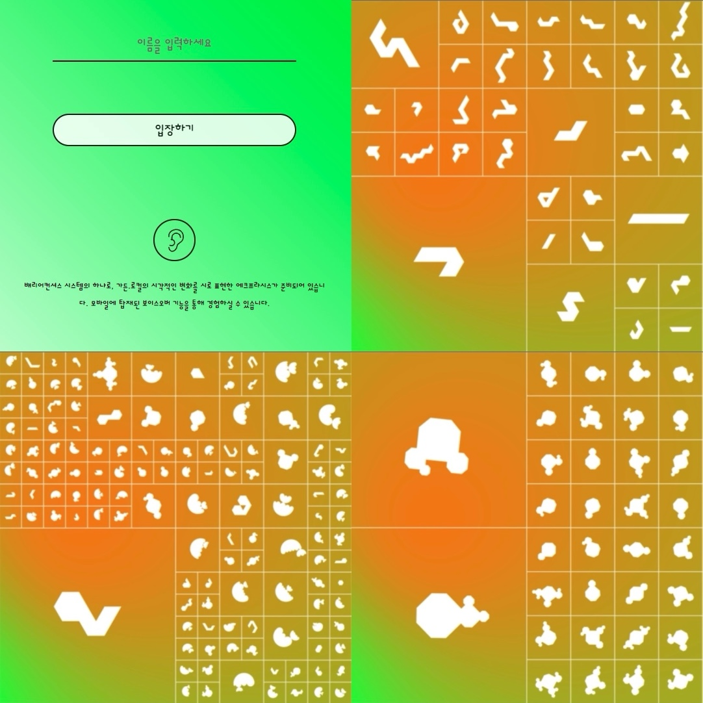
<figcaption></figcaption>
</figure>

A multimedia exhibition that poses a question ‘What if the Internet is like a garden?’. Logging into the mobile website via local wifi network, the audience can experience their own virtual gardens and creatures. Made with pixi js (web 2D rendering engine), WebGL, socket, node js, Raspberry PI, etc.

- 인터렉티브 멀티미디어 전시로써, 사용자가 로컬 IP 주소를 통해 현장 네트워크로만 접속가능한 모바일 웹사이트에 접속합니다. 
- 해당 웹사이트에서 닉네임을 설정하고 입장합니다. 
- 본인만의 가든과 크리쳐가 생성됩니다. 가든은 삼각형과 아크 모양으로 이루어져있으며 애니메이션이 계속 재생됩니다. 
    - 가든이 움직이는 애니메이션의 속도와 그라데이션 색깔은 현장 라즈베리 파이에서 받아오는 온도, 습도 데이터르 반영해서 변화합니다.
- nodejs, nginx, socket, PIXI js 등을 사용해 개발했습니다. 
- 저는 주로 PIXIjs를 이용한 2D 그래픽 변화, 사운드 인터렉션, 랜딩페이지 화면, 유저 경험 디자인 등을 담당했습니다. 추가적으로 server코드와 socket의 서버-클라이언트 연동 구현도 함께했습니다.
- 2022년에는 프로덕트 매니저 역할을 병행하면서 21년 프로젝트를 업데이트했습니다. 
    - 크리쳐의 SVG 코드 제너레이션 알고리즘과 코드 리팩토링을 담당했습니다.
    - 서버 개발자의 클라우드 데이터베이스 마이그레이션 프로그래밍을 보조했습니다. 

<h3 id="web-3"><a target="_blank" rel="noreferrer"  href="https://digital-trypanosomiasis-2022.netlify.app/">디지털 수면병 Digital Trypanosomiasis, 2022</a></h3>

Topic: Healing of Trauma

<figure style="display: block; margin: 0 auto; text-align: center">
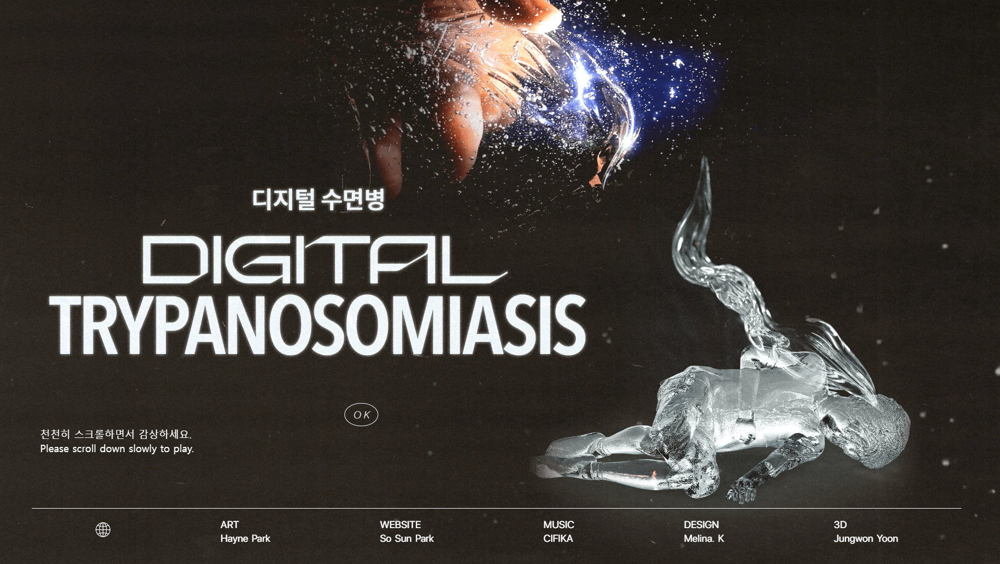
<figcaption> Digital Trypanosomiasis by Hayne Park, featured on Ars Electronica and K’ARTS Festival. </figcaption>
</figure>

Developed an interactive scroll-based website about trypanosomiasis, sleeping sickness parasite.
- 300+ 장의 사진들을 연속적으로 플레이하여 마치 GIF 애니메이션 재생 같은 작품을 보여주는 웹사이트입니다. 
- 유저가 마우스 휠을 위아래로 움직일 때만 사진들이 연속으로 재생됩니다. 
- 구간별로 사운드 효과 재생도 구현하였으나, 최종 결과물에서는 사운드를 제외했습니다. 
- 구간마다 한글 및 영어 자막을 코드로 설정했습니다.
- Netlify로 배포하였으며, 대용량 이미지 로드는 Cloudinary 서비스를 사용했습니다.

<h3 id="web-4">Tripbtoz, 2020 - 2021</h3>

Topic: Travel Tech, B2C Service  
Position: Full-time Front-end Web Developer

<figure style="display: block; margin: 0 auto; text-align: center">
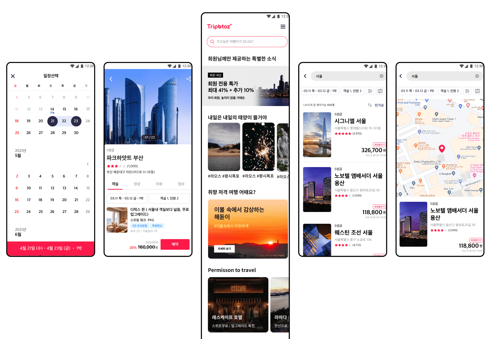
<figcaption> Tripbotz, travel tech startup, Pre-Series B as of Summer 2022, Seoul, South Korea.
 </figcaption>
</figure>

Built the entire website with responsive design and refactored mobile webViews. Modularized UI components based on Atomic Design System. Actively collaborated with designers and backend developers to refactor the legacy codes and improve the renderings and data flow.

<h3 id="web-5"><a target="_blank" rel="noreferrer"  href="https://sosunnyproject.github.io/portfolio/jeju-hackathon/">Saving Okja, Global Jeju Hackathon, 2017</a></h3>

Topic: Environment
<figure style="display: block; margin: 0 auto; text-align: center">
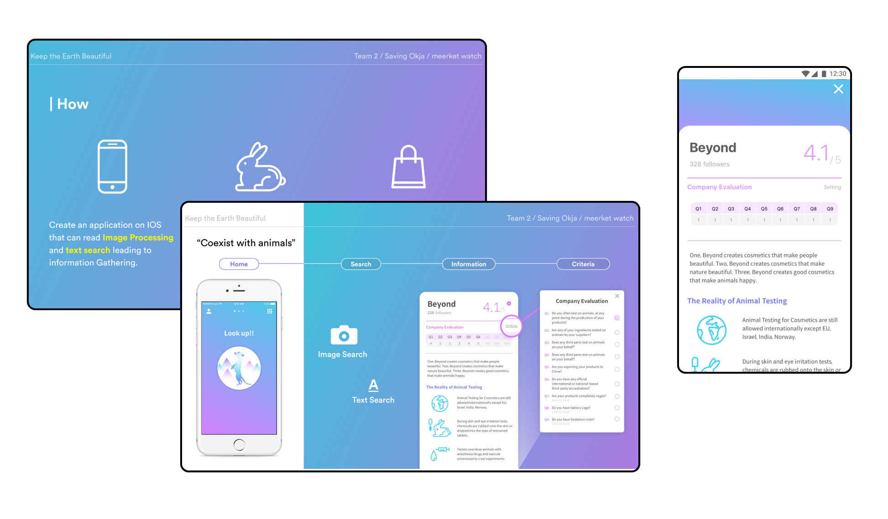
<figcaption> October 2017, an application demo, 1st place winner in Global Jeju Hackathon, South Korea. </figcaption>
</figure>

iOS mobile application that instantly checks the environment-friendly scores of the products with image-detection or OCR

## 2. XR (AR, VR, MR)

<h3 id="xr-1">POSCO DX (POSCO ICT) R&D Center: AR.VR Research Team</h3>

<figure style="display: block; margin: 0 auto; text-align: center">

<figcaption>대외비 프로젝트임에 따라 유사이미지를 첨부합니다.</figcaption>
</figure>

<h3 id="xr-2"><a target="_blank" rel="noreferrer"  href="https://2021frankenstein.bubbleapps.io/version-test/">2021 Frankenstein, 2021</a></h3>

Topic: Duality of technology

<figure style="display: block; margin: 0 auto; text-align: center">
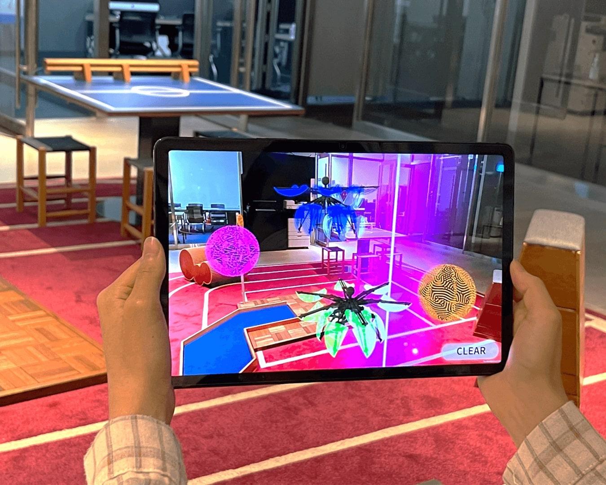
<figcaption>2021 Frankenstein, Hololens 2.0 & AR mobile app (Android & iOS), on-site exhibition,   <i>XR-SAPY</i>, Seoul Artists Platform New & Young and SFAC sponsored.
</figcaption>
</figure>

A site-specific XR artwork about reinterpreting the meanings of ‘monster’ in a techno-advanced 21st century.

We were inspired by Mary Shelley and her classic SF novel, Frankenstein. Questioning why she created a monster, we connected the imaginary creatures with the real-world exhibition space. We also designed a new ‘monster’ reflecting the modern society and technologies. 

<h3 id="xr-3"><a target="_blank" rel="noreferrer"  href="https://sosunnyproject.github.io/portfolio/5-pointz-vr/">Reviving 5 Pointz, 2017</a></h3>

Topic: Urban Environment

<figure style="display: block; margin: 0 auto; text-align: center">
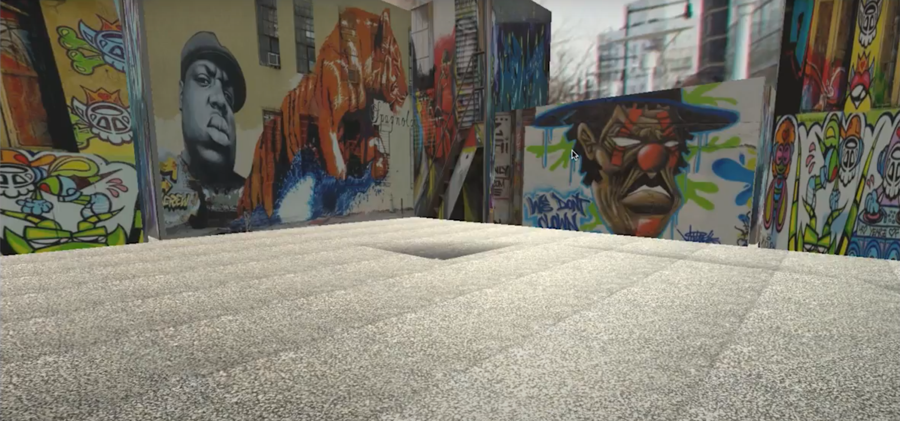
<figcaption>January 2017, Reviving 5 Pointz, <i>TimeWave VR Festial</i> supported by Oculus and Time Inc.
</figcaption>
</figure>

A short interactive VR documentary about gentrified and now-disappeared historic American mural space 5 Pointz in New York. Made with Unity.

## 3. GENERATIVE ARTS

<h3 id="ga-1"><a target="_blank" rel="noreferrer"  href="https://sosunnyproject.github.io/portfolio/jsconf-korea-2022">Audiovisual live-coding performance, 2022 </a></h3>

Topic: Audiovisual
<figure style="display: block; margin: 0 auto; text-align: center">
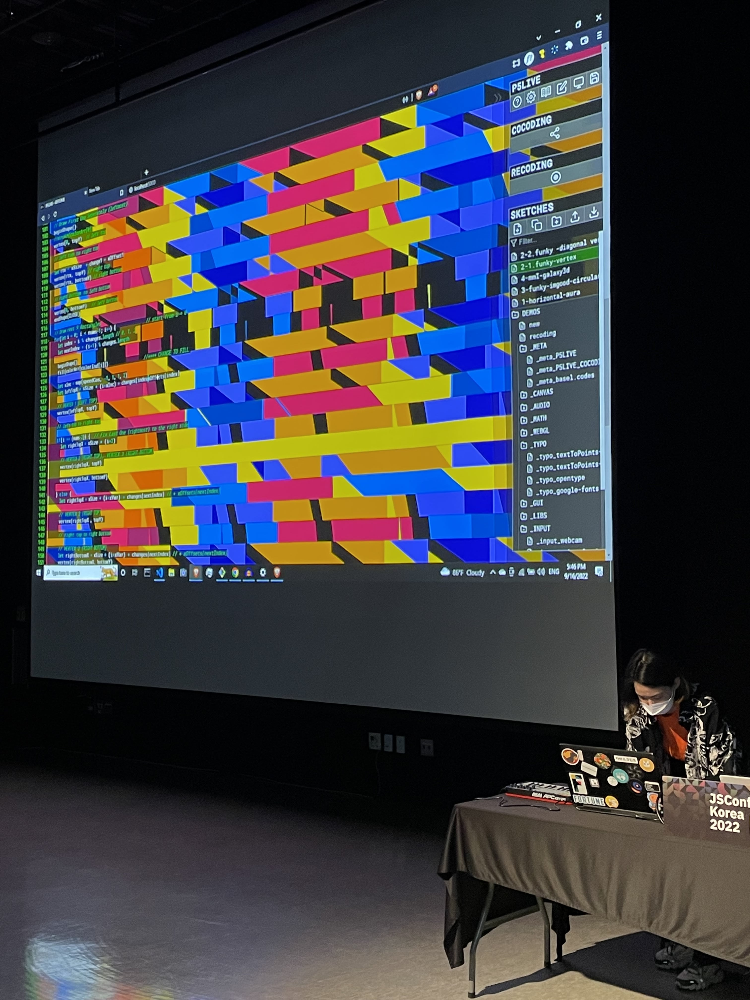
<figcaption> September 2022, Dancing Vertex, JSCONF KOREA 2022 Day 2 Opening show. </figcaption>
</figure>

A live-coding audiovisual performance made with p5js creative coding library and p5live website. 

<h3 id="ga-2"><a target="_blank" rel="noreferrer"  href="https://sosunnyproject.github.io/portfolio/smhs-music-coding/">Creative coding classes and performances, 2022 </a></h3>

Topic: Audiovisual

<figure style="display: block; margin: 0 auto; text-align: center">
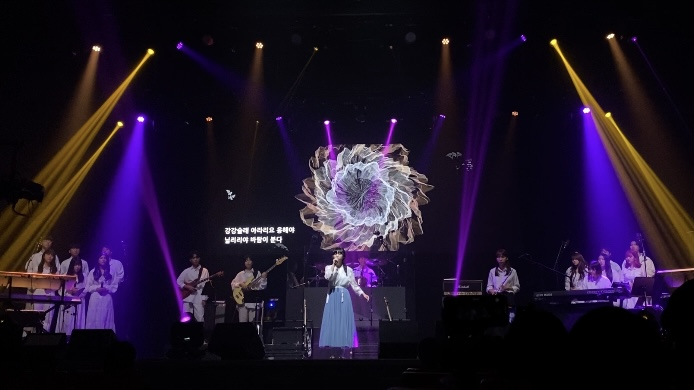
<figcaption>August - October 2022, An audiovisual projection design with p5js creative coding,   Seoul Music High School</figcaption>
</figure>

Teach creative coding at Seoul Music High School and produce audiovisual videos for music showcase. 

<h3 id="ga-4"><a target="_blank" rel="noreferrer"  href="http://instagram.com/sosunnyproject">Creative coding works on social media</a></h3>

<figure style="display: block; margin: 0 auto; text-align: center">
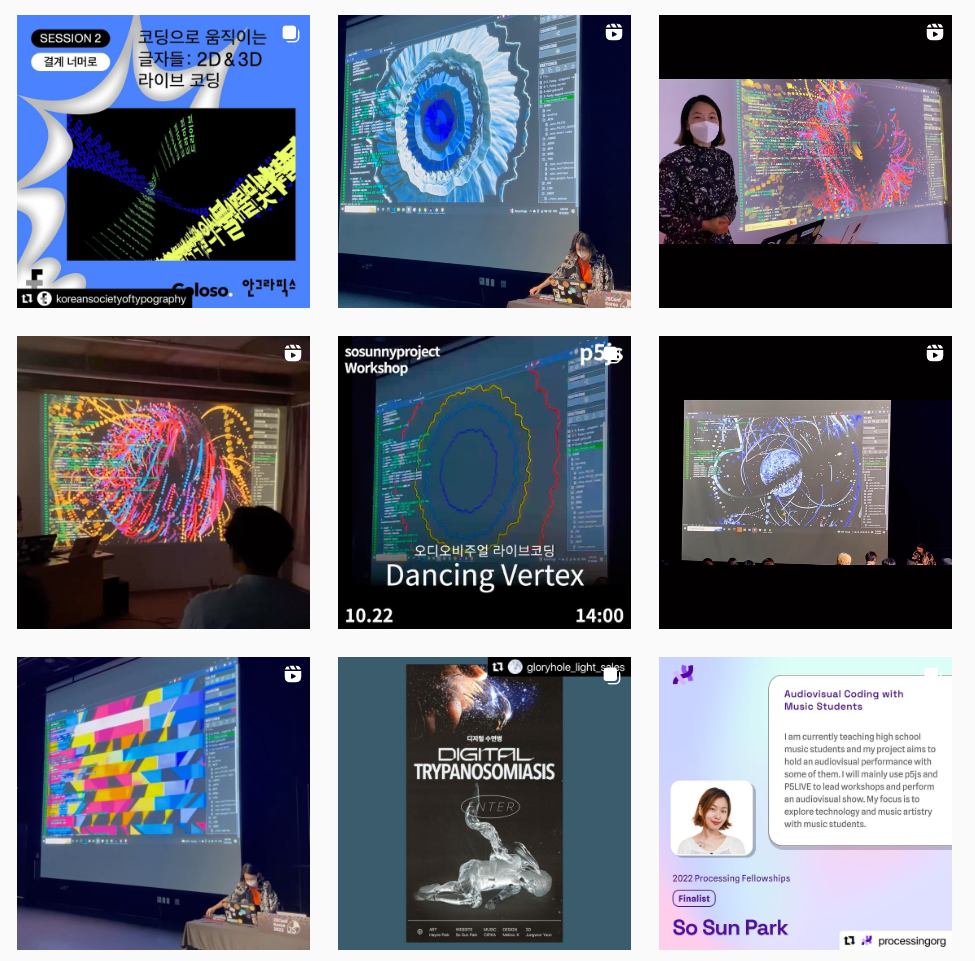
<figcaption>Instagram @sosunnyproject, Creative technologist, Educator.
</figcaption>
</figure>

Upload daily coding sketches, experiment with creative codes, make series of sketches with themes, and actively communicate with followers through Q&A and events like p5js Instagram Takeover.

## 4. INTERACTIVE INSTALLATION

<h3 id="ii-1">Dance x Tech Lab, 2021</h3>

Topic: Technology and human body  
Position: [Collaborator] Creative Technologist.

<figure style="display: block; margin: 0 auto; text-align: center">
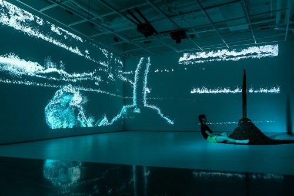
<figcaption>August 2021, Untitled, <i>Dance X Tech Lab</i>,   Korea National Contemporary Dance Company.</figcaption>
</figure>

<figure style="display: block; margin: 0 auto; text-align: center">
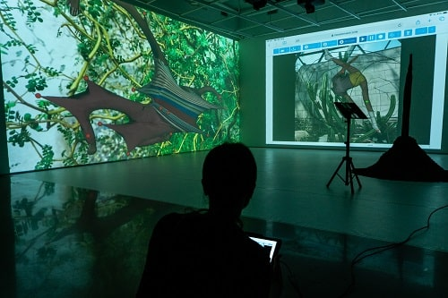
<figcaption><i>Dance x Tech Lab Showcase</i> 2021, 2-channel projections,   Performance View, Windmill gallery, Seoul
</figcaption>
</figure>

A choreography piece experimenting and researching the collaboration of body, dance, and technology. 
Used Touch Designer, Kinect, MonsterMash, and social media AR filters. 

<h3 id="ii-2"><a target="_blank" rel="noreferrer"  href="https://sosunnyproject.github.io/portfolio/chwihyanggwan-exhibition-seoul-hongdae/">Subconscious, 2021</a></h3>

Topic: Trauma recovery

<figure style="display: block; margin: 0 auto; text-align: center">
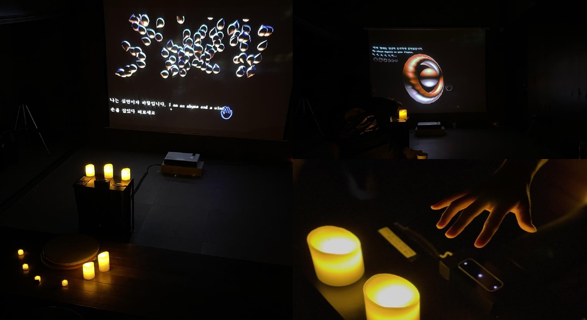
<figcaption>May 2021, Subconscious, Art event in Chwi Hyang culture salon venue, Seoul. </figcaption>
</figure>

An interactive media installation that allows the audience to meditate on their inner thoughts. Made with p5js and Leap motion hand detector. An extension of work below, Here, Now.

<h3 id="ii-4"><a target="_blank" rel="noreferrer"  href="https://sosunnyproject.github.io/portfolio/2019-ial-show/">Bloom Together,  2019</a></h3>

Topic: Social power dynamic

<figure style="display: block; margin: 0 auto; text-align: center">
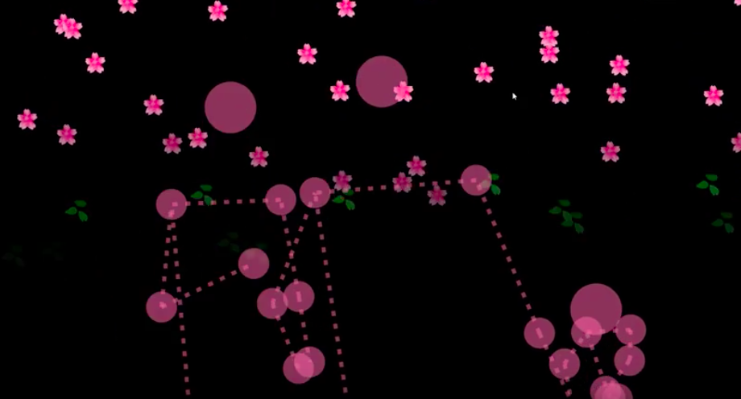
<figcaption>March 2019, Bloom Together,   Interactive Art Lab group exhibition <i>Encounter</i>, Mapo Art Center, Seoul</figcaption>
</figure>

An interactive media installation about encouraging two different people to come close and bloom the flowers together. Used p5js and poseNet deep learning.

<h3 id="ii-6"><a target="_blank" rel="noreferrer"  href="https://sosunnyproject.github.io/portfolio/media-thesis-vassar">Interplaying, 2016</a></h3>

Topic: Social power dynamic

<figure style="display: block; margin: 0 auto; text-align: center">
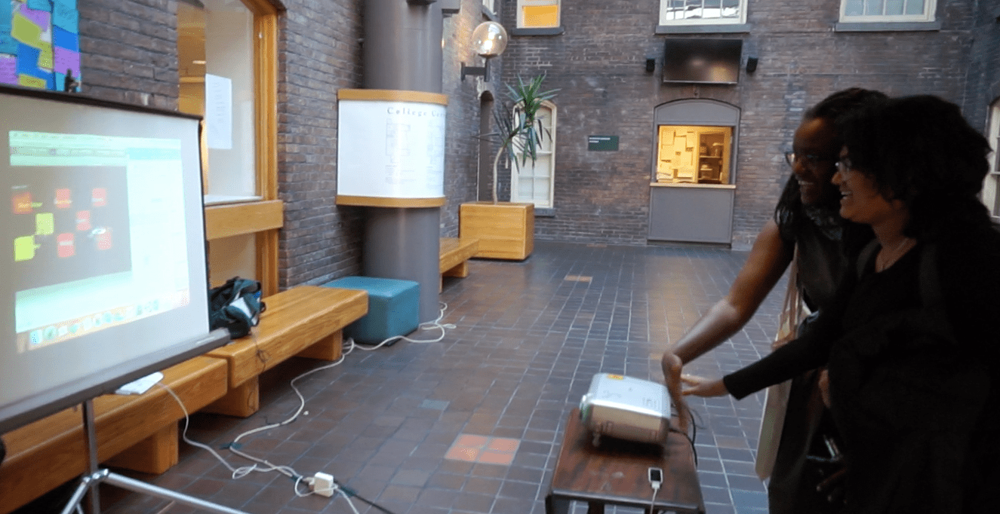
<figcaption>May 2016, Media Studies senior thesis project showcase,  Vassar College Main Building, New York. </figcaption>
</figure>

An interactive media installation demo for live music events. It experiments multiple audience and artists interacting with each other and create collaborative soundscape. Made with Unity, Leap Motion.

<h3 id="ii-7">Theater, Vassar College, 2012-2015</h3>

Position: [Collaborator] Lighting designer, Sound designer, Lighting crew.

<figure style="display: block; margin: 0 auto; text-align: center">
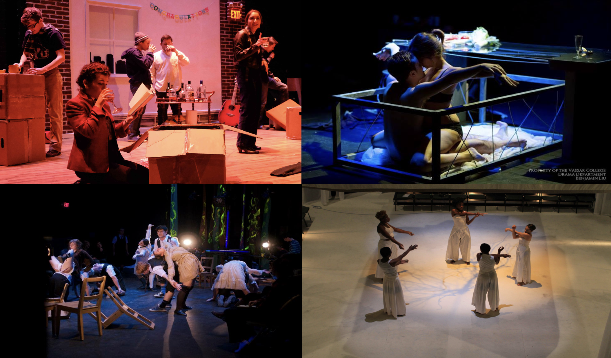
<figcaption>Vassar College Theater Production for plays and musicals. 
</figcaption>
</figure>

Participated in various Vassar College Drama Department shows and student theater productions such as Stockholm, Little Shop of Horrors, Company, Mayor of Baltimore, Spring Awakening, Arcadia, and Lacunae.

## 5. PRESENTATION

<h3 id="pp-1" style="inline-block">Talks</h3>

2022.11   		Artist Talk, IML300: Reading and Writing the Web course by Qianqian Ye, 		USC Media Arts and Practice Division

2022.11 		<i>Coding Typography in 2D & 3D world</i>, Korean Society of Typography

2022.09 		Organizer, MC, Creative coding performer JSCONF KOREA 2022

2022.08 		Panel, Discussion About Translation and p5js, Women Open Tech Lab, Seoul Arts Week

2022.02 		Judge, Google Developer Student Clubs Korea Winter Hackathon: Play Your Stay

2021.08		Instagram Takeover, p5js official Instagram account

2021.08		Organizer, MC, and Speaker, Processing Day Seoul, Gather.Town & KOTE gallery, Seoul

2020.10		<i>Introducing Creative Coding Open-Source to Generate Art</i>, Samsung Open Source Conference, Seoul

2019.12		<i>Learn Code to Make Art</i>, Modu Conference, Modulabs, Seoul

2019.11		<i>Creative Coding: Code + Art</i>, Women Who Code Seoul, Microsoft Office, Seoul

2019.10		<i>How We Do Code x Art Lab</i>, JSCONF Korea, COEX expo center, Seoul

2018.12		Presentation and demo, <i>Playing with Deep Learning: Interact with PoseNet</i>, Modulabs

2018.10 		Poster presentation, <i>Transforming Hand-Sketched Objects into Photographic Qualities</i>,		Artificial Intelligence Symposium Conference by IEIE, Seoul National University

2018.06 		<i>Introduction to Blockchain</i>, Modulabs

<h3 id="pp-2">Workshops</h3>

2022.09-11  	<i>Interactive Visual Coding</i>, 5-weeks curriculum, Notefolio Design Academy, Seoul 

2022.02 	     	<i>Dancing Vertex – Behind the Scene</i>, Nest Gangnam, Seoul

2022.08		Assistant Teacher, Taeyoon Choi’s Body Coding workshop, 		Smilegate Game Company Future lab, Seoul

2022.07 	       	<i>Trigonometry in p5js</i>, Virtual CC Fest

2022.04-05   	<i>Animating Pixel Human with p5js</i>, Nest Gangnam, Seoul

2022.05 		Artist Talk & Workshop, Taeyoon Choi’s Creative coding workshop for 		Samsung Special Education School students, Leeum Museum, Seoul

2022.02 		<i>Generative Symmetric Patterns with p5js</i>, Nest Gangnam, Seoul

2019.07-09	<i>Draw Nature with Code, p5js</i>, a series based on Nature of Code lectures,		Modulabs

2016.10 		Participant and team lead, <i>Augmented Beatz</i>, Reality Virtually Hackathon, 		MIT Media Lab, Boston

2016.07 		Participant, Hack Cooper 2016, Cooper Union, NY

