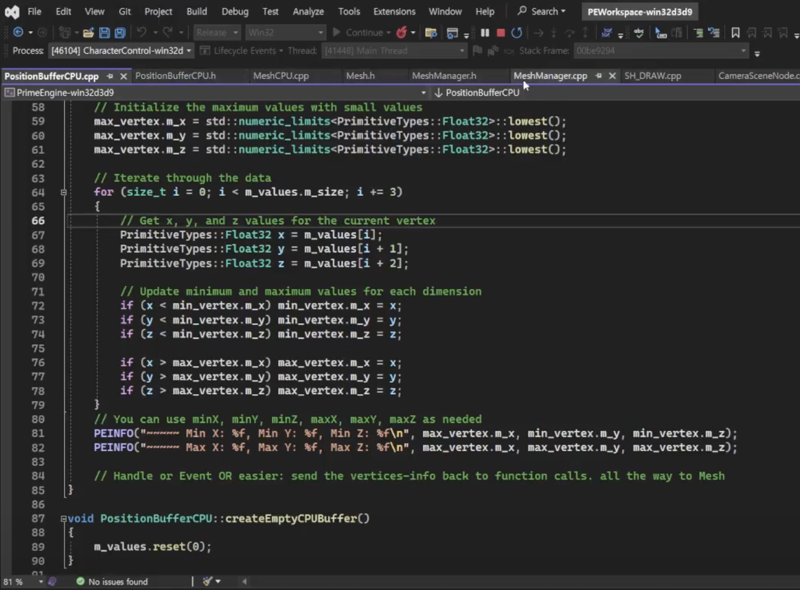

<figure style="display: block; margin: 0 auto; text-align: center">

<figcaption></figcaption>
</figure>
 

<h2>Course:</h2>
<ul>
    <li>CSCI 522 Game Engine Development (Professor Artem Kovalovs, Principal Graphics & Game Programmer at Naughty Dog)</li>
</ul>

<h2>Codebase:</h2>
<ul>
    <li>C++, Lua, Python (USC-owned Prime Engine)</li>
</ul>

<h2>Key Features:</h2>
<ul>
    <li>Enhanced waypoint algorithms</li>
    <li>Modified character behaviors and target directions</li>
    <li>Implemented AABB bounding volumes for meshes</li>
    <li>Integrated camera frustum checking</li>
    <li>Updated physics simulations including collision effects and raycasting</li>
</ul>

<h2>Task Summaries:</h2>
<ul>
    <li>
        <h3>Task 1: Code Analysis</h3>
        <ul>
            <li>Examined camera movement mechanisms and event handling</li>
            <li>Identified event origins and component interactions</li>
        </ul>
    </li>
    <li>
        <h3>Task 2: Character Behavior Modification</h3>
        <ul>
            <li>Added multi-waypoint support and randomized movement for Soldier #1</li>
            <li>Designed a new object, Target, for Soldier #2 to aim and shoot at</li>
            <li>Repurposed soldier object as target with custom parameters</li>
        </ul>
    </li>
    <li>
        <h3>Task 3: Bounding Volumes and Frustum Plane Equations</h3>
        <ul>
            <li>Developed Axis Aligned Bounding Box (AABB) around meshes</li>
            <li>Implemented helper functions for volume rendering in debug mode</li>
            <li>Created camera frustum plane equations based on field of view</li>
            <li>Used bounding volumes for camera view frustum checks to optimize render performance</li>
        </ul>
    </li>
</ul>

<figure style="display: block; margin: 0 auto; text-align: center">

<figcaption></figcaption>
</figure>
 

<figure style="display: block; margin: 0 auto; text-align: center">

<figcaption></figcaption>
</figure>
 

<figure style="display: block; margin: 0 auto; text-align: center">

<figcaption></figcaption>
</figure>
 

<figure style="display: block; margin: 0 auto; text-align: center">

<figcaption></figcaption>
</figure>
 

<figure style="display: block; margin: 0 auto; text-align: center">

<figcaption></figcaption>
</figure>
 

<figure style="display: block; margin: 0 auto; text-align: center">

<figcaption></figcaption>
</figure>
 