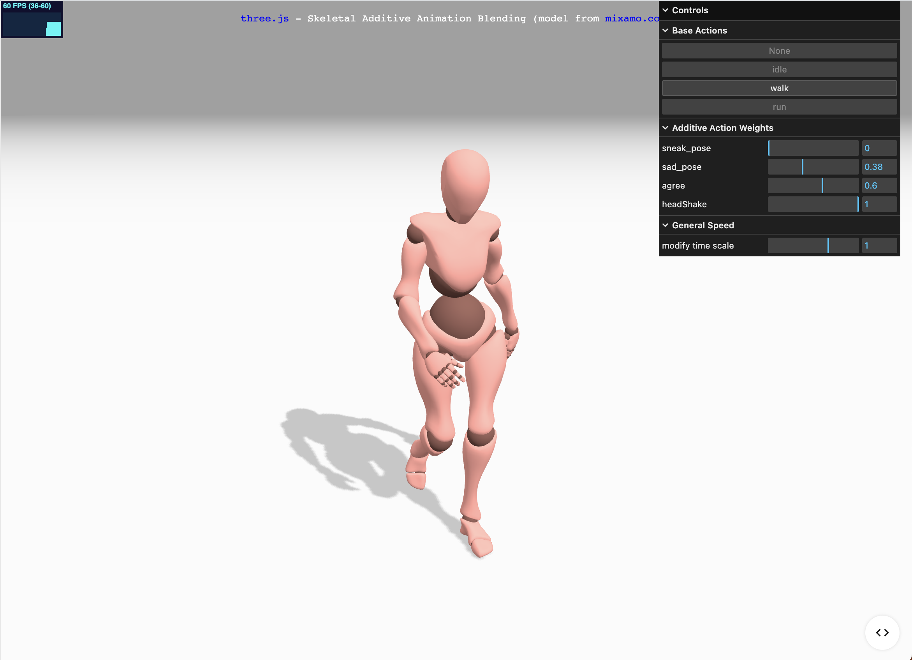
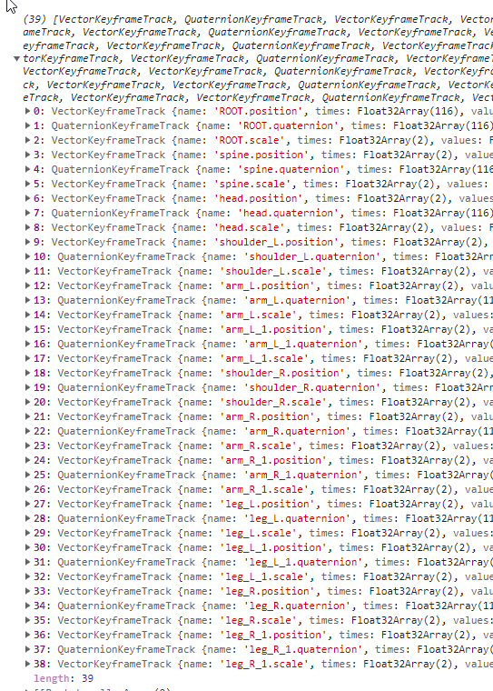
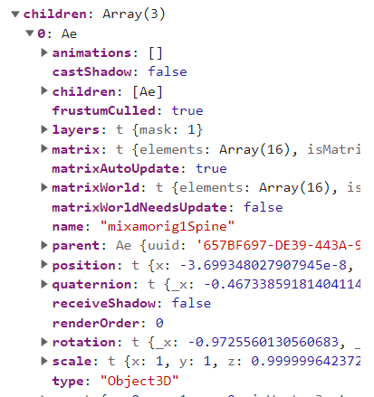

<figure style="display: block; margin: 0 auto; text-align: center">

<figcaption>Screenshot of threejs animation official example</figcaption>
</figure>
 

<h2>Technical Research and Implementation</h2>

<ul>
  <li>Conducted in-depth research on the Threejs Animation system, leading to the development of user-controllable modules for real-time web browser interactions.</li>
  <li>Enabled real-time modifications to the animation mixer, clips, and actions.</li>
  <li>Investigated the feasibility of manually retargeting animations to different model skeletons.</li>
  <li>Successfully adapted models by adjusting position, quaternion values of joints, and animation weights.</li>
  <li>Implemented additive or blending animation effects, such as idle, walk, and jump sequences.</li>
  <li>Developed features to export Threejs scenes to both static images and GIF captures.</li>
  <li>Referenced Threejs documentation and examples to guide development processes:
    <ul>
      <li><a target="_blank" href="https://threejs.org/examples/#webgl_animation_skinning_blending">Skinning Blending Example</a></li>
      <li><a target="_blank" href="https://threejs.org/docs/index.html?q=animation#api/en/animation/AnimationAction.setEffectiveWeight">Animation Action Effective Weight Documentation</a></li>
      <li><a target="_blank" href="https://threejs.org/examples/#webgl_animation_skinning_additive_blending">Additive Blending Example</a></li>
    </ul>
  </li>
</ul>

<i>Note: unfortunately, the real application images are confidential and cannot be shared.</i>

<figure style="display: block; margin: 0 auto; text-align: center">

<figcaption>Debugging 3D mode's animation keyframes in threejs</figcaption>
</figure>
 

<figure style="display: block; margin: 0 auto; text-align: center">

<figcaption>stats, lil-gui controls to test animation customization</figcaption>
</figure>
 

<figure style="display: block; margin: 0 auto; text-align: center">

<figcaption>Debugging through mixamo rigged 3D blender models</figcaption>
</figure>
 