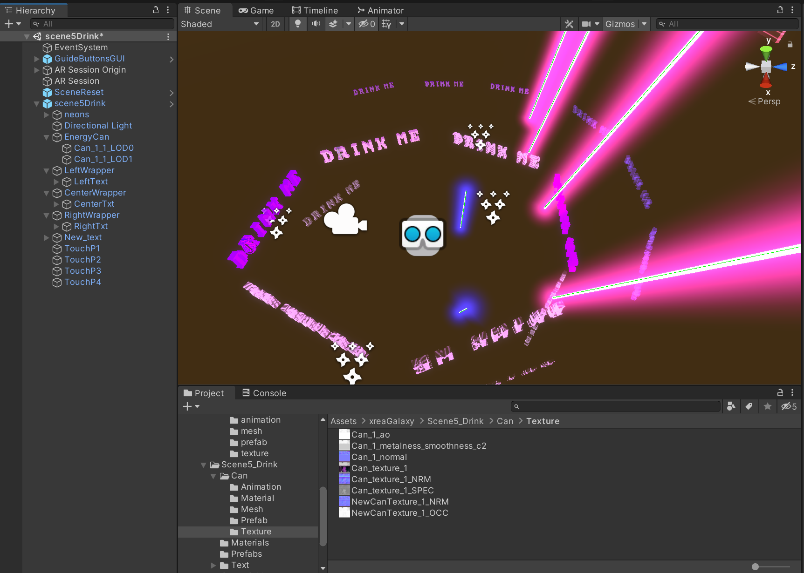
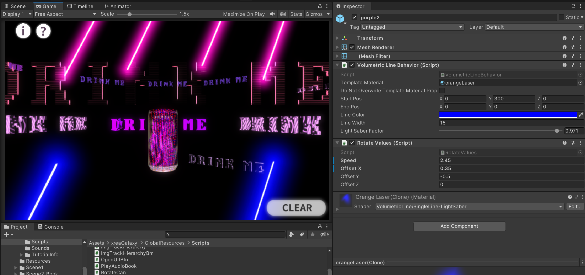
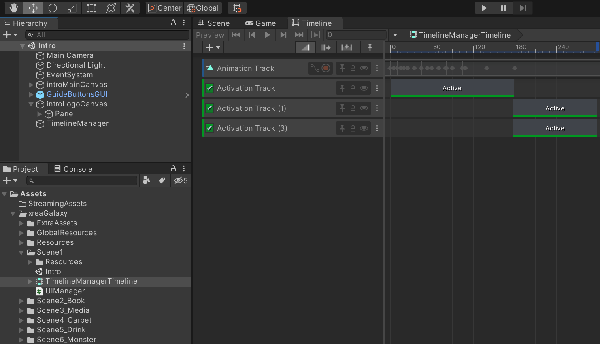
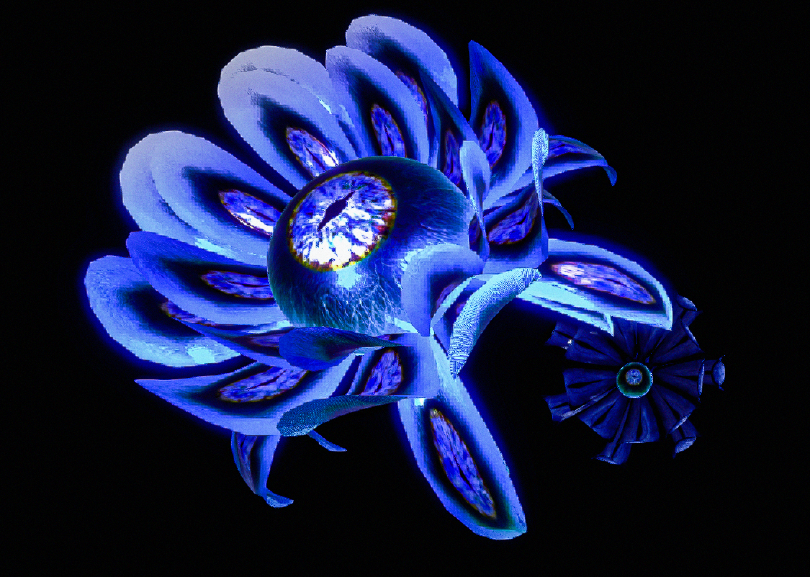
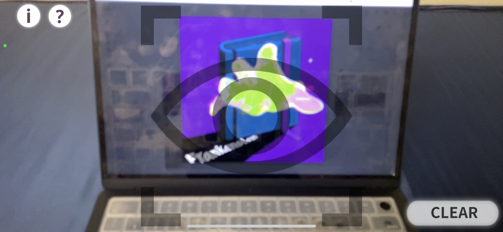
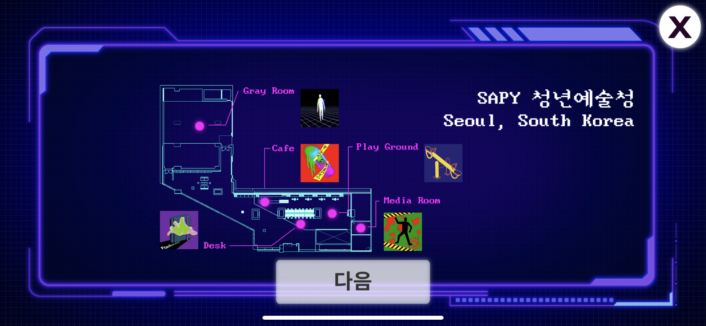
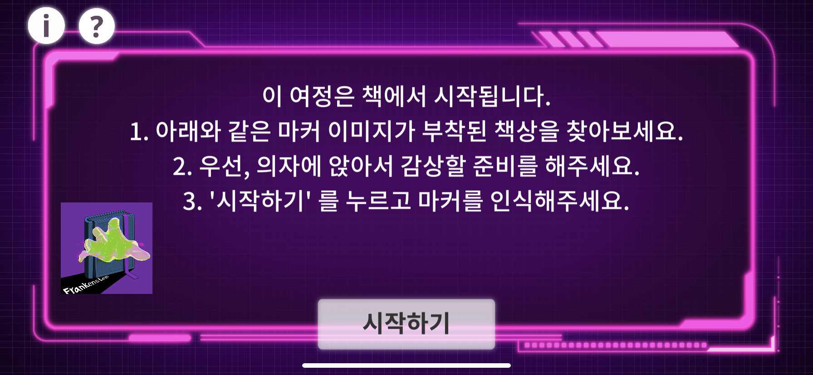

<iframe width="100%" height="400" src="https://www.youtube.com/embed/EAKpIvpl6zU" title="YouTube video player" frameborder="0" allow="accelerometer; autoplay; clipboard-write; encrypted-media; gyroscope; picture-in-picture" allowfullscreen></iframe>

  <h2>Project Overview</h2>
  

    
<b>Position:</b> Team lead, Producer, Developer

    
<b>Topic:</b> AR / VR / XR, Duality of Technology

    
<b>Team:</b> X-REA (Hanna Ok, Sun Ho Lee, Joo Yeon Lee, So Sun Park)

    
<b>Venue:</b> <a target="_blank" rel="noreferrer" href="http://www.sapy.kr/XR-SAPY">Seoul Artists' Platform New&Young (SAPY) 청년예술청</a>

    
<b>Type:</b> XR (AR, MR) on Android Samsung Tablets, iPads, Hololens 2.0

    
<b>Tools:</b> Unity, Unity AR foundation packages, Unity MR Toolkit

    
<b>Date:</b> 2021.06 ~ 2021.08

    
<b>Sponsored by:</b> Seoul Foundation of Arts and Culture

  

  <h2>Environment & Goal</h2>
  <ul>
    <li>Developed in a 3D URP environment in Unity</li>
    <li>Deployed as iOS and Android apps as well as Hololens 2.0</li>
    <li>Showcased on-site AR exhibition with docent</li>
  </ul>

  <h2>AR/MR Tools & Plugins</h2>
  <ul>
    <li>Utilized AR Foundation, ARCore XR Plugin, ARKit, and MRTK</li>
  </ul>

  <h2>Functionality</h2>
  <ul>
    <li>Based on QR code recognition</li>
    <li>Each QR triggers a distinct AR scene, sound narration, and sound effects</li>
  </ul>

  <h2>Role & Collaboration</h2>
  <ul>
    <li>Lead developer and project lead</li>
    <li>Led a cross-functional team comprising of 2 designers and 1 producer</li>
  </ul>

  <h2>Coding & Mechanics</h2>
  <ul>
    <li>Scripted repetitive and procedural movements of static models, like laser rotations and spinning beverage cans, using trigonometry and C#</li>
    <li>Programmed and validated AR positioning within Unity to ensure accurate and stable placement of AR models relative to QR code scan locations during on-site tests. </li>
    <li>Customized materials, texture, and animation controller system of design assets to align with overarching visual aesthetic.</li>
  </ul>

  <h2>Project Structure</h2>
  <ul>
    <li>Differentiated between 5 unique scenes within Unity</li>
    <li>Managed AR models using Unity prefabs for each scene</li>
  </ul>

  <h2>Interactions</h2>
  <ul>
    <li>Implemented touch interaction triggering particle creation and sound effects</li>
    <li>Integrated canvas UI and Timeline Manager for intro scene, map menu, QR scan and reset button, and help menu to enhance user experience </li>
  </ul>

  <figure style="display: block; margin: 0 auto; text-align: center">
  
  <figcaption>Customized materials, animations, procedural movement of 3D models</figcaption>
  </figure>

  <figure style="display: block; margin: 0 auto; text-align: center">
  
  <figcaption></figcaption>
  </figure>

  <figure style="display: block; margin: 0 auto; text-align: center">
  
  <figcaption>CAN movement and Neon lines animation are programmed in C# with trigonometry functions and parameter inputs</figcaption>
  </figure>

  <h2>3D Design & Integration</h2>
  <ul>
    <li>Partnered with 3D designers to adapt models for the Unity environment and rendering</li>
    <li>Purchased certain assets and then customized their materials and animations</li>
  </ul>

  <h2>Project Context & Training</h2>
  <ul>
    <li>The project was conducted as part of an educational/business initiative supported by the Seoul Cultural Foundation</li>
    <li>Participated in a 2-3 month program, which included short-term training in Unity, Maya, 3ds Max</li>
  </ul>

  <h3>Repository</h3>
  
<a target="_blank" rel="noreferrer" href="https://github.com/sosunnyproject/XreaUnityArUrp">Github Repository</a>

  <figure style="display: block; margin: 0 auto; text-align: center">
  
  <figcaption>Unity Timeline Manager for introduction scenes</figcaption>
  </figure>

  <figure style="display: block; margin: 0 auto; text-align: center">
  
  <figcaption>Particle system</figcaption>
  </figure>

  <figure style="display: block; margin: 0 auto; text-align: center">
  
  <figcaption>Made in 3ds Max, Cinema 4D</figcaption>
  </figure>

  <figure style="display: block; margin: 0 auto; text-align: center">
  
  <figcaption>UI: AR Camera</figcaption>
  </figure>

  <figure style="display: block; margin: 0 auto; text-align: center">
  
  <figcaption>UI: Help Menu</figcaption>
  </figure>

  <figure style="display: block; margin: 0 auto; text-align: center">
  
  <figcaption>UI: Intro</figcaption>
  </figure>

  <figure style="display: block; margin: 0 auto; text-align: center">
  
  <figcaption>UI: Image Marker Scan</figcaption>
  </figure>

<h3>Details about Storytelling</h3>

In the 1800s, Dr. Frankenstein’s monster was a supernatural creature with a mixture of individual and social desires to surpass God. Monsters were not human but imperfect existences that pretended to be human and adjust to the world. We analyzed various phenomena in society and the causes of anxiety in individuals during the process of finding out the appearance of a modern-day monster. After many conversations, we defined “a 21st century monster as a being who tries to overcome human limitations with technology.”

The results from human desires have been manifested by technology -- technology that violates human territory, and technology that tries to force human limitations intentionally or unintentionally provide convenience but also stimulate anxiety and various emotions. Each individual may feel threatened and find it future-oriented.

Modern people are in a position of simultaneously enjoying and consuming such developed skills. This is why we believe we have the responsibility of considering the various forms created by technology and its societal and ethical perspectives, and imperfect fantasies.

We have expressed a modern monster created by that technology as an XR artwork. The modern monster was inspired by social media, AI robots, energy drinks that defy a human’s body clock etc,. In addition, in the last scene, the modern monster created by that technology depicts them on the same page of humans(viewers) as intelligent independent creatures that are no longer interpreted as a methodology or medium. 

The monster is modern Frankenstein made with technology and human spirit yet a digital hard hydra, embodying Cocoons as a new being rapidly trying to transcend human limitations and human inherent domains. We hope the audience will take a moment to step back from the reckless or unconscious consumption of technology and experience the artwork from their own perspective and think about the 21st century Frankenstein as a modern being.

Currently, you can only download the korean version of Android/iOS app. We are preparing to add english and launch a global version in 2023. 

X-REA: 공간(area)을 XR, X차원의 경험이 있는 공간을 만들자

메리셸리는 프랑켄슈타인 소설을 쓴 여성 작가입니다. 
우리는 메리셸리의 생애를 추적하며 ‘왜 그녀는 괴물을 창조했을까?’ 하는 물음을 갖게 되었습니다.  

그러면서 우리는 현대 사회에서의 ‘괴물'의 상징성에 대해 서로의 해석과 관점을 나누고, 각자 갖고 있던 장르적 문법을 해체하고 재조립했습니다. 그렇게 2021년 현대판 ‘괴물'을 
창조한 X-REA 4명의 작가는 이 시대의 메리셸리입니다. 

소개 웹사이트 Temporary introduction website (korean!) <a target="_blank" rel="noreferrer" href="https://2021frankenstein.bubbleapps.io/version-test">here</a>.

<figure style="display: block; margin: 0 auto; text-align: center">

<figcaption>scene 2</figcaption>
</figure>

<figure style="display: block; margin: 0 auto; text-align: center">

<figcaption>scene 2</figcaption>
</figure>

<figure style="display: block; margin: 0 auto; text-align: center">

<figcaption>scene 3</figcaption>
</figure>

<figure style="display: block; margin: 0 auto; text-align: center">

<figcaption>scene 3</figcaption>
</figure>

<figure style="display: block; margin: 0 auto; text-align: center">

<figcaption>scene 4</figcaption>
</figure>

<figure style="display: block; margin: 0 auto; text-align: center">

<figcaption>scene 5</figcaption>
</figure>

<h1>TEAM XREA</h1>

박소선 / 𝗦𝗢 𝗦𝗨𝗡 𝗣𝗔𝗥𝗞  
TEAM LEAD, XR DESIGN,UNITY DEVELOPMENT (AR, HOLOLENSE)   
@sosunnyproject   

옥한나 / 𝗛𝗔𝗡𝗡𝗔 𝗢𝗞  
PRODUCER, STORYTELLING, NARRATION WRITER & SOUND DIRECTION   
@ok_hanna_ok   

이선호 / 𝗦𝗨𝗡 𝗛𝗢 𝗟𝗘𝗘   
ART DIRECTION, 3D MODELLING,3D ANIMATION   
@visceralwarmth   
 
이주연 / 𝗝𝗢𝗢 𝗬𝗘𝗢𝗡 𝗟𝗘𝗘   
3D MODELLING & ANIMATION,
UI * GRAPHIC DESIGN, INTERIOR DESIGN   
@jewyoming   

<h1>Collaborators</h1>

이제우 / 𝗝𝗔𝗘 𝗪𝗢𝗢 𝗟𝗘𝗘  
DIRECTOR, DOP, EDIT, POST PRODUCTION  
@jaewoo_1987  

박성준 / 𝗦𝗨𝗡𝗚 𝗝𝗢𝗢𝗡 𝗣𝗔𝗥𝗞  
COMPOSER    
@simeon_joon   

강은일 / 𝗘𝗨𝗡 𝗜𝗟 𝗞𝗔𝗡𝗚  
NARRATOR   
@euuuuuun___n   

임은정 / 𝗘𝗨𝗡 𝗝𝗨𝗡𝗚 𝗜𝗠  
CHOREOGRAPHY & DANCE  
@imeunjoung  

<iframe width="100%" height="400" src="https://www.youtube.com/embed/bbBC4r61OWM" title="YouTube video player" frameborder="0" allow="accelerometer; autoplay; clipboard-write; encrypted-media; gyroscope; picture-in-picture" allowfullscreen></iframe>